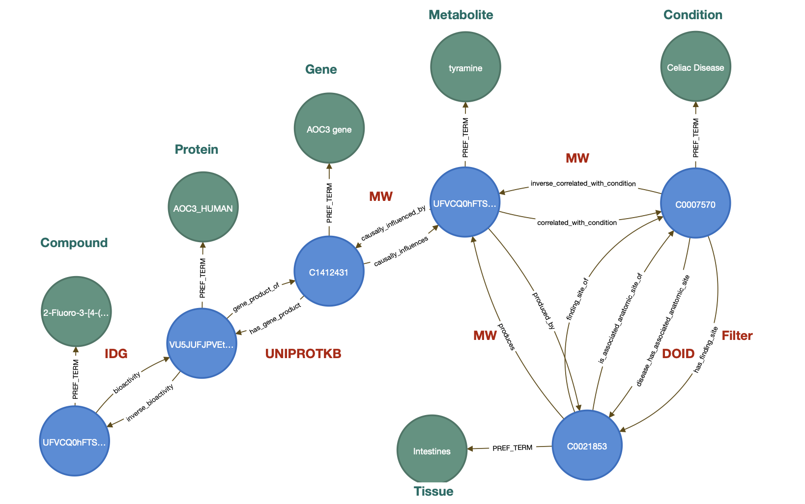
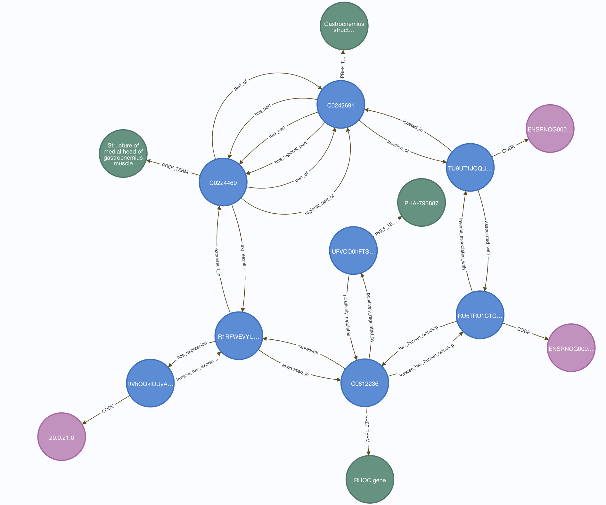
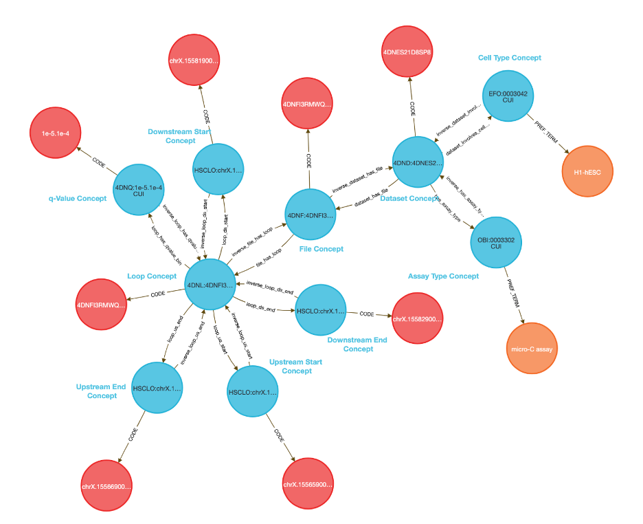
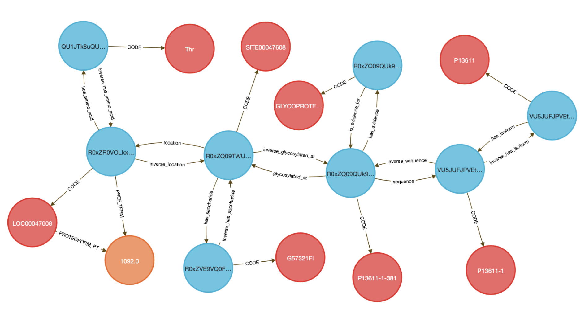
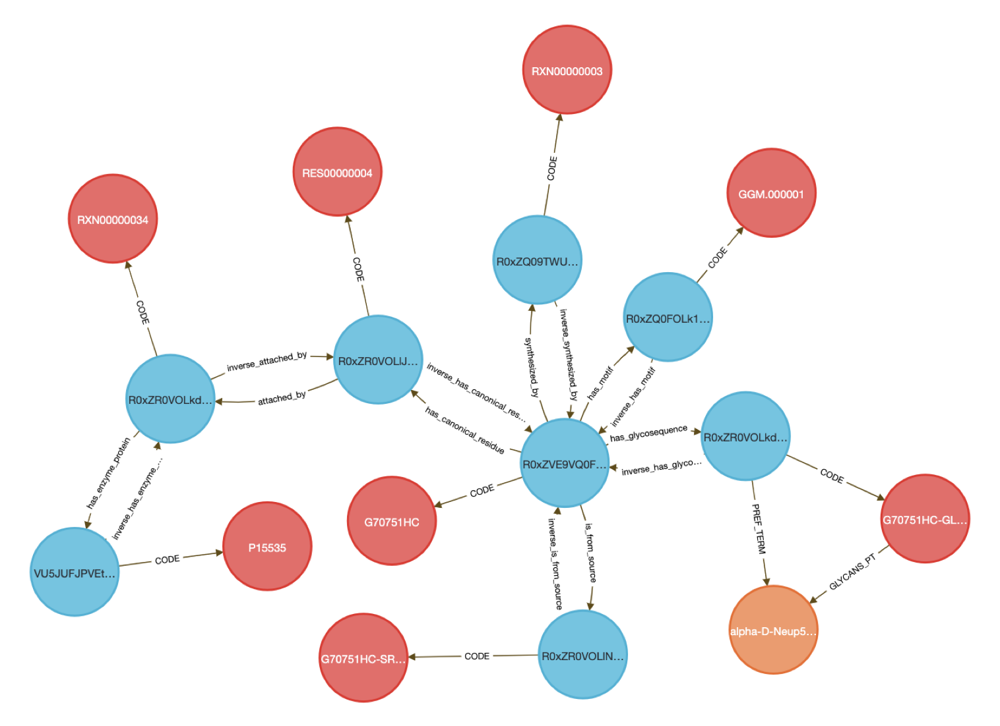
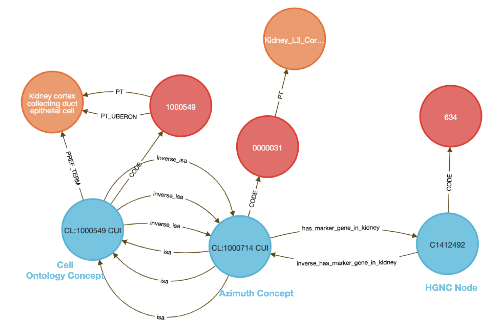

# User Guide for the CFDE Data Distillery Knowledge Graph

## Guide for exploring the Data Distillery knowledge graph using Cypher
---------
* This guide is meant to be an introduction for how to write Cypher queries to explore the Data Distillery Knowledge Graph (DDKG). A basic understanding of Cypher is assumed. If you are unfamiliar with Cypher please refer to the [Neo4j docs](https://neo4j.com/developer/cypher/). 
* For documentation concerning how the DDKG is generated or for information about the general schema of the graph please see our [Github docs page](https://ubkg.docs.xconsortia.org). For documentation concerning the specific schema for a DCCs dataset please see our [Data Dictionary](DataDistilleryDataDictionary.md).
* It is assumed you are working with the latest version of the DDKG which can be found on [globus](https://app.globus.org/file-manager?origin_id=24c2ee95-146d-4513-a1b3-ac0bfdb7856f&origin_path=%2Fprojects%2Fdata-distillery%2FValidated%2FDistribution%2F). Some queries will fail to return anything if you are working with an older version of the graph.
--------
This guide has 4 sections:

1. [Introduction](CFDE_DataDistillery_UserGuide.md#introduction)

2. [Use Cases](CFDE_DataDistillery_UserGuide.md#dcc-use-cases)

3. [Queries to reproduce Data Dictionary figures](CFDE_DataDistillery_UserGuide.md#queries-to-reproduce-the-figures-in-the-data-dictionary)

4. [Tips and Tricks](CFDE_DataDistillery_UserGuide.md#tips-and-tricks)

--------
## Introduction

### The simplest way to find a Code in the graph is to search for it using it's source abbreviation (SAB).
For a list of all Data Distillery SABs see [here](https://ubkg.docs.xconsortia.org/contexts/#data-distillery-context).
#### 1. How can I return a Code node from a specific ontology/dataset, for example an HGNC Code?
Specify the `HGNC` as the SAB property:
```cypher
MATCH (hgnc_code:Code {SAB:'HGNC'})
RETURN * 
LIMIT 1
```

You can also specify properties outside the Node syntax using the `WITH` keyword,
```cypher
WITH 'HGNC' AS HGNC_SAB
MATCH (hgnc_code:Code {SAB:HGNC_SAB})
RETURN * 
LIMIT 1
```
or using the `WHERE` keyword:

```cypher
MATCH (hgnc_code:Code) WHERE hgnc_code.SAB = 'HGNC'
RETURN * 
LIMIT 1
```

All of these are equivalent, although sometimes it can be helpful to use the `WHERE` keyword combined with `STARTS WITH` or `CONTAINS` if you can't remember how a specific SAB is spelled.

For example, if you know you want to use an `ENCODE` SAB in your query but can't remember the exact spelling you can simply return all SABs starting with 'ENCODE':
```cypher
MATCH (code:Code) WHERE code.SAB STARTS WITH 'ENCODE'
WITH DISTINCT code.SAB AS encode_sabs
RETURN collect(encode_sabs)
```

(the query above should return `["ENCODE.CCRE", "ENCODE.CCRE.ACTIVITY", "ENCODE.CCRE.CTCF", "ENCODE.CCRE.H3K27AC", "ENCODE.CCRE.H3K4ME3", "ENCODE.RBS.150.NO.OVERLAP", "ENCODE.RBS.HEPG2", "ENCODE.RBS.HEPG2.K562", "ENCODE.RBS.K562"]`).

...or if you want to include multiple SABs from a DCC:
```cypher
MATCH (code:Code) WHERE code.SAB CONTAINS 'GTEX'
RETURN DISTINCT code.SAB
```

(the query above should return `GTEXEXP` and `GTEXEQTL`).

#### 2. How can I return a Code node and its Concept node from a specific ontology/dataset, for example an HGNC Code node and its Concept node?
Every Code node is connected to a Concept node by a 'CODE' relationship:
```cypher
MATCH (hgnc_code:Code {SAB:'HGNC'})-[:CODE]-(concept:Concept)
RETURN * 
LIMIT 1
```

#### 3. To return the human-readable string that a Code represents you can return the Term node along with the Code. 
Note: Not all Code nodes have Terms attached to them. If a Code does have Term nodes then it will almost always have a 'preferred term'. This 'preferred term' is always attached to it's Code by the 'PT' relationship:

```cypher
MATCH (hgnc_code:Code {SAB:'HGNC'})-[:PT]-(term:Term)
RETURN * 
LIMIT 1
```

You can also directly access the 'preferred term' through the corresponding Concept node through a 'PREF_TERM' relationship:
```cypher
MATCH (hgnc_code:Code {SAB:'HGNC'})-[:CODE]-(concept:Concept)-[:PREF_TERM]-(term:Term)
RETURN * 
LIMIT 1
```

#### 4. Ontologies/datasets are connected to one another through Concept-Concept relationships, so you must query the concept space to find these relationships.
Return an `HGNC` to `GO` path (code)-(concept)-(concept)-(code):
```cypher
MATCH (code1:Code {SAB:'HGNC'})-[:CODE]-(concept1:Concept)-[r]-(concept2:Concept)-[:CODE]-(code2:Code {SAB:'GO'})
RETURN * 
LIMIT 1
```

#### 5. Another way to query relationships between 2 ontologies/datasets without necessarily including the Code nodes (and specifying SABs) on either end of the query is to know the SAB of the relationship and/or TYPE of relationship. It's important to realize that while every Code has an SAB that identifies what ontology/dataset it belongs to, relationships in the graph also have SABs.

In this example, the 'type' of relationship is `process_involves_gene` and the SAB is `NCI`:
```cypher
MATCH (code:Code {SAB:'HGNC'})-[:CODE]-(concept:Concept)-[r:process_involves_gene {SAB:'NCI'}]-(concept2:Concept)-[:CODE]-(code2:Code {SAB:'GO'})
RETURN * 
LIMIT 1
```

It can be helpful to return the 'type' and 'SAB' of the relationship between Concepts of interest. You can easily do this by returning them in a table. For example, if you want to find all the unique relationship 'types' and 'SABs' between the `HGNC` and `GO` datasets you can write something like this:

```cypher
MATCH (code:Code {SAB:'HGNC'})-[:CODE]-(concept:Concept)-[r]-(concept2:Concept)-[:CODE]-(code2:Code {SAB:'GO'})
RETURN DISTINCT code.SAB, type(r), r.SAB, code2.SAB
```

#### 6. How can I find out what relationships exist between my ontology/dataset and other ontologies/datasets?
If you simply want to find the relationship 'types' and 'SABs' between a dataset of interest (for example `HGNC`) and all other datasets you can write something like this: 
```cypher
MATCH (code:Code {SAB:'HGNC'})-[:CODE]-(concept:Concept)-[r]-(concept2:Concept)-[:CODE]-(code2:Code)
RETURN DISTINCT code.SAB AS hgnc_start_code, type(r) AS edge_TYPE, r.SAB AS edge_SAB,  code2.SAB AS SAB_end_code
LIMIT 10
```

we can also go a step further and return the Terms on either end of this query:

```cypher
MATCH (hgnc_term:Term)-[:PT]-(code:Code {SAB:'HGNC'})-[:CODE]-(concept:Concept)-[r]-(concept2:Concept)-[:CODE]-(code2:Code)-[:PT]-(term2:Term)
RETURN DISTINCT hgnc_term.name AS gene_name, code.SAB AS hgnc_start_code, type(r) AS edge_TYPE, r.SAB AS edge_SAB,  code2.SAB AS SAB_end_code, term2.name AS end_term
LIMIT 10
```


## DCC Use Cases


### <ins>IDG and Metabolomics Workbench (MW)</ins>

For a disease (condition) in Metabolomics Workbench data find all `IDG` and `GTEX` data that may be related by disease and tissue type
For example, suppose a study would like to find biomarkers (`MW`) associated with the use of a certain drug (`IDG`) in association with a medical condition.
Query description: intersection of `MW` and `IDG`; compounds that regulate products of genes (`IDG`) that causally influence metabolites correlated with conditions (`MW`), with tissues and conditions directly connected through a single relationship (e.g. `DOID`).
Disease-tissue relationships are used as a filter to obtain metabolite-tissue-condition triangles that are affected by a certain compound through gene product perturbations.

```cypher
MATCH (compound_concept:Concept)-[r1:bioactivity {SAB:"IDGP"}]->(protein_concept:Concept)-[r2:gene_product_of {SAB:"UNIPROTKB"}]->(gene_concept:Concept)-[r3:causally_influences {SAB:"MW"}]->(metabolite_concept:Concept)-[r4:correlated_with_condition {SAB:"MW"}]->(condition_concept:Concept)-[]->(tissue_concept:Concept)<-[r5:produced_by {SAB:"MW"}]-(metabolite_concept:Concept) 
WITH * MATCH (compound_concept:Concept)-[:PREF_TERM]-(compound:Term),
(protein_concept:Concept)-[:PREF_TERM]-(protein:Term),
(gene_concept:Concept)-[:PREF_TERM]-(gene:Term),
(condition_concept:Concept)-[:PREF_TERM]-(condition:Term),
(metabolite_concept:Concept)-[:PREF_TERM]-(metabolite:Term),
(tissue_concept:Concept)-[:PREF_TERM]-(tissue:Term) RETURN DISTINCT * LIMIT 1
```


The following query will return a table version of the previous query:
```cypher
MATCH (compound_concept:Concept)-[r1:bioactivity {SAB:"IDGP"}]->(protein_concept:Concept)-[r2:gene_product_of {SAB:"UNIPROTKB"}]->(gene_concept:Concept)-[r3:causally_influences {SAB:"MW"}]->(metabolite_concept:Concept)-[r4:correlated_with_condition {SAB:"MW"}]->(condition_concept:Concept)-[]->(tissue_concept:Concept)<-[r5:produced_by {SAB:"MW"}]-(metabolite_concept:Concept) 
WITH * MATCH (compound_concept:Concept)-[:PREF_TERM]-(compound:Term),
(protein_concept:Concept)-[:PREF_TERM]-(protein:Term),
(gene_concept:Concept)-[:PREF_TERM]-(gene:Term),
(condition_concept:Concept)-[:PREF_TERM]-(condition:Term),
(metabolite_concept:Concept)-[:PREF_TERM]-(metabolite:Term),
(tissue_concept:Concept)-[:PREF_TERM]-(tissue:Term) RETURN DISTINCT compound.name,protein.name,gene.name,metabolite.name,tissue.name,condition.name LIMIT 20
```
### <ins>MOTRPAC, LINCS and GTEx</ins>

This query identifies `MOTRPAC` genes that are 1) affected by exercise, 2) are expressed in matched tissues in humans in `GTEX`, and 3) that are either matches or inverse matches of a perturbation signal in `LINCS`.

```cypher
MATCH (motrpac_code:Code {SAB:"MOTRPAC"})<-[:CODE]-(motrpac_concept:Concept)-[r1:associated_with]->(rat_gene_concept:Concept)-[r2:has_human_ortholog]->(hgnc_concept:Concept)<-[r3 {SAB:"LINCS"}]-(perturbagen_concept:Concept),
(motrpac_concept:Concept)-[r4:located_in]->(tissue_concept_1:Concept)-[r5:part_of]-(tissue_concept_2:Concept)-[r6:expresses {SAB:"GTEXEXP"}]->(gtex_concept:Concept)-[r7:expressed_in {SAB:"GTEXEXP"}]-(hgnc_concept:Concept),
(gtex_concept:Concept)-[r8:has_expression {SAB:"GTEXEXP"}]->(expr_concept:Concept)-[:CODE]->(expr_code:Code),
(hgnc_concept:Concept)-[:PREF_TERM]->(hgnc_term:Term),
(perturbagen_concept:Concept)-[:PREF_TERM]->(perturbagen_term:Term),
(tissue_concept_1:Concept)-[:PREF_TERM]->(tissue_term_1:Term),
(tissue_concept_2:Concept)-[:PREF_TERM]->(tissue_term_2:Term),
(rat_gene_concept:Concept)-[:CODE]->(rat_gene_code:Code)
RETURN * LIMIT 1
```


The following query will return a table version of the previous query:
```cypher
MATCH (motrpac_code:Code {SAB:"MOTRPAC"})<-[:CODE]-(motrpac_concept:Concept)-[r1:associated_with]->(rat_gene_concept:Concept)-[r2:has_human_ortholog]->(hgnc_concept:Concept)<-[r3 {SAB:"LINCS"}]-(perturbagen_concept:Concept),
(motrpac_concept:Concept)-[r4:located_in]->(tissue_concept_1:Concept)-[r5:part_of]-(tissue_concept_2:Concept)-[r6:expresses {SAB:"GTEXEXP"}]->(gtex_concept:Concept)-[r7:expressed_in {SAB:"GTEXEXP"}]-(hgnc_concept:Concept),
(gtex_concept:Concept)-[r8:has_expression {SAB:"GTEXEXP"}]->(expr_concept:Concept)-[:CODE]->(expr_code:Code),
(hgnc_concept:Concept)-[:PREF_TERM]->(hgnc_term:Term),
(perturbagen_concept:Concept)-[:PREF_TERM]->(perturbagen_term:Term),
(tissue_concept_1:Concept)-[:PREF_TERM]->(tissue_term_1:Term),
(tissue_concept_2:Concept)-[:PREF_TERM]->(tissue_term_2:Term),
(rat_gene_concept:Concept)-[:CODE]->(rat_gene_code:Code)
RETURN DISTINCT motrpac_code.CODE AS MoTrPac_DS, rat_gene_code.CODE AS rat_gene, hgnc_term.name AS human_gene,tissue_term_1.name AS tissue_MoTrPac, tissue_term_2.name AS tissue_GTEx, expr_code.CODE AS TPM,perturbagen_term.name AS perturbagen,type(r3) AS effect_direction LIMIT 20
```

### <ins>GlyGen, KF and GTEx</ins>

Birth defects could be caused by dysregulation of glycosylation (PMC6331365). Certain heart defects have been shown to be associated with loss of glycosylation (e.g. heterotaxy, PMC3869867). KF heart defect cohort (711 subjects) may have evidence of genetic variants affecting glycosylation genes. A question could be, which KF deleterious variants could lead to loss of glycosylation by affecting glycoenzymes and glycoenzyme expression, specifically for those genes found in the GTEx heart dataset
?

Query Description: Intersection of `GLYGEN`, `KF` and `GTEX`. The query retrieves Glycoreactions {SAB:”GLYCOSYLTRANSFERASE.REACTION”} and subsequently Glycoenzymes data from GLYCANS dataset. Associated genes, their expression and variant count are obtained from `GTEXEXP` and `KF` datatsets respectively. 

```cypher
WITH "Myocardium of left ventricle" AS tissue_name
MATCH (glycoreaction_code:Code)<-[:CODE]-(glycoreaction_concept:Concept)-[r1:has_enzyme_protein {SAB:"GLYCANS"}]->(glycoenzyme_concept:Concept)-[r2:gene_product_of]->(gene_concept:Concept)-[r3]-(bin_concept:Concept)-[:CODE]->(bin_code:Code {SAB:"KFGENEBIN"}),(tissue_concept:Concept)-[r4:expresses {SAB:"GTEXEXP"}]->(gtexexp_concept:Concept)-[r5 {SAB:"GTEXEXP"}]->(gene_concept:Concept),(gtexexp_concept:Concept)-[r6:has_expression {SAB:"GTEXEXP"}]->(exp_concept:Concept)-[:CODE]-(exp_code:Code),
(gene_concept:Concept)-[:PREF_TERM]->(gene:Term),
(glycoenzyme_concept:Concept)-[:PREF_TERM]->(glycoenzyme:Term),
(tissue_concept:Concept)-[:PREF_TERM]-(tissue:Term {name:tissue_name})
RETURN * LIMIT 1
```

The following query will return a table version of the previous query:
```cypher
WITH "Myocardium of left ventricle" AS tissue_name
MATCH (glycoreaction_code:Code)<-[:CODE]-(glycoreaction_concept:Concept)-[r1:has_enzyme_protein {SAB:"GLYCANS"}]->(glycoenzyme_concept:Concept)-[r2:gene_product_of]->(gene_concept:Concept)-[r3]-(bin_concept:Concept)-[:CODE]->(bin_code:Code {SAB:"KFGENEBIN"}),(tissue_concept:Concept)-[r4:expresses {SAB:"GTEXEXP"}]->(gtexexp_concept:Concept)-[r5 {SAB:"GTEXEXP"}]->(gene_concept:Concept),(gtexexp_concept:Concept)-[r6:has_expression {SAB:"GTEXEXP"}]->(exp_concept:Concept)-[:CODE]-(exp_code:Code),
(gene_concept:Concept)-[:PREF_TERM]->(gene:Term),
(glycoenzyme_concept:Concept)-[:PREF_TERM]->(glycoenzyme:Term),
(tissue_concept:Concept)-[:PREF_TERM]-(tissue:Term {name:tissue_name})
RETURN DISTINCT gene.name,tissue.name,glycoenzyme.name,bin_code.value AS variant_count,exp_code.CODE AS liver_expression
```

### <ins>ERCC</ins>

##### RBP	 	
Queries of the assertions relating to extracellular RNA binding proteins (RBPs) are meant to help identify candidate minimally invasive biomarkers of disease. We envision that users would provide three inputs to queries of this data. These inputs include a target biofluid, a set of RBPs that are expressed within the cell type of interest, and a set of genes that are also expressed within the cell type of interest. The following example queries showcase the information encoded within the assertions provided between RBPs, biofluids, and RBP eCLIP peaks. 

The query below first identifies the RBPs that are predicted to be present within the input target biofluid. Next, it identifies the genes among the input set whose genetic coordinates overlap with the coordinates of at least one eCLIP peak of RBPs that are predicted to be present within the target biofluid. 

Query1:
```cypher
MATCH (a:Code {CodeID: 'UBERON 0001088'})
MATCH (b:Code) WHERE b.CodeID in ['ENSEMBL ENSG00000221461', 'ENSEMBL ENSG00000253190', 'ENSEMBL ENSG00000231764', 'ENSEMBL ENSG00000277027']
MATCH (c:Code) WHERE c.CodeID in ['UNIPROTKB P05455', 'UNIPROTKB Q12874', 'UNIPROTKB Q9GZR7', 'UNIPROTKB Q9HAV4', 'UNIPROTKB Q2TB10']
MATCH (a)<-[:CODE]-(:Concept)<-[:predicted_in]-(p:Concept)-[:CODE]->(c)
MATCH (p)-[:molecularly_interacts_with]->(q:Concept)-[:overlaps]->(:Concept)-[:CODE]->(b)
MATCH (q)-[:CODE]->(r:Code)
RETURN DISTINCT c.CodeID AS RBP,r.CodeID AS RBS,b.CodeID AS Gene,a.CodeID AS Biosample;
```

The query below differs from the first query in that it considers a different set of RBP loci. In this case, we query genetic loci that are the result of removing overlaps from eCLIP peaks across RBPs.

Query2:
```cypher
MATCH (a:Code {CodeID: 'UBERON 0001088'})
MATCH (b:Code) WHERE b.CodeID in ['ENSEMBL ENSG00000221461', 'ENSEMBL ENSG00000253190', 'ENSEMBL ENSG00000231764', 'ENSEMBL ENSG00000277027']
MATCH (c:Code) WHERE c.CodeID in ['UNIPROTKB P05455', 'UNIPROTKB Q12874', 'UNIPROTKB Q9GZR7', 'UNIPROTKB Q9HAV4', 'UNIPROTKB Q2TB10']
MATCH (a)<-[:CODE]-(:Concept)<-[:predicted_in]-(p:Concept)-[:CODE]->(c)
MATCH (p)-[:molecularly_interacts_with]->(:Concept)<-[:is_subsequence_of]-(q:Concept)-[:CODE]->(r:Code)
MATCH (q)-[:overlaps]-(:Concept)-[:CODE]->(b)
RETURN DISTINCT c.CodeID AS RBP,r.CodeID AS RBS,b.CodeID AS Gene,a.CodeID AS Biosample;
```

In the following query, we constrain the queried non-overlapping RBP loci to those that are covered by at least 2 reads in 10 percent of samples taken from the target biofluid of healthy controls available on the exRNA Atlas. 

Query3:
```cypher
MATCH (a:Code {CodeID: 'UBERON 0001088'})
MATCH (b:Code) WHERE b.CodeID in ['ENSEMBL ENSG00000221461', 'ENSEMBL ENSG00000253190', 'ENSEMBL ENSG00000231764', 'ENSEMBL ENSG00000277027']
MATCH (c:Code) WHERE c.CodeID in ['UNIPROTKB P05455', 'UNIPROTKB Q12874', 'UNIPROTKB Q9GZR7', 'UNIPROTKB Q9HAV4', 'UNIPROTKB Q2TB10']
MATCH (a)<-[:CODE]-(p:Concept)<-[:predicted_in]-(q:Concept)-[:CODE]->(c)
MATCH (q)-[:molecularly_interacts_with]->(:Concept)<-[:is_subsequence_of]-(r:Concept)-[:CODE]->(s:Code)
MATCH (p)<-[]-(r)-[:overlaps]->(:Concept)-[:CODE]->(b)
RETURN DISTINCT c.CodeID AS RBP,s.CodeID AS RBS,b.CodeID AS Gene,a.CodeID AS Biosample;
```

In our final example query, we add another constraint to the RBP loci. In this case we consider only non-overlapping RBP loci that meet the coverage cutoff stated above, and whose coverage across biofluid-specific control samples in the exRNA Atlas is significantly correlated with the coverage of other loci from the same RBP.

Query4:
```cypher
MATCH (a:Code {CodeID: 'UBERON 0001088'})
MATCH (b:Code) WHERE b.CodeID in ['ENSEMBL ENSG00000221461', 'ENSEMBL ENSG00000253190', 'ENSEMBL ENSG00000231764', 'ENSEMBL ENSG00000277027']
MATCH (c:Code) WHERE c.CodeID in ['UNIPROTKB P05455', 'UNIPROTKB Q12874', 'UNIPROTKB Q9GZR7', 'UNIPROTKB Q9HAV4', 'UNIPROTKB Q2TB10']
MATCH (a)<-[:CODE]-(p:Concept)<-[:predicted_in]-(q:Concept)-[:CODE]->(c)
MATCH (q)-[:molecularly_interacts_with]->(:Concept)<-[:is_subsequence_of]-(r:Concept)-[:CODE]->(s:Code)
MATCH (p)<-[:correlated_in]-(r)-[:overlaps]->(:Concept)-[:CODE]->(b)
RETURN DISTINCT c.CodeID AS RBP,s.CodeID AS RBS,b.CodeID AS Gene,a.CodeID AS Biosample;
```

##### Regulatory Element

Knowledge encoded in the assertions relating to regulatory elements allow users to identify active regulatory elements within a specific tissue, get information derived from ChIP-seq experiments to help identify the function of a regulatory element, and the genes whose expression is regulated by specific genetic elements. Our first example query shows how to retrieve the set of regulatory elements active within a specific input tissue.

Query1:
```cypher
MATCH (a:Code {CodeID: 'UBERON 0002367'})
MATCH (a)<-[:CODE]-(p:Concept)-[:part_of]->(q:Concept)-[:CODE]->(:Code {SAB: 'ENCODE.CCRE.ACTIVITY'})
MATCH (q)<-[:part_of]-(r:Concept)-[:CODE]->(s:Code {SAB: 'ENCODE.CCRE'})
RETURN DISTINCT a.CodeID AS Tissue,s.CodeID AS cCRE
```

In our next example query, we again retrieve the regulatory elements active within the input tissue. In this case though, we also add the constraint that an active eQTL must reside within the regulatory element.

Query2:
```cypher
MATCH (a:Code {CodeID: 'UBERON 0002367'})
MATCH (a)<-[:CODE]-(p:Concept)-[:part_of]->(q:Concept)-[:CODE]->(:Code {SAB: 'ENCODE.CCRE.ACTIVITY'})
MATCH (q)<-[:part_of]-(r:Concept)<-[:located_in]-(:Concept)-[:part_of]->(:Concept)<-[:part_of]-(:Concept)-[:CODE]->(a)
MATCH (r)-[:CODE]->(s:Code {SAB: 'ENCODE.CCRE'})
RETURN DISTINCT a.CodeID AS Tissue, s.CodeID AS cCRE
```

Our third example query demonstrates how to retrieve information to identify the class of a regulatory element within a specific tissue. In this case, the query results allow the user to determine whether the input regulatory element is enriched within tissue specific ChIP-seq data targeting H3K27Ac, H3K4Me3, and CTCF.

Query3:
```cypher
MATCH (a:Code {CodeID: 'UBERON 0002367'})
MATCH (b:Code {CodeID: 'ENCODE.CCRE EH38E3881508'})
MATCH (a)<-[:CODE]-(:Concept)-[:part_of]->(p:Concept)<-[:part_of]-(:Concept)-[:CODE]->(b)
MATCH (p)-[:isa]->(:Concept)-[:CODE]->(q:Code {SAB: 'ENCODE.CCRE.H3K27AC'})
MATCH (p)-[:isa]->(:Concept)-[:CODE]->(r:Code {SAB: 'ENCODE.CCRE.H3K4ME3'})
MATCH (p)-[:isa]->(:Concept)-[:CODE]->(s:Code {SAB: 'ENCODE.CCRE.CTCF'})
RETURN a.CodeID AS Tissue,b.CodeID AS cCRE,q.CODE AS H3K27AC,r.CODE AS H3K4ME3,s.CODE AS CTCF
```

In our final example query we show how to retrieve the genes whose body lies within 10 kilobases from an input regulatory element. Transcription of the output genes is likely to be regulated by the input regulatory element.

Query4:
```cypher
MATCH (a:Code {CodeID: 'ENCODE.CCRE EH38E3881508'})
MATCH (a)<-[:CODE]-(:Concept)-[:part_of]->(:Concept)-[:regulates]->(:Concept)-[:CODE]->(p:Code {SAB: 'ENSEMBL'})
RETURN DISTINCT a.CodeID AS cCRE,p.CodeID AS Gene
```


# Queries to reproduce the figures in the [Data Dictionary](DataDistilleryDataDictionary.md)

### <ins>4D Nucleome (4DN)</ins>
The following query extracts the `4DN` loop anchor-associated nodes in `HSCLO` (`r1` through `r4`). `r5` finds the donut q-value associated with the loop where `r6` and `r7` retrieve the file and dataset containing a specific loop. `r8` finds which cell type has been used in the Hi-C experiment by `4DN`.
```cypher
MATCH (loop_concept:Concept)-[r1:loop_us_start {SAB:'4DN'}
]->(us_start_concept:Concept)-[:CODE]->(us_start_code:Code),//Loop upstream start node in HSCLO
(loop_concept:Concept)-[r2:loop_us_end {SAB:'4DN'}
]->(us_end_concept:Concept)-[:CODE]->(us_end_code:Code),//Loop upstream end node in HSCLO
(loop_concept:Concept)-[r3:loop_ds_start {SAB:'4DN'}
]->(ds_start_concept:Concept)-[:CODE]->(ds_start_code:Code),//Loop downstream start node in HSCLO
(loop_concept:Concept)-[r4:loop_ds_end {SAB:'4DN'}
]->(ds_end_concept:Concept)-[:CODE]->(ds_end_code:Code),//Loop downstream end node in HSCLO
(loop_code:Code {SAB:'4DNL'})<-[:CODE]-(loop_concept:Concept)-[r5:loop_has_qvalue_bin {SAB:'4DN'}
]->(qvalue_bin_concept:Concept)-[:CODE]->(qvalue_bin_code:Code {SAB:'4DNQ'}
),//Loop q-value bin
(file_code:Code {SAB:'4DNF'})<-[:CODE]-(file_concept:Concept)-[r6:file_has_loop {SAB:'4DN'}
]->(loop_concept:Concept),//File containing the loop
(dataset_code:Code {SAB:'4DND'}
)<-[:CODE]-(dataset_concept:Concept)-[r7:dataset_has_file {SAB:'4DN'}
]->(file_concept:Concept),//Dataset containing the file
(dataset_concept:Concept)-[r8:dataset_involves_cell_type {SAB:'4DN'}
]->(cell_type_concept:Concept)-[:PREF_TERM]->(cell_type_term:Term ),//Cell type used in the experiment
(dataset_concept:Concept)-[r9:has_assay_type {SAB:'4DN'}
]->(assay_type_concept:Concept)-[:PREF_TERM]->(assay_type_term:Term)//Assay type associated with experiments
RETURN * LIMIT 1
```


### <ins>Extracellular RNA Communication Program (ERCC)</ins>

##### RBP
Show the `ENCODE.RBS.150.NO.OVERLAP` node and its relationships to `ENSEMBL` and `UBERON` nodes.
```cypher
MATCH (a:Concept)-[:CODE]-(b:Code {SAB:'ENCODE.RBS.150.NO.OVERLAP'})
MATCH (a)-[:overlaps {SAB:'ERCCRBP'}]-(c:Concept)-[:CODE]-(c_code:Code {SAB:'ENSEMBL'})
MATCH (a)-[:correlated_in {SAB:'ERCCRBP'} ]-(d:Concept)-[:CODE]-(e:Code {SAB:'UBERON'})
MATCH (d)-[:predicted_in]-(f:Concept)-[:molecularly_interacts_with]-(g:Concept)
MATCH (g)-[:overlaps]-(c)
RETURN * LIMIT 1
```
##### Regulatory Element
Show the central `ENCODE.CCRE.ACTIVITY` node and its relationships to the rest of the `ENCODE.*` nodes, as well to an `ENSEMBL` node, an `UBERON` node and a `GTEXEQTL` node.
```cypher
MATCH (a:Concept)-[:CODE]-(b:Code {SAB:'ENCODE.CCRE.ACTIVITY'})
MATCH (a)-[:part_of {SAB:'ERCCREG'}]-(c:Concept)-[:CODE]-(c_code:Code {SAB:'ENCODE.CCRE'})
MATCH (a)-[:regulates {SAB:'ERCCREG'} ]-(d:Concept)-[:CODE]-(e:Code {SAB:'ENSEMBL'})
MATCH (a)-[:isa]-(f:Concept)-[:CODE]-(g:Code {SAB:'ENCODE.CCRE.H3K4ME3'})
MATCH (a)-[:isa]-(h:Concept)-[:CODE]-(i:Code {SAB:'ENCODE.CCRE.H3K27AC'})
MATCH (a)-[:isa]-(j:Concept)-[:CODE]-(k:Code {SAB:'ENCODE.CCRE.CTCF'})
MATCH (a)-[:part_of]-(l:Concept)-[:CODE]-(m:Code {SAB:'UBERON'})
MATCH (c)-[:location_of]-(n:Concept)-[:CODE]-(o:Code {SAB:'CLINGEN.ALLELE.REGISTRY'})
MATCH (d)-[:positively_regulates]-(p:Concept)-[:CODE]-(q:Code {SAB:'GTEXEQTL'})
RETURN * LIMIT 1
```

### <ins>GlyGen</ins>

This query uses the `PROTEOFORM` SAB in GlyGen data. The query extracts the `GLYGEN`-defined relationships between glycans (SAB:`GLYTOUCAN`) and the glycoprotein complex information including the protein, isoform, glycosylation site (location and amino-acid) and the evidence for such a pattern.

```cypher
MATCH (glycan_code:Code {SAB:'GLYTOUCAN'})<-[:CODE]-(glycan_concept:Concept)<-[r1:has_saccharide {SAB:'PROTEOFORM'}]-(site_concept:Concept)-[:CODE]->(site_code:Code {SAB:'GLYCOSYLATION.SITE'}),//Saccaride and glycosylation site
(site_concept:Concept)-[r2:location {SAB:'PROTEOFORM'}]->(location_concept:Concept)-[:CODE]->(location_code:Code {SAB:'GLYGEN.LOCATION'})-[:PROTEOFORM_PT]->(location_term:Term),//Location
(location_concept:Concept)-[r3:has_amino_acid {SAB:'PROTEOFORM'}]->(amino_acid_concept:Concept)-[:CODE]->(amino_acid_code:Code {SAB:'AMINO.ACID'}),//Amino acid
(site_concept:Concept)<-[r4:glycosylated_at {SAB:'PROTEOFORM'}]-(glycoprotein_concept:Concept)-[:CODE]->(glycoprotein_code:Code {SAB:'GLYCOPROTEIN'}),//Glycoprotein
(glycoprotein_concept:Concept)-[r5:sequence {SAB:'PROTEOFORM'}]->(isoform_concept:Concept)-[:CODE]->(isoform_code:Code {SAB:'UNIPROTKB.ISOFORM'}),//Isoform
(isoform_concept:Concept)<-[r6:has_isoform {SAB:'PROTEOFORM'}]->(protein_concept:Concept)-[:CODE]->(protein_code:Code {SAB:'UNIPROTKB'}),//Protein
(glycoprotein_concept:Concept)-[r7:has_evidence {SAB:'PROTEOFORM'}]->(evidence_concept:Concept)-[:CODE]->(evidence_code:Code {SAB:'GLYCOPROTEIN.EVIDENCE'})//Evidence
RETURN * LIMIT 1
```


This query uses the `GLYCANS` SAB from the GlyGen data. The query extracts the `GLYGEN`-defined relationships between glycans (SAB:`GLYTOUCAN`) and the asscoiated residues, motifs, glycoreactions, glycoenzymes, glycosequences and source:
```cypher
MATCH (glycan_code:Code {SAB:'GLYTOUCAN'})<-[:CODE]-(glycan_concept:Concept)-[r1:synthesized_by {SAB:'GLYCANS'}]->(glycosylation_concept:Concept)-[:CODE]->(glycosylation_code:Code {SAB:'GLYCOSYLTRANSFERASE.REACTION'}),//Glycans and glycosyltransferase reactions
(glycan_concept:Concept)-[r2:has_canonical_residue {SAB:'GLYCANS'}]->(residue_concept:Concept)-[:CODE]->(residue_code:Code {SAB:'GLYGEN.RESIDUE'}),//Residues
(glycan_concept:Concept)-[r3:has_motif {SAB:'GLYCANS'}]->(motif_concept:Concept)-[:CODE]->(motif_code:Code {SAB:'GLYCAN.MOTIF'}),//Motifs
(glycan_concept:Concept)-[r4:has_glycosequence {SAB:'GLYCANS'}]->(glycosequence_concept:Concept)-[:CODE]->(glycosequence_code:Code {SAB:'GLYGEN.GLYCOSEQUENCE'})-[:GLYCANS_PT]->(glycosequence_term:Term),//Glycosequence
(residue_concept:Concept)-[r5:attached_by {SAB:'GLYCANS'}]->(reaction_concept:Concept)-[:CODE]->(reaction_code:Code {SAB:'GLYGEN.GLYCOSYLATION'}),//Glycosylation
(reaction_concept:Concept)-[r6:has_enzyme_protein {SAB:'GLYCANS'}]->(glycoenzyme_concept:Concept)-[:CODE]->(glycoenzyme_code:Code {SAB:'UNIPROTKB'}),//Glycoenzyme
(glycan_concept:Concept)-[r7:is_from_source {SAB:'GLYCANS'}]->(source_concept:Concept)-[:CODE]->(source_code:Code {SAB:'GLYGEN.SRC'})//Glygen source
RETURN * LIMIT 1
```


### <ins>Genotype Tissue Expression (GTEx)</ins>

This query shows the `GTEXEXP` node and its three edges as linked to an `HGNC` node, an `UBERON` node and an `EXPBINS` node. The `EXPBINS` node contains the median TPM value from `GTEX` (the upperbound and lowerbound properties).
```cypher
MATCH (gtex_cui:Concept)-[r0:CODE]-(gtex_exp_code:Code {SAB:'GTEXEXP'}) 
MATCH (gtex_cui)-[r1:expressed_in]-(hgnc_concept:Concept)-[r2:CODE]-(hgnc_code:Code {SAB:'HGNC'})
MATCH (gtex_cui)-[r3:expressed_in]-(ub_concept:Concept)-[r4:CODE]-(ub_code:Code {SAB:'UBERON'})
MATCH (gtex_cui)-[r5:has_expression]-(expbin_concept:Concept)-[r6:CODE]-(expbin_code:Code {SAB:'EXPBINS'})
RETURN * LIMIT 1
```

This query shows the `GTEXEQTL` node and its three edges as linked to an `HGNC` node, an `UBERON` node and a `PVALUEBINS` node. The `PVALUEBINS` node contains the p-value for the eQTL (the upperbound and lowerbound properties).
```cypher
MATCH (gtex_cui:Concept)-[r0:CODE]-(gtex_exp_code:Code {SAB:'GTEXEQTL'}) 
MATCH (gtex_cui)-[r1]-(hgnc_concept:Concept)-[r2:CODE]-(hgnc_code:Code {SAB:'HGNC'})
MATCH (gtex_cui)-[r3:located_in]-(ub_concept:Concept)-[r4:CODE]-(ub_code:Code {SAB:'UBERON'})
MATCH (gtex_cui)-[r5:p_value]-(pvalbin_concept:Concept)-[r6:CODE]-(pvalbin_code:Code {SAB:'PVALUEBINS'} ) 
RETURN * LIMIT 1
```

### <ins>The Human BioMolecular Atlas Program (HuBMAP)</ins>

The query extracts genes associated with the HubMAP Azimuth dataset (node SAB: `AZ`, edge SAB: `HMAZ`) clusters in human heart, liver and kidney tissues.

```cypher
MATCH (azimuth_term:Term)-[:PT]-(azimuth_code:Code {SAB:"AZ"})-[:CODE]-(azimuth_concept:Concept)-[r1 {SAB:"HMAZ"}]->(gene_concept:Concept)-[:CODE]-(gene_code:Code {SAB:"HGNC"}), (azimuth_concept:Concept)-[:isa]->(CL_concept:Concept)-[:CODE]-(CL_code:Code {SAB:"CL"})-[:PT]-(CL_term:Term) RETURN * LIMIT 1
```


### <ins>Illuminating the Druggable Genome (IDG)</ins>

Show the `IDGP` (IDG-protein) mapping between `PUBCHEM` and `UNIPROTKB`.
```cypher 
MATCH (pubchem_code:Code {SAB:'PUBCHEM'})-[:CODE]-(pubchem_cui:Concept)-[:bioactivity {SAB:'IDGP'}]-(uniprot_cui:Concept)-[:CODE]-(uniprot_code:Code {SAB:"UNIPROTKB"})
RETURN * LIMIT 1
```

Show the `IDGD` (IDG-disease) mapping between `PUBCHEM` and `SNOMEDUS_CT`:
```cypher
MATCH (pubchem_code:Code {SAB:'PUBCHEM'})-[:CODE]-(pubchem_cui:Concept)-[:indication {SAB:'IDGD'}]-(snomed_cui:Concept)-[:CODE]-(snomed_code:Code {SAB:"SNOMEDCT_US"})
RETURN * LIMIT 1
```

#### Additional IDG Use Cases from the [IDG User Guide](https://github.com/unmtransinfo/cfde-distillery/blob/main/doc/UserGuide/IDG_UBKG_queries_for_tutorial.md): 

##### IDG use-case which combines our IDG dataset with both LINCS and GTEx (Example 2 from the IDG User Guide)
Example 2a: Find the top 25% genes that are highly expressed in the GTEx dataset using HGNC for gene annotations.

```cypher 
MATCH p=(tissue_code:Code {SAB:"GTEXEXP"})<-[:CODE]-(tissue_concept:Concept)-[r:expressed_in {SAB:"GTEXEXP"}]-(gene_concept:Concept)-[:CODE]->(gene_code:Code{SAB:'HGNC'})
WITH gene_code.CodeID as genes, COUNT(tissue_code.CodeID) as tissue_count, toInteger(COUNT(p) * 0.25) as top25Percent
ORDER BY tissue_count DESC
RETURN genes, tissue_count LIMIT 10
```

Neo4j screenshot of query results:


### <ins>Gabriella Miller Kids First (GMKF)</ins>

Show the `belongs_to_cohort` relationship between a `KFPT` node (Kids First Patient) and a `KFCOHORT` (Kids First Cohort) node as well as the `KFGENEBIN` node:
```cypher
MATCH (kf_pt_code:Code {SAB:'KFPT'})-[r0:CODE]-(kf_pt_cui)-[r1:belongs_to_cohort]-(kf_cohort_cui:Concept)-[r2:CODE]-(kf_cohort_code:Code {SAB:'KFCOHORT'})
MATCH (kf_pt_cui)-[r3:has_phenotype]-(hpo_cui)-[r4:CODE]-(hpo_code:Code {SAB:'HPO'})
MATCH (kf_cohort_cui)-[r5:belongs_to_cohort]-(kfgenebin_cui)-[r6:CODE]-(kfgenebin_code:Code {SAB:'KFGENEBIN'})
MATCH (kfgenebin_cui)-[r7:gene_has_variants]-(hgnc_cui:Concept)-[r8:CODE]-(hgnc_code:Code {SAB:'HGNC'})
RETURN * LIMIT 1
```

### <ins>The Library of Integrated Network-Based Cellular Signatures (LINCS)</ins>

Show the `LINCS` relationship which maps `HGNC` nodes to `PUBCHEM` nodes (there is also a `negatively_regulated_by` relationship) and finding a second PUBCHEM compound which is `in_similarity_relationship_with` the first compound: 
```cypher
MATCH (hgnc_cui:Concept)-[:CODE]->(hgnc_code:Code {SAB:'HGNC'})-[]->(hgnc_term:Term)
MATCH (hgnc_cui)-[:positively_regulated_by {SAB:'LINCS'}]-(pubchem_cui_1:Concept)-[:CODE]-(pubchem_code_1:Code {SAB:'PUBCHEM'})
MATCH (pubchem_cui_1:Concept)-[:in_similarity_relationship_with {SAB:'LINS'}]-(pubchem_cui_2:Concept)-[:CODE]-(pubchem_code_2:Code {SAB:'PUBCHEM'})
RETURN * LIMIT 1 
```

### <ins>The Molecular Transducers of Physical Activity Consortium (MoTrPAC)</ins>

Show the `MOTRPAC` node and its relationships to the 'ENSEMBL' rat node and to the `PATO` sex/gender node. The p-value for the  difference in gene expression before and after exercise is on the 'value' property of the `MOTRPAC` node.  
```cypher
MATCH (mp_cui:Concept)-[:CODE]->(mp_code:Code {SAB:'MOTRPAC'}) 
WHERE mp_code.CODE CONTAINS 'liver'
MATCH (mp_cui)-[:associated_with {SAB:'MOTRPAC'}]-(ensRat_cui:Concept)-[:CODE]->(ensRat_code:Code {SAB:'ENSEMBL'})
MATCH (ensRat_cui)-[:has_human_ortholog]-(ensHum_cui:Concept)-[:CODE]-(ensHum_code:Code {SAB:'ENSEMBL'})-[]-(ensHum_term:Term)
MATCH (ensHum_cui)-[:RO ]-(hgnc_cui:Concept)-[:CODE]-(hgnc_code:Code {SAB:'HGNC'})-[:ACR]-(hgnc_term:Term)
MATCH (mp_cui)-[:sex {SAB:'MOTRPAC'}]->(pato_cui:Concept)-[:PREF_TERM]-(pato_term:Term)
RETURN * LIMIT 1
```

### <ins>Metabolomics Workbench (MW)</ins>

Show the Metabolics Workbench mapping between an `HGNC` node and a `PUBCHEM` node through the `causally_influences` relationship and correlations between that metabolite and a human condition and the associated tissue that the metabolite is `produced_by`:
```cypher
MATCH (gene_code:Code {SAB:"HGNC"})<-[:CODE]-(gene_concept:Concept)-[r1:causally_influences {SAB:"MW"}]->(metabolite_concept:Concept)-[r2:correlated_with_condition {SAB:"MW"}]->(condition_concept:Concept)-[]->(tissue_concept:Concept)<-[r3:produced_by {SAB:"MW"}]-(metabolite_concept:Concept)
RETURN * LIMIT 1
```

### <ins>Stimulating Peripheral Activity to Relieve Conditions (SPARC)</ins>

Show an `ILX` node and its relationship to an `UBERON` node.
```cypher
MATCH (ub_term:Term)-[a:PT]-(uberon_code:Code)-[b:CODE]-(ub_cui:Concept)-[c:isa {SAB:'NPO'}]-(ilx_cui:Concept)-[d:CODE]-(ilx_code:Code {SAB:'ILX'})-[e:PT_NPOSKCAN]-(ilx_term:Term) 
RETURN * LIMIT 1
```


## Tips and Tricks

- You might notice that some queries have a `MATCH` statement for every line such as these [GTEx queries](CFDE_DataDistillery_UserGuide.md#genotype-tissue-expression-gtex), while other queries have a single `MATCH` statement followed by several patterns seperated by a comma such as these [GlyGen queries](CFDE_DataDistillery_UserGuide.md#glygen-1). Both styles produce identical query plans, they just represent two different syntax styles.

- Most of the queries in this tutorial should not take long to run (<10 seconds). But in general, to speed up the run time of a query it can be helpful to start with the smaller dataset or even a single node if possible. For example, if you know you want to search for a specific gene and the phenotypes it is related to, you would first want to `MATCH` on the gene and then on the relationships to the `HPO` dataset.

Here is an example using Cypher:

This query, where we `MATCH` on the `HGNC` gene of interest first, returns results in ~30ms.
```cypher
MATCH (hgnc_code:Code {CODE:'7881'})
MATCH (hgnc_code)-[:CODE]-(hgnc_cui)-[r]-(hpo_cui:Concept)-[:CODE]-(hpo_code:Code {SAB:'HPO'})
RETURN DISTINCT hgnc_code.CodeID, hpo_code.CodeID
```

meanwhile, this query, where we `MATCH` on the `HPO` dataset first, returns results in ~700ms.
```cypher
MATCH (hpo_cui)-[:CODE]-(hpo_code:Code {SAB:'HPO'})
MATCH (hpo_cui)-[r]-(hgnc_cui)-[:CODE]-(hgnc_code:Code {CODE:'7881'})
RETURN DISTINCT hgnc_code.CodeID, hpo_code.CodeID
```
The total run time for both queries is short because `HPO` is a small dataset, but the first query still runs over 20x faster. The speed up will be magnified if you are dealing with some of the larger datasets in the graph such as `GTEX` and `ERCC`.

Also, note that run times will vary from system to system but the relative speed up should be consistent. Additionally, Neo4j performs query caching, so if you are timing your own query run times just know that after you run a query for the first time Neo4j will cache the query and any identical queries submitted afterwards will be checked and (if found) returned much more quickly. This can make finding an 'average' run time of a query difficult and misleading if you're simply running the same query again and again. You can read about Neo4j's query caching [here](https://neo4j.com/developer/kb/understanding-the-query-plan-cache/).


