# User Guide for the Data Distillery Knowledge Graph (DDKG) — New-Schema Edition

# Guide for exploring the Data Distillery knowledge graph using Cypher

* This guide is meant to be an introduction for how to write Cypher queries to explore the Data Distillery Knowledge Graph (DDKG). A basic understanding of Cypher is assumed. If you are unfamiliar with Cypher please refer to the Neo4j docs.

* For documentation concerning how the DDKG is generated or for information about the general schema of the graph please see our Github docs page. For documentation concerning the specific schema for a DCCs dataset please see our Data Dictionary.

* It is assumed you are working with the latest version of the DDKG which can be found on globus. Some queries will fail to return anything if you are working with an older version of the graph.

This guide has 4 sections:

1. [Introduction](#introduction)
2. [DCC Use Cases](#dcc-use-cases)
3. [Queries to reproduce Data Dictionary figures](#queries-to-reproduce-the-data-dictionary-figures)
4. [Tips and Tricks](#tips-and-tricks)


---

## Introduction

### The simplest way to find a Code in the graph is to search for it using its source abbreviation (SAB).

#### 1. How can I return a Code node from a specific ontology/dataset, for example an HGNC Code?

Specify `HGNC` as the SAB property:<br />
**1.a**
```cypher
MATCH (hgnc_code:Code {SAB:'HGNC'})
RETURN *
LIMIT 1
```

 You can also specify properties outside the node syntax using the `WITH` keyword:<br />
**1.b**
```cypher
WITH 'HGNC' AS HGNC_SAB
MATCH (hgnc_code:Code {SAB:HGNC_SAB})
RETURN *
LIMIT 1
```

…or using the `WHERE` keyword:<br />
**1.c**
```cypher
MATCH (hgnc_code:Code) WHERE hgnc_code.SAB = 'HGNC'
RETURN *
LIMIT 1
```
Output for Code **1.a-1.c**


All of these are equivalent. `WHERE` with `STARTS WITH` or `CONTAINS` is handy when you can't remember exactly how a SAB is spelled — e.g. all SABs beginning with `ENCODE`:<br />

**1.d**
```cypher
MATCH (code:Code) WHERE code.SAB STARTS WITH 'ENCODE'
WITH DISTINCT code.SAB AS encode_sabs
RETURN collect(encode_sabs)
```


…or every SAB containing `GTEX` (returns `GTEXEXP` and `GTEXEQTL`):<br />
**1.e**
```cypher
MATCH (code:Code) WHERE code.SAB CONTAINS 'GTEX'
RETURN DISTINCT code.SAB
```


#### 2. How can I return a Code node and its Concept node?

Every Code is connected to a Concept. **This edge is now `HAS_CODE`** (it was `CODE` in the old schema):

```cypher
MATCH (hgnc_code:Code {SAB:'HGNC'})-[:HAS_CODE]-(concept:Concept)
RETURN *
LIMIT 1
```


#### 3. To return the human-readable string a Code represents, return the Term along with the Code.

Not all Codes have Terms; those that do almost always have a *preferred term*, attached to the Code by the `PT` relationship:

```cypher
MATCH (hgnc_code:Code {SAB:'HGNC'})-[:PT]-(term:Term)
RETURN *
LIMIT 1
```


```cypher
MATCH (hgnc_code:Code {SAB:'HGNC'})-[:HAS_CODE]-(concept:Concept)-[:HAS_CODE]-(:Code)-[:PT]-(term:Term)
RETURN *
LIMIT 1
```


#### 4. Datasets are connected through Concept–Concept relationships, so query the concept space to find them.

Return an `HGNC` to `GO` path — (code)–(concept)–(concept)–(code):

```cypher
MATCH (code1:Code {SAB:'HGNC'})-[:HAS_CODE]-(concept1:Concept)-[r]-(concept2:Concept)-[:HAS_CODE]-(code2:Code {SAB:'GO'})
RETURN *
LIMIT 1
```


#### 5. You can also query by the relationship's own SAB and/or type. Relationships carry SABs too.

Here the relationship type is `process_involves_gene` and its SAB is `NCI`:

```cypher
MATCH (code:Code {SAB:'HGNC'})-[:HAS_CODE]-(concept:Concept)-[r:process_involves_gene {SAB:'NCI'}]-(concept2:Concept)-[:HAS_CODE]-(code2:Code {SAB:'GO'})
RETURN *
LIMIT 1
```


To list the unique relationship types and SABs between `HGNC` and `GO`:

```cypher
MATCH (code:Code {SAB:'HGNC'})-[:HAS_CODE]-(concept:Concept)-[r]-(concept2:Concept)-[:HAS_CODE]-(code2:Code {SAB:'GO'})
RETURN DISTINCT code.SAB, type(r), r.SAB, code2.SAB
```


#### 6. What relationships exist between my dataset and all others?

```cypher
MATCH (code:Code {SAB:'HGNC'})-[:HAS_CODE]-(concept:Concept)-[r]-(concept2:Concept)-[:HAS_CODE]-(code2:Code)
RETURN DISTINCT code.SAB AS hgnc_start_code, type(r) AS edge_TYPE, r.SAB AS edge_SAB,  code2.SAB AS SAB_end_code
LIMIT 10
```


…and a step further, returning the Terms on either end:

```cypher
MATCH (hgnc_term:Term)-[:PT]-(code:Code {SAB:'HGNC'})-[:HAS_CODE]-(concept:Concept)-[r]-(concept2:Concept)-[:HAS_CODE]-(code2:Code)-[:PT]-(term2:Term)
RETURN DISTINCT hgnc_term.name AS gene_name, code.SAB AS hgnc_start_code, type(r) AS edge_TYPE, r.SAB AS edge_SAB,  code2.SAB AS SAB_end_code, term2.name AS end_term
LIMIT 10
```


---

## DCC Use Cases

### IDG and Metabolomics Workbench (MW)

For a condition in MW data, find related `IDG` and `GTEX` data: compounds that regulate products of genes (`IDG`) that causally influence metabolites correlated with conditions (`MW`), with tissue and condition joined through a single relationship. 

```cypher
MATCH
(compound_concept:Concept)-[r1:bioactivity {SAB:"IDGP"}]->
(protein_concept:Concept)-[r2:gene_product_of {SAB:"UNIPROTKB"}]->
(gene_concept:Concept)-[r3:causally_influences {SAB:"MW"}]->
(metabolite_concept:Concept)-[r4:correlated_with_condition {SAB:"MW"}]->
(condition_concept:Concept)-[r6]->
(tissue_concept:Concept)<-[r5:produced_by {SAB:"MW"}]-
(metabolite_concept:Concept)

WITH *

MATCH
(compound_concept)-[:HAS_CODE]-(compound_code:Code {SAB:"PUBCHEM"})-[:PT_IDGP|PT_IDGD]-(compound:Term),
(protein_concept)-[:HAS_CODE]-(protein_code:Code {SAB:"UNIPROTKB"})-[:PT]-(protein:Term),
(gene_concept)-[:HAS_CODE]-(gene_code:Code {SAB:"HGNC"})-[:MTH_ACR]-(gene:Term),
(condition_concept)-[:HAS_CODE]-(condition_code:Code)-[:PT]-(condition:Term),
(metabolite_concept)-[:HAS_CODE]-(metabolite_code:Code {SAB:"PUBCHEM"})-[:PT_MW]-(metabolite:Term),
(tissue_concept)-[:HAS_CODE]-(tissue_code:Code)-[:PT]-(tissue:Term)

WHERE condition_code.SAB IN ["DOID", "MONDO", "HP"]

RETURN DISTINCT *
LIMIT 1;
```
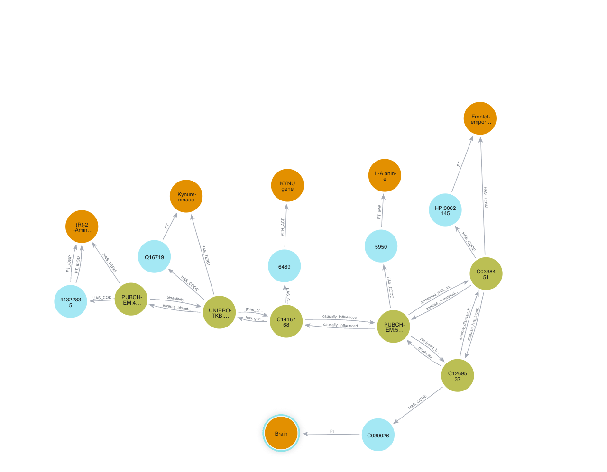


A table version of the same query:

```cypher
MATCH
(compound_concept:Concept)-[r1:bioactivity {SAB:"IDGP"}]->
(protein_concept:Concept)-[r2:gene_product_of {SAB:"UNIPROTKB"}]->
(gene_concept:Concept)-[r3:causally_influences {SAB:"MW"}]->
(metabolite_concept:Concept)-[r4:correlated_with_condition {SAB:"MW"}]->
(condition_concept:Concept)-[r6]->
(tissue_concept:Concept)<-[r5:produced_by {SAB:"MW"}]-
(metabolite_concept:Concept)

WITH *

MATCH
(compound_concept)-[:HAS_CODE]-(compound_code:Code {SAB:"PUBCHEM"})-[:PT_IDGP|PT_IDGD]-(compound:Term),
(protein_concept)-[:HAS_CODE]-(protein_code:Code {SAB:"UNIPROTKB"})-[:PT]-(protein:Term),
(gene_concept)-[:HAS_CODE]-(gene_code:Code {SAB:"HGNC"})-[:MTH_ACR]-(gene:Term),
(condition_concept)-[:HAS_CODE]-(condition_code:Code)-[:PT]-(condition:Term),
(metabolite_concept)-[:HAS_CODE]-(metabolite_code:Code {SAB:"PUBCHEM"})-[:PT_MW]-(metabolite:Term),
(tissue_concept)-[:HAS_CODE]-(tissue_code:Code)-[:PT]-(tissue:Term)

WHERE condition_code.SAB IN ["DOID", "MONDO", "HP"]

RETURN DISTINCT
  compound.name AS compound,
  protein.name AS protein,
  gene.name AS gene,
  metabolite.name AS metabolite,
  tissue.name AS tissue,
  condition.name AS condition

LIMIT 20;
```
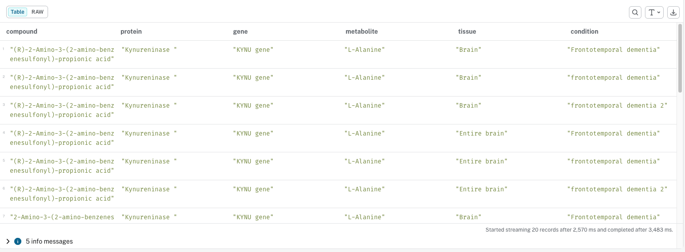


### Illuminating the Druggable Genome (IDG)

**Example 1a** —`IDGP` (IDG-protein) mapping between `PUBCHEM` and `UNIPROTKB`:

```cypher
MATCH (pubchem_code:Code {SAB:'PUBCHEM'})-[:HAS_CODE]-(pubchem_cui:Concept)-[:bioactivity {SAB:'IDGP'}]-(uniprot_cui:Concept)-[:HAS_CODE]-(uniprot_code:Code {SAB:"UNIPROTKB"})
RETURN * LIMIT 1
```
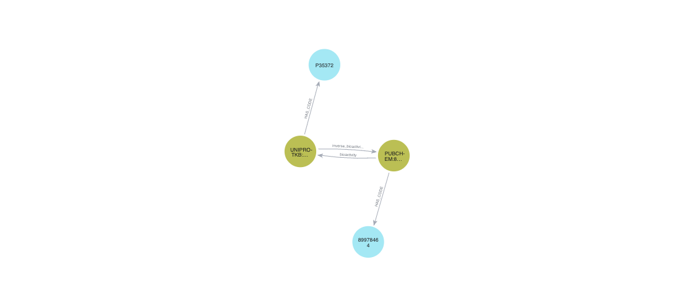

**Example 1b** —`IDGD` (IDG-disease) mapping between `PUBCHEM` and `SNOMEDCT_US`:

```cypher
MATCH (pubchem_code:Code {SAB:'PUBCHEM'})-[:HAS_CODE]-(pubchem_cui:Concept)-[:indication {SAB:'IDGD'}]-(snomed_cui:Concept)-[:HAS_CODE]-(snomed_code:Code {SAB:"SNOMEDCT_US"})
RETURN * LIMIT 1
```
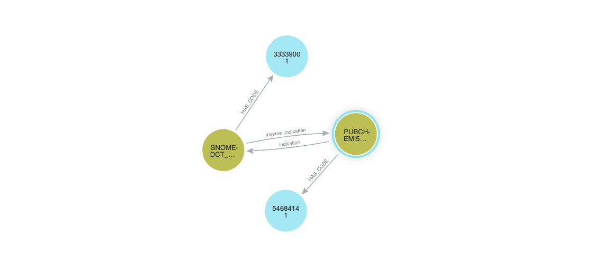


**Example 2a** — top 25% genes highly expressed in GTEx:

```cypher
MATCH p=(tissue_code:Code {SAB:"GTEXEXP"})<-[:HAS_CODE]-(tissue_concept:Concept)-[r:expressed_in {SAB:"GTEXEXP"}]-(gene_concept:Concept)-[:HAS_CODE]->(gene_code:Code{SAB:'HGNC'})
WITH gene_code.CodeID as genes, COUNT(tissue_code.CodeID) as tissue_count, toInteger(COUNT(p) * 0.25) as top25Percent
ORDER BY tissue_count DESC
RETURN genes, tissue_count LIMIT 10
```
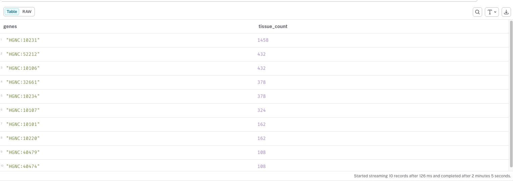

**Example 2b** — narrow to genes perturbed by a PubChem compound (LINCS + IDG-DrugCentral). 

```cypher
MATCH (tissue_concept:Concept)-[:HAS_CODE]->(tissue_code:Code {SAB:"GTEXEXP"})
MATCH (gene_concept:Concept)-[:HAS_CODE]->(gene_code:Code {SAB:'HGNC'})
MATCH (pubchem_concept:Concept)-[:HAS_CODE]->(pubchem_code:Code {SAB:'PUBCHEM'})
MATCH (protein_concept:Concept)-[:HAS_CODE]->(protein_code:Code {SAB:"UNIPROTKB"})
MATCH (tissue_concept)-[r1:expressed_in {SAB:"GTEXEXP"}]-(gene_concept)-[r2 {SAB:'LINCS'}]-(pubchem_concept)-[r3:bioactivity {SAB:'IDGP'}]-(protein_concept)
RETURN * LIMIT 5
```
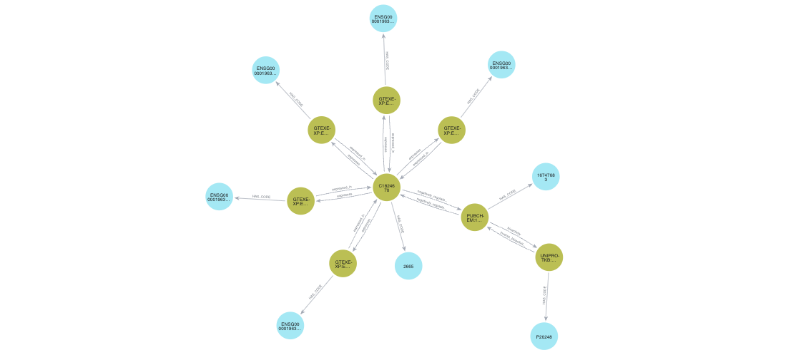

**Example 2c** — genes perturbed by LINCS compounds also linked to Parkinson's disease via the DrugCentral `indication`:

```cypher
MATCH (gene_concept:Concept)-[:HAS_CODE]->(gene_code:Code{SAB:'HGNC'})
MATCH (snomed_concept:Concept)-[:HAS_CODE]-(snomed_code:Code {SAB:'SNOMEDCT_US'})-[:PT]-(snomed_term:Term)
MATCH (pubchem_concept:Concept)-[:HAS_CODE]-(pubchem_code:Code {SAB:'PUBCHEM'})
MATCH (gene_concept)-[r1 {SAB:'LINCS'}]-(pubchem_concept)-[r2:indication {SAB:'IDGD'}]-(snomed_concept)
WHERE snomed_term.name="Parkinson's disease"
RETURN * LIMIT 5
```
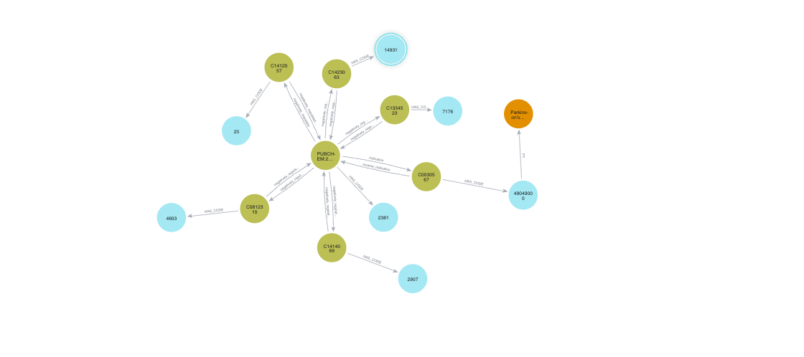

**Example 2d** — genes and compounds associated with "Congenital diaphragmatic hernia" *(SAB `HPO`→`HP`)*:

```cypher
WITH ['Congenital diaphragmatic hernia'] as birthDefects
MATCH (hpo_concept:Concept)-[:HAS_CODE]-(hpo_code:Code {SAB:'HP'})-[:PT]-(hpo_term:Term)
MATCH (gene_concept:Concept)-[:HAS_CODE]->(gene_code:Code{SAB:'HGNC'})
MATCH (pubchem_concept:Concept)-[:HAS_CODE]->(pubchem_code:Code {SAB:'PUBCHEM'})
MATCH gr=(hpo_concept)-[r1:associated_with]-(gene_concept)-[r2 {SAB:'LINCS'}]-(pubchem_concept)
WHERE hpo_term.name in birthDefects
RETURN *
LIMIT 10
```
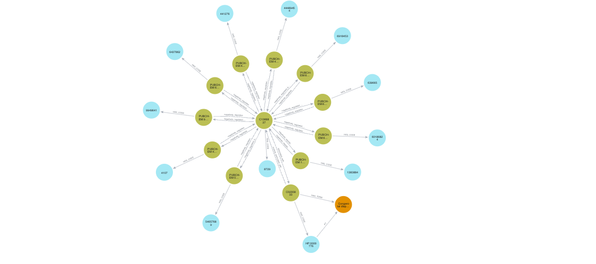

**Example 3a** — genes and compounds associated with "asthma" *(SAB `HPO`→`HP`)*:

```cypher
WITH ['Asthma'] as theDisease
MATCH (hpo_concept:Concept)-[:HAS_CODE]-(hpo_code:Code {SAB:'HP'})-[:PT]-(hpo_term:Term)
MATCH (gene_concept:Concept)-[:HAS_CODE]->(gene_code:Code{SAB:'HGNC'})
MATCH (pubchem_concept:Concept)-[:HAS_CODE]->(pubchem_code:Code {SAB:'PUBCHEM'})
MATCH gr=(hpo_concept)-[r1:associated_with]-(gene_concept)-[r2 {SAB:'LINCS'}]-(pubchem_concept)
WHERE hpo_term.name in theDisease
RETURN *
LIMIT 50
```
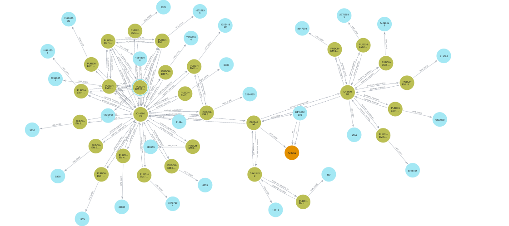

**Example 3b** — lipoxygenase isoforms (`ALOX*`) and compounds via `bioactivity`. *(Both `PREF_TERM` bindings became Code-mediated; the one whose Term sits on the left reverses to `(:Term)-[:PT]-(:Code)-[:HAS_CODE]-(:Concept)`.)*

```cypher
MATCH
(c_term:Term)-[:PT_IDGP|PT_IDGD|PT]-
(c_code:Code)-[:HAS_CODE]-
(c_concept:Concept)-[:bioactivity {SAB:'IDGP'}]-
(p_concept:Concept)-[:HAS_CODE]-
(p_code:Code {SAB:'UNIPROTKB'})-[p_term_rel:PT|PT_IDGP|SY]-
(p_term:Term)

WHERE
  p_term.name CONTAINS "ALOX"
  OR toLower(p_term.name) CONTAINS "lipoxygenase"

RETURN DISTINCT
  c_concept,
  p_concept
LIMIT 50;
```
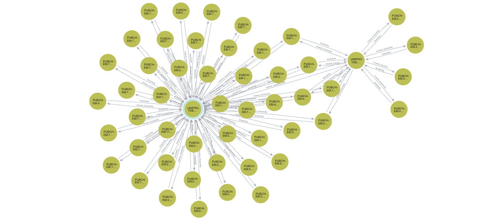

**Example 3c** — tissue types expressing ALOX5 (IDG + GTEx):

```cypher
MATCH
(uniprot_cui:Concept)-[:gene_product_of]->
(hgnc_cui:Concept)-[:HAS_CODE]->
(hgnc_code:Code {SAB:'HGNC'})-[:ACR]->
(:Term {name:'ALOX5'})

MATCH
(hgnc_cui)-[:expresses {SAB:'GTEXEXP'}]-
(gtexexp_cui:Concept)-[:HAS_CODE]->
(gtexexp_code:Code {SAB:'GTEXEXP'})

MATCH
(expbins_code:Code {SAB:'EXPBINS'})<-[:HAS_CODE]-
(expbins_cui:Concept)-[:has_expression {SAB:'GTEXEXP'}]-
(gtexexp_cui)

RETURN DISTINCT
  split(gtexexp_code.CodeID, "-12-")[1] AS tissue
LIMIT 50;
```
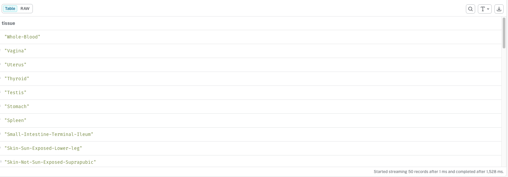


### MoTrPAC, LINCS and GTEx

Identifies `MOTRPAC` genes that are (1) affected by exercise, (2) expressed in matched human tissues in `GTEX`, and (3) matches or inverse matches of a `LINCS` perturbation signal.

```cypher
MATCH
(motrpac_code:Code {SAB:"MOTRPAC"})<-[:HAS_CODE]-
(motrpac_concept:Concept)-[r1:associated_with]->
(rat_gene_concept:Concept)-[r2:has_human_ortholog]->
(hgnc_concept:Concept)<-[r3 {SAB:"LINCS"}]-
(perturbagen_concept:Concept),

(motrpac_concept:Concept)-[r4:located_in]->
(tissue_concept_1:Concept)-[r5:part_of]-
(tissue_concept_2:Concept)-[r6:expresses {SAB:"GTEXEXP"}]->
(gtex_concept:Concept)-[r7:expressed_in {SAB:"GTEXEXP"}]-
(hgnc_concept:Concept),

(gtex_concept:Concept)-[r8:has_expression {SAB:"GTEXEXP"}]->
(expr_concept:Concept)-[:HAS_CODE]->
(expr_code:Code),

hgnc_path =
(hgnc_concept:Concept)-[:HAS_CODE]-(hgnc_code:Code {SAB:"HGNC"})-[:MTH_ACR]-(hgnc_term:Term),

perturbagen_path =
(perturbagen_concept:Concept)-[:HAS_CODE]-(perturbagen_code:Code)-[:SY|PT]-(perturbagen_term:Term),

tissue1_path =
(tissue_concept_1:Concept)-[:HAS_CODE]-(tissue_code_1:Code)-[:PT]-(tissue_term_1:Term),

tissue2_path =
(tissue_concept_2:Concept)-[:HAS_CODE]-(tissue_code_2:Code)-[:PT]-(tissue_term_2:Term),

rat_gene_path =
(rat_gene_concept:Concept)-[:HAS_CODE]->(rat_gene_code:Code)

WHERE perturbagen_code.SAB IN ["LINCS", "LNC", "MTHSPL", "PUBCHEM"]
  AND tissue_code_1.SAB IN ["SNOMEDCT_US", "UBERON", "FMA", "CHV"]
  AND tissue_code_2.SAB IN ["SNOMEDCT_US", "UBERON", "FMA", "CHV"]

RETURN
  motrpac_code,
  motrpac_concept,
  rat_gene_concept,
  hgnc_concept,
  perturbagen_concept,
  tissue_concept_1,
  tissue_concept_2,
  gtex_concept,
  expr_concept,
  expr_code,
  r1, r2, r3, r4, r5, r6, r7, r8,
  hgnc_path,
  perturbagen_path,
  tissue1_path,
  tissue2_path,
  rat_gene_path
LIMIT 1;
```
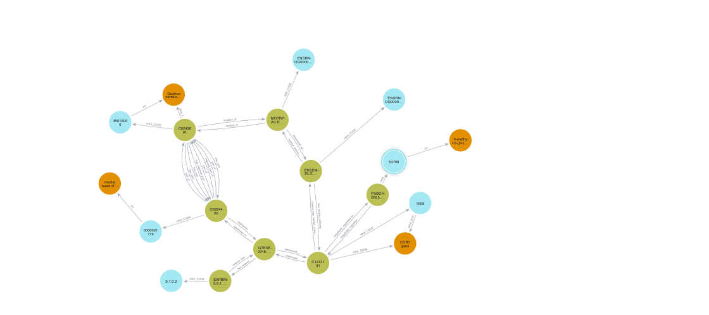

Table version:

```cypher
MATCH
(motrpac_code:Code {SAB:"MOTRPAC"})<-[:HAS_CODE]-
(motrpac_concept:Concept)-[r1:associated_with]->
(rat_gene_concept:Concept)-[r2:has_human_ortholog]->
(hgnc_concept:Concept)<-[r3 {SAB:"LINCS"}]-
(perturbagen_concept:Concept),

(motrpac_concept:Concept)-[r4:located_in]->
(tissue_concept_1:Concept)-[r5:part_of]-
(tissue_concept_2:Concept)-[r6:expresses {SAB:"GTEXEXP"}]->
(gtex_concept:Concept)-[r7:expressed_in {SAB:"GTEXEXP"}]-
(hgnc_concept:Concept),

(gtex_concept:Concept)-[r8:has_expression {SAB:"GTEXEXP"}]->
(expr_concept:Concept)-[:HAS_CODE]->
(expr_code:Code),

(hgnc_concept:Concept)-[:HAS_CODE]-
(hgnc_code:Code {SAB:"HGNC"})-[:MTH_ACR]-
(hgnc_term:Term),

(perturbagen_concept:Concept)-[:HAS_CODE]-
(perturbagen_code:Code)-[:SY|PT]-
(perturbagen_term:Term),

(tissue_concept_1:Concept)-[:HAS_CODE]-
(tissue_code_1:Code)-[:PT]-
(tissue_term_1:Term),

(tissue_concept_2:Concept)-[:HAS_CODE]-
(tissue_code_2:Code)-[:PT]-
(tissue_term_2:Term),

(rat_gene_concept:Concept)-[:HAS_CODE]->
(rat_gene_code:Code)

WHERE
  perturbagen_code.SAB IN ["LINCS", "LNC", "MTHSPL", "PUBCHEM"]
  AND tissue_code_1.SAB IN ["SNOMEDCT_US", "UBERON", "FMA", "CHV"]
  AND tissue_code_2.SAB IN ["SNOMEDCT_US", "UBERON", "FMA", "CHV"]

RETURN DISTINCT
  motrpac_code.CODE AS MoTrPac_DS,
  rat_gene_code.CODE AS rat_gene,
  hgnc_term.name AS human_gene,
  tissue_term_1.name AS tissue_MoTrPac,
  tissue_term_2.name AS tissue_GTEx,
  expr_code.CODE AS TPM,
  perturbagen_term.name AS perturbagen,
  type(r3) AS effect_direction

LIMIT 20;
```
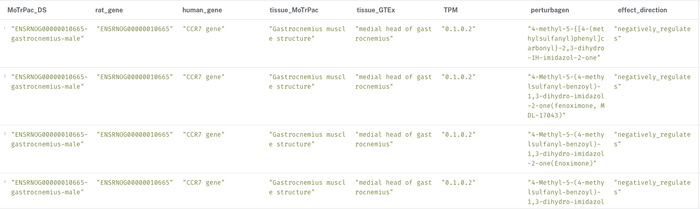


### GlyGen, KF and GTEx

Intersection of `GLYGEN`, `KF` and `GTEX`: retrieves glycoreactions and glycoenzymes (GLYCANS), then the associated genes, their expression (`GTEXEXP`) and variant count (`KFGENEBIN`).

```cypher
WITH "Myocardium of left ventricle" AS tissue_name

MATCH
(glycoreaction_code:Code)<-[:HAS_CODE]-
(glycoreaction_concept:Concept)-[r1:has_enzyme_protein {SAB:"GLYCANS"}]->
(glycoenzyme_concept:Concept)-[r2:gene_product_of]->
(gene_concept:Concept)-[r3]-
(bin_concept:Concept)-[:HAS_CODE]->
(bin_code:Code {SAB:"KFGENEBIN"}),

(tissue_concept:Concept)-[r4:expresses {SAB:"GTEXEXP"}]->
(gtexexp_concept:Concept)-[r5 {SAB:"GTEXEXP"}]->
(gene_concept:Concept),

(gtexexp_concept:Concept)-[r6:has_expression {SAB:"GTEXEXP"}]->
(exp_concept:Concept)-[:HAS_CODE]-
(exp_code:Code),

gene_path =
(gene_concept:Concept)-[:HAS_CODE]-
(gene_code:Code {SAB:"HGNC"})-[:MTH_ACR]-
(gene:Term),

glycoenzyme_path =
(glycoenzyme_concept:Concept)-[:HAS_CODE]-
(glycoenzyme_code:Code)-[:PT]-
(glycoenzyme:Term),

tissue_path =
(tissue_concept:Concept)-[:HAS_CODE]-
(tissue_code:Code)-[:PT]-
(tissue:Term {name:tissue_name})

RETURN *
LIMIT 1;
```
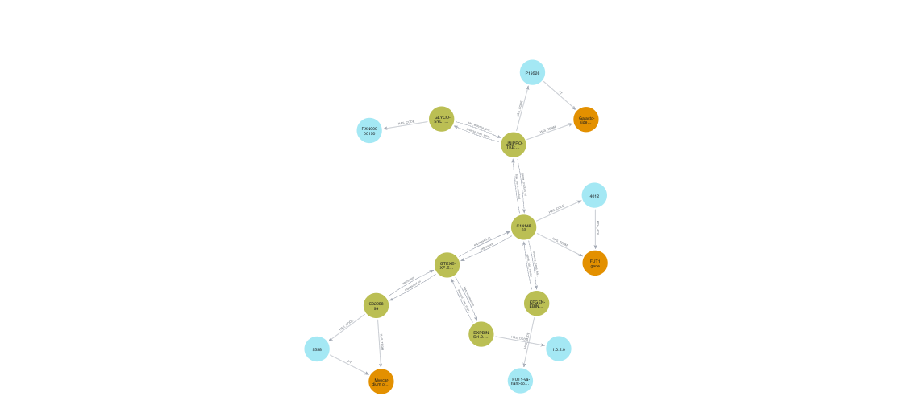

Table version:

```cypher
WITH "Myocardium of left ventricle" AS tissue_name

MATCH
(glycoreaction_code:Code)<-[:HAS_CODE]-
(glycoreaction_concept:Concept)-[r1:has_enzyme_protein {SAB:"GLYCANS"}]->
(glycoenzyme_concept:Concept)-[r2:gene_product_of]->
(gene_concept:Concept)-[r3]-
(bin_concept:Concept)-[:HAS_CODE]->
(bin_code:Code {SAB:"KFGENEBIN"}),

(tissue_concept:Concept)-[r4:expresses {SAB:"GTEXEXP"}]->
(gtexexp_concept:Concept)-[r5 {SAB:"GTEXEXP"}]->
(gene_concept:Concept),

(gtexexp_concept:Concept)-[r6:has_expression {SAB:"GTEXEXP"}]->
(exp_concept:Concept)-[:HAS_CODE]-
(exp_code:Code),

(gene_concept:Concept)-[:HAS_CODE]-
(gene_code:Code {SAB:"HGNC"})-[:MTH_ACR]-
(gene:Term),

(glycoenzyme_concept:Concept)-[:HAS_CODE]-
(:Code)-[:PT]-
(glycoenzyme:Term),

(tissue_concept:Concept)-[:HAS_CODE]-
(:Code)-[:PT]-
(tissue:Term {name:tissue_name})

RETURN DISTINCT
  gene.name AS gene,
  tissue.name AS tissue,
  glycoenzyme.name AS glycoenzyme,
  bin_code.value AS variant_count,
  exp_code.CODE AS liver_expression;
```
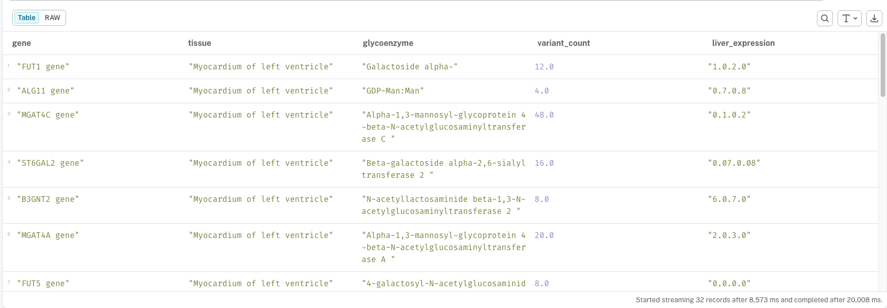

### ERCC — RBP

These queries identify RBPs predicted to be present in a target biofluid and the input genes whose coordinates overlap an eCLIP peak of those RBPs.

**Query1:**

```cypher
MATCH (a:Code {CodeID: 'UBERON:0001088'})
MATCH (b:Code) WHERE b.CodeID in ['ENSEMBL:ENSG00000221461', 'ENSEMBL:ENSG00000253190', 'ENSEMBL:ENSG00000231764', 'ENSEMBL:ENSG00000277027']
MATCH (c:Code) WHERE c.CodeID in ['UNIPROTKB:P05455', 'UNIPROTKB:Q12874', 'UNIPROTKB:Q9GZR7', 'UNIPROTKB:Q9HAV4', 'UNIPROTKB:Q2TB10']
MATCH (a)<-[:HAS_CODE]-(:Concept)<-[:predicted_in]-(p:Concept)-[:HAS_CODE]->(c)
MATCH (p)-[:molecularly_interacts_with]->(q:Concept)-[:overlaps]->(:Concept)-[:HAS_CODE]->(b)
MATCH (q)-[:HAS_CODE]->(r:Code)
RETURN DISTINCT c.CodeID AS RBP,r.CodeID AS RBS,b.CodeID AS Gene,a.CodeID AS Biosample;
```
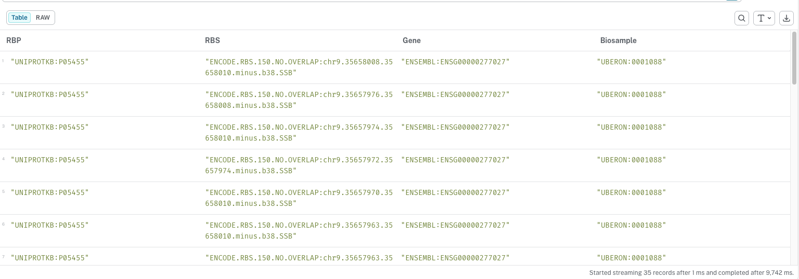

**Query2:** 

```cypher
MATCH (o1:Code {CodeID: 'UBERON:0001088'})

MATCH (o2:Code)
WHERE o2.CodeID IN [
  'ENSEMBL:ENSG00000221461',
  'ENSEMBL:ENSG00000253190',
  'ENSEMBL:ENSG00000231764',
  'ENSEMBL:ENSG00000277027'
]

MATCH (o3:Code)
WHERE o3.CodeID IN [
  'UNIPROTKB:P05455',
  'UNIPROTKB:Q12874',
  'UNIPROTKB:Q9GZR7',
  'UNIPROTKB:Q9HAV4',
  'UNIPROTKB:Q2TB10'
]

MATCH
(o1)<-[:HAS_CODE]-
(c1:Concept)<-[:predicted_in]-
(c3:Concept)-[:HAS_CODE]-
(o3)

MATCH
(c3)-[:molecularly_interacts_with]-
(c4:Concept)-[:overlaps]-
(c2:Concept)-[:HAS_CODE]->
(o2)

MATCH
(c4)-[:HAS_CODE]->
(o4:Code)

RETURN DISTINCT
  o1.CodeID AS Biosample,
  o2.CodeID AS Gene,
  o3.CodeID AS RBP,
  o4.CodeID AS RBS;
```
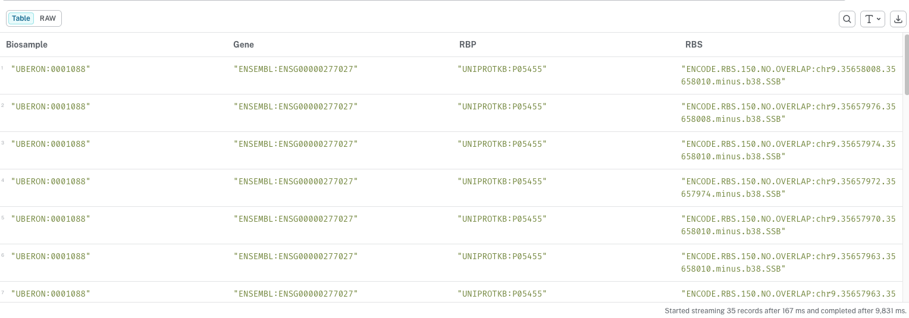

**Query3:** 

```cypher
MATCH (a:Code {CodeID: 'UBERON:0001088'})

MATCH (b:Code)
WHERE b.CodeID IN [
  'ENSEMBL:ENSG00000221461',
  'ENSEMBL:ENSG00000253190',
  'ENSEMBL:ENSG00000231764',
  'ENSEMBL:ENSG00000277027'
]

MATCH (c:Code)
WHERE c.CodeID IN [
  'UNIPROTKB:P05455',
  'UNIPROTKB:Q12874',
  'UNIPROTKB:Q9GZR7',
  'UNIPROTKB:Q9HAV4',
  'UNIPROTKB:Q2TB10'
]

MATCH
(a)<-[:HAS_CODE]-
(p:Concept)<-[:predicted_in]-
(q:Concept)-[:HAS_CODE]->
(c)

MATCH
(q)-[:molecularly_interacts_with]-
(r:Concept)-[:HAS_CODE]->
(s:Code)

MATCH
(p)<-[]-
(r)-[:overlaps]->
(:Concept)-[:HAS_CODE]->
(b)

RETURN DISTINCT
  c.CodeID AS RBP,
  s.CodeID AS RBS,
  b.CodeID AS Gene,
  a.CodeID AS Biosample;
```
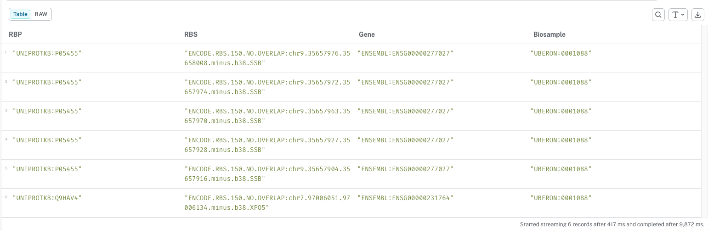

**Query4:** 

```cypher
MATCH (a:Code {CodeID: 'UBERON:0001088'})

MATCH (b:Code)
WHERE b.CodeID IN [
  'ENSEMBL:ENSG00000221461',
  'ENSEMBL:ENSG00000253190',
  'ENSEMBL:ENSG00000231764',
  'ENSEMBL:ENSG00000277027'
]

MATCH (c:Code)
WHERE c.CodeID IN [
  'UNIPROTKB:P05455',
  'UNIPROTKB:Q12874',
  'UNIPROTKB:Q9GZR7',
  'UNIPROTKB:Q9HAV4',
  'UNIPROTKB:Q2TB10'
]

MATCH
(a)<-[:HAS_CODE]-
(p:Concept)<-[:predicted_in]-
(q:Concept)-[:HAS_CODE]->
(c)

MATCH
(q)-[:molecularly_interacts_with]-
(r:Concept)-[:HAS_CODE]->
(s:Code)

MATCH
(p)<-[:correlated_in]-
(r)-[:overlaps]->
(:Concept)-[:HAS_CODE]->
(b)

RETURN DISTINCT
  c.CodeID AS RBP,
  s.CodeID AS RBS,
  b.CodeID AS Gene,
  a.CodeID AS Biosample;
```
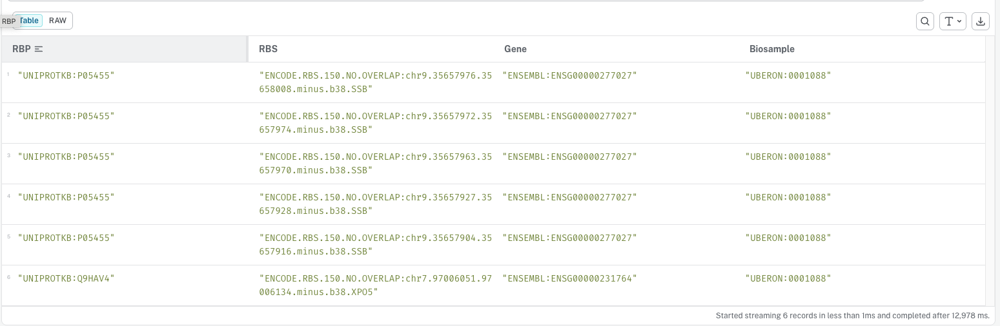

### ERCC — Regulatory Element

Retrieve regulatory elements active within an input tissue.

**Query1:**
```cypher
MATCH (a:Code {CodeID: 'UBERON:0002367'})
MATCH (a)<-[:HAS_CODE]-(p:Concept)-[:part_of]->(q:Concept)-[:HAS_CODE]->(:Code {SAB: 'ENCODE.CCRE.ACTIVITY'})
MATCH (q)<-[:part_of]-(r:Concept)-[:HAS_CODE]->(s:Code {SAB: 'ENCODE.CCRE'})
RETURN DISTINCT
  a.CodeID AS Tissue,
  s.CodeID AS cCRE
LIMIT 20;
```
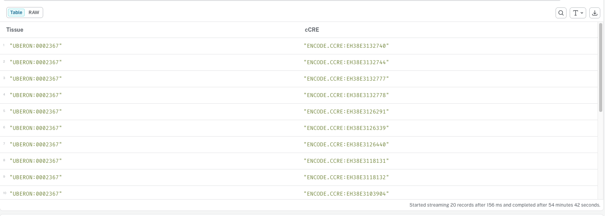


**Query2** — additionally require an active eQTL within the regulatory element:

```cypher
MATCH (a:Code {CodeID: 'UBERON:0002367'})
MATCH (a)<-[:HAS_CODE]-(p:Concept)-[:part_of]->(q:Concept)-[:HAS_CODE]->(:Code {SAB: 'ENCODE.CCRE.ACTIVITY'})
MATCH (q)<-[:part_of]-(r:Concept)<-[:located_in]-(:Concept)-[:part_of]->(:Concept)<-[:part_of]-(:Concept)-[:HAS_CODE]->(a)
MATCH (r)-[:HAS_CODE]->(s:Code {SAB: 'ENCODE.CCRE'})
RETURN DISTINCT
  a.CodeID AS Tissue,
  s.CodeID AS cCRE
LIMIT 20;
```

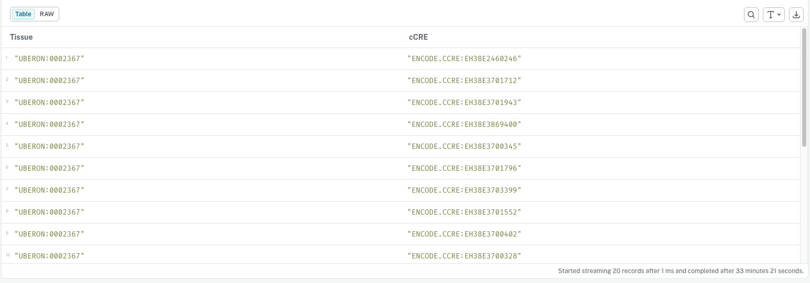


**Query3** — identify the class of a regulatory element (H3K27Ac / H3K4Me3 / CTCF):

```cypher
MATCH (a:Code {CodeID: 'UBERON:0002367'})
MATCH (b:Code {CodeID: 'ENCODE.CCRE:EH38E3881508'})

CALL {
  WITH b
  MATCH (b)<-[:HAS_CODE]-(:Concept)-[:part_of]->(p:Concept)
  RETURN DISTINCT p
}

MATCH (p)<-[:part_of]-(:Concept)-[:HAS_CODE]->(a)

MATCH (p)-[:isa]->(:Concept)-[:HAS_CODE]->(mark_code:Code)
WHERE mark_code.SAB IN [
  'ENCODE.CCRE.H3K27AC',
  'ENCODE.CCRE.H3K4ME3',
  'ENCODE.CCRE.CTCF'
]

WITH
  a,
  b,
  collect(DISTINCT CASE WHEN mark_code.SAB = 'ENCODE.CCRE.H3K27AC' THEN mark_code.CODE END) AS H3K27AC_values,
  collect(DISTINCT CASE WHEN mark_code.SAB = 'ENCODE.CCRE.H3K4ME3' THEN mark_code.CODE END) AS H3K4ME3_values,
  collect(DISTINCT CASE WHEN mark_code.SAB = 'ENCODE.CCRE.CTCF' THEN mark_code.CODE END) AS CTCF_values

RETURN
  a.CodeID AS Tissue,
  b.CodeID AS cCRE,
  [x IN H3K27AC_values WHERE x IS NOT NULL][0] AS H3K27AC,
  [x IN H3K4ME3_values WHERE x IS NOT NULL][0] AS H3K4ME3,
  [x IN CTCF_values WHERE x IS NOT NULL][0] AS CTCF;
```
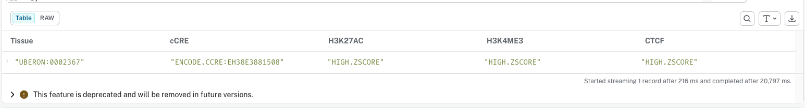

**Query4** — genes whose body lies within 10 kb of an input regulatory element:

```cypher
MATCH (a:Code {CodeID: 'ENCODE.CCRE:EH38E3881508'})
MATCH (a)<-[:HAS_CODE]-(:Concept)-[:part_of]->(:Concept)-[:regulates]->(:Concept)-[:HAS_CODE]->(p:Code {SAB: 'ENSEMBL'})
RETURN DISTINCT
  a.CodeID AS cCRE,
  p.CodeID AS Gene;
```
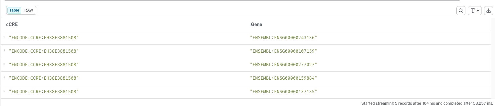


---

## Queries to reproduce the Data Dictionary figures

### 4D Nucleome (4DN)

Extracts the `4DN` loop anchor nodes in `HSCLO` (`r1`–`r4`), the donut q-value (`r5`), the file and dataset containing the loop (`r6`, `r7`), the cell type (`r8`) and assay type (`r9`).

```cypher
MATCH (loop_concept:Concept)-[r1:loop_us_start {SAB:'4DN'}]->(us_start_concept:Concept)-[:HAS_CODE]->(us_start_code:Code),
(loop_concept:Concept)-[r2:loop_us_end {SAB:'4DN'}]->(us_end_concept:Concept)-[:HAS_CODE]->(us_end_code:Code),
(loop_concept:Concept)-[r3:loop_ds_start {SAB:'4DN'}]->(ds_start_concept:Concept)-[:HAS_CODE]->(ds_start_code:Code),
(loop_concept:Concept)-[r4:loop_ds_end {SAB:'4DN'}]->(ds_end_concept:Concept)-[:HAS_CODE]->(ds_end_code:Code),
(loop_code:Code {SAB:'4DNL'})<-[:HAS_CODE]-(loop_concept:Concept)-[r5:loop_has_qvalue_bin {SAB:'4DN'}]->(qvalue_bin_concept:Concept)-[:HAS_CODE]->(qvalue_bin_code:Code {SAB:'4DNQ'}),
(file_code:Code {SAB:'4DNF'})<-[:HAS_CODE]-(file_concept:Concept)-[r6:file_has_loop {SAB:'4DN'}]->(loop_concept:Concept),
(dataset_code:Code {SAB:'4DND'})<-[:HAS_CODE]-(dataset_concept:Concept)-[r7:dataset_has_file {SAB:'4DN'}]->(file_concept:Concept),
(dataset_concept:Concept)-[r8:dataset_involves_cell_type {SAB:'4DN'}]->(cell_type_concept:Concept)-[:HAS_CODE]-(:Code)-[:PT]->(cell_type_term:Term),
(dataset_concept:Concept)-[r9:has_assay_type {SAB:'4DN'}]->(assay_type_concept:Concept)-[:HAS_CODE]-(:Code)-[:PT]->(assay_type_term:Term)
RETURN * LIMIT 1
```
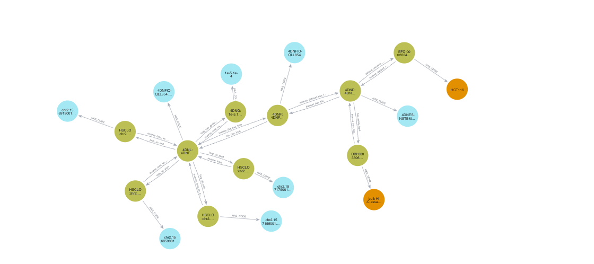

### Extracellular RNA Communication Program (ERCC)

#### RBP

Show the `ENCODE.RBS.150.NO.OVERLAP` node and its relationships to `ENSEMBL` and `UBERON` nodes.

```cypher
MATCH (a:Concept)-[:HAS_CODE]-(b:Code {SAB:'ENCODE.RBS.150.NO.OVERLAP'})
MATCH (a)-[:overlaps {SAB:'ERCCRBP'}]-(c:Concept)-[:HAS_CODE]-(c_code:Code {SAB:'ENSEMBL'})
MATCH (a)-[:correlated_in {SAB:'ERCCRBP'} ]-(d:Concept)-[:HAS_CODE]-(e:Code {SAB:'UBERON'})
MATCH (d)-[:predicted_in]-(f:Concept)-[:molecularly_interacts_with]-(g:Concept)
MATCH (g)-[:overlaps]-(c)
RETURN * LIMIT 1
```
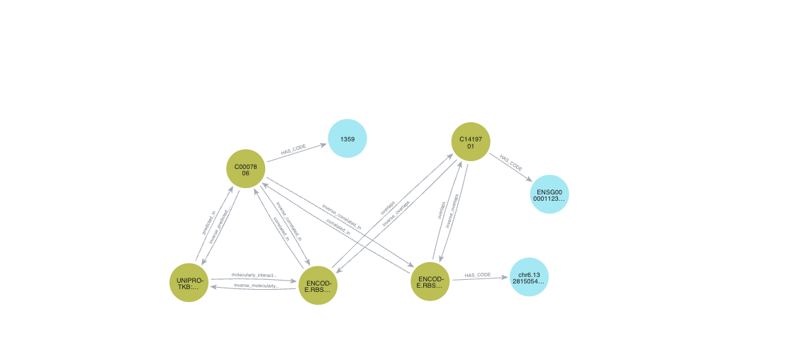


#### Regulatory Element

Show the central `ENCODE.CCRE.ACTIVITY` node and its relationships to the rest of the `ENCODE.*` nodes, plus `ENSEMBL`, `UBERON` and `GTEXEQTL`.

```cypher
MATCH (a:Concept)-[:HAS_CODE]-(b:Code {SAB:'ENCODE.CCRE.ACTIVITY'})
MATCH (a)-[:part_of {SAB:'ERCCREG'}]-(c:Concept)-[:HAS_CODE]-(c_code:Code {SAB:'ENCODE.CCRE'})
MATCH (a)-[:regulates {SAB:'ERCCREG'} ]-(d:Concept)-[:HAS_CODE]-(e:Code {SAB:'ENSEMBL'})
MATCH (a)-[:isa]-(f:Concept)-[:HAS_CODE]-(g:Code {SAB:'ENCODE.CCRE.H3K4ME3'})
MATCH (a)-[:isa]-(h:Concept)-[:HAS_CODE]-(i:Code {SAB:'ENCODE.CCRE.H3K27AC'})
MATCH (a)-[:isa]-(j:Concept)-[:HAS_CODE]-(k:Code {SAB:'ENCODE.CCRE.CTCF'})
MATCH (a)-[:part_of]-(l:Concept)-[:HAS_CODE]-(m:Code {SAB:'UBERON'})
MATCH (c)-[:location_of]-(n:Concept)-[:HAS_CODE]-(o:Code {SAB:'CLINGEN.ALLELE.REGISTRY'})
MATCH (d)-[:positively_regulates]-(p:Concept)-[:HAS_CODE]-(q:Code {SAB:'GTEXEQTL'})
RETURN * LIMIT 1
```
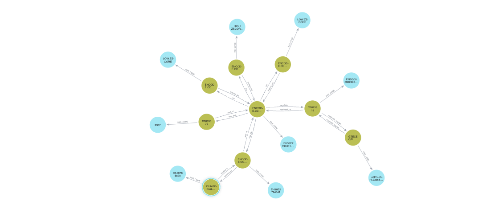

### GlyGen

PROTEOFORM view — glycans (`GLYTOUCAN`) and the glycoprotein complex (protein, isoform, site, amino acid, evidence). *(Note `PROTEOFORM_PT` → `PT_PROTEOFORM`.)*

```cypher
MATCH (glycan_code:Code {SAB:'GLYTOUCAN'})<-[:HAS_CODE]-(glycan_concept:Concept)<-[r1:has_saccharide {SAB:'PROTEOFORM'}]-(site_concept:Concept)-[:HAS_CODE]->(site_code:Code {SAB:'GLYCOSYLATION.SITE'}),
(site_concept:Concept)-[r2:location {SAB:'PROTEOFORM'}]->(location_concept:Concept)-[:HAS_CODE]->(location_code:Code {SAB:'GLYGEN.LOCATION'})-[:PT_PROTEOFORM]->(location_term:Term),
(location_concept:Concept)-[r3:has_amino_acid {SAB:'PROTEOFORM'}]->(amino_acid_concept:Concept)-[:HAS_CODE]->(amino_acid_code:Code {SAB:'AMINO.ACID'}),
(site_concept:Concept)<-[r4:glycosylated_at {SAB:'PROTEOFORM'}]-(glycoprotein_concept:Concept)-[:HAS_CODE]->(glycoprotein_code:Code {SAB:'GLYCOPROTEIN'}),
(glycoprotein_concept:Concept)-[r5:sequence {SAB:'PROTEOFORM'}]->(isoform_concept:Concept)-[:HAS_CODE]->(isoform_code:Code {SAB:'UNIPROTKB.ISOFORM'}),
(isoform_concept:Concept)<-[r6:has_isoform {SAB:'PROTEOFORM'}]->(protein_concept:Concept)-[:HAS_CODE]->(protein_code:Code {SAB:'UNIPROTKB'}),
(glycoprotein_concept:Concept)-[r7:has_evidence {SAB:'PROTEOFORM'}]->(evidence_concept:Concept)-[:HAS_CODE]->(evidence_code:Code {SAB:'GLYCOPROTEIN.EVIDENCE'})
RETURN * LIMIT 1
```
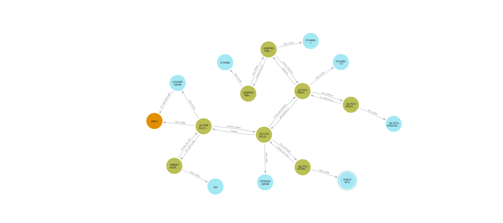


GLYCANS view — glycans and associated residues, motifs, glycoreactions, glycoenzymes, glycosequences and source. 

```cypher
MATCH
(glycan_code:Code {SAB:'GLYTOUCAN'})<-[:HAS_CODE]-
(glycan_concept:Concept)-[r1:synthesized_by {SAB:'GLYCANS'}]->
(glycosylation_concept:Concept)-[:HAS_CODE]->
(glycosylation_code:Code {SAB:'GLYCOSYLTRANSFERASE.REACTION'}),

(glycan_concept)-[r2:has_canonical_residue {SAB:'GLYCANS'}]->
(residue_concept:Concept)-[:HAS_CODE]->
(residue_code:Code {SAB:'GLYGEN.RESIDUE'}),

(glycan_concept)-[r3:has_motif {SAB:'GLYCANS'}]->
(motif_concept:Concept)-[:HAS_CODE]->
(motif_code:Code {SAB:'GLYCAN.MOTIF'}),

(glycan_concept)-[r4:has_glycosequence {SAB:'GLYCANS'}]->
(glycosequence_concept:Concept)-[:HAS_CODE]->
(glycosequence_code:Code {SAB:'GLYGEN.GLYCOSEQUENCE'}),

(residue_concept)-[r5:attached_by {SAB:'GLYCANS'}]->
(reaction_concept:Concept)-[:HAS_CODE]->
(reaction_code:Code {SAB:'GLYGEN.GLYCOSYLATION'}),

(reaction_concept)-[r6:has_enzyme_protein {SAB:'GLYCANS'}]->
(glycoenzyme_concept:Concept)-[:HAS_CODE]->
(glycoenzyme_code:Code {SAB:'UNIPROTKB'}),

(glycan_concept)-[r7:is_from_source {SAB:'GLYCANS'}]->
(source_concept:Concept)-[:HAS_CODE]->
(source_code:Code {SAB:'GLYGEN.SRC'})

RETURN *
LIMIT 1;
```
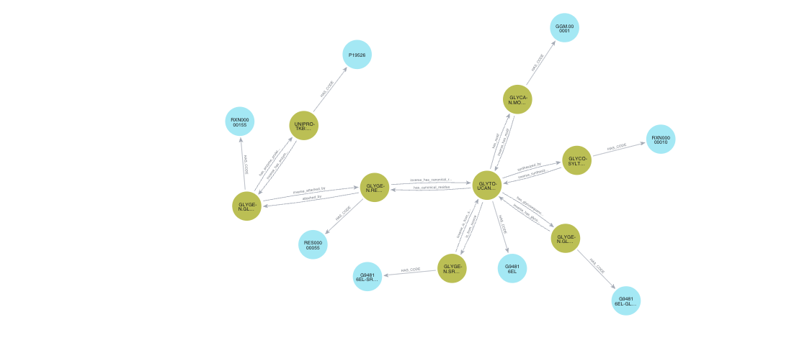


### Genotype Tissue Expression (GTEx)

`GTEXEXP` node linked to `HGNC`, `UBERON` and `EXPBINS` (median TPM):

```cypher
MATCH (gtex_cui:Concept)-[r0:HAS_CODE]-(gtex_exp_code:Code {SAB:'GTEXEXP'})
MATCH (gtex_cui)-[r1:expressed_in]-(hgnc_concept:Concept)-[r2:HAS_CODE]-(hgnc_code:Code {SAB:'HGNC'})
MATCH (gtex_cui)-[r3:expressed_in]-(ub_concept:Concept)-[r4:HAS_CODE]-(ub_code:Code {SAB:'UBERON'})
MATCH (gtex_cui)-[r5:has_expression]-(expbin_concept:Concept)-[r6:HAS_CODE]-(expbin_code:Code {SAB:'EXPBINS'})
RETURN * LIMIT 1
```
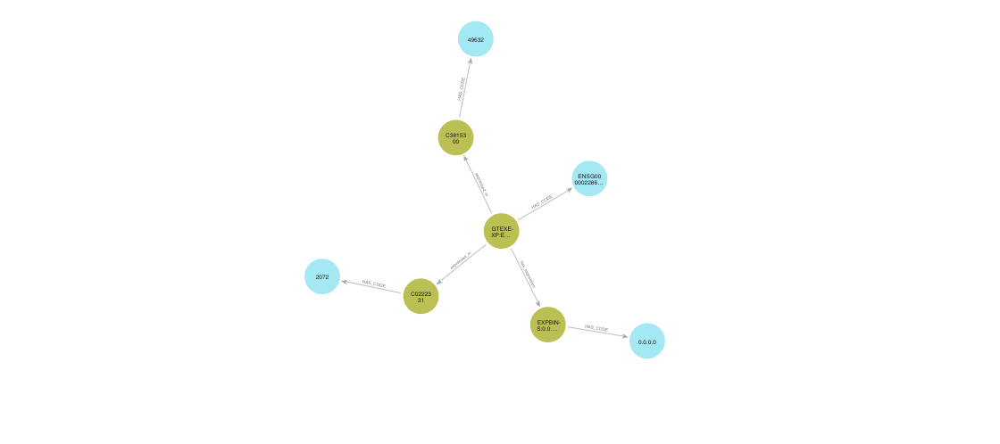


`GTEXEQTL` node linked to `HGNC`, `UBERON` and `PVALUEBINS` (eQTL p-value):

```cypher
MATCH (gtex_cui:Concept)-[r0:HAS_CODE]-(gtex_exp_code:Code {SAB:'GTEXEQTL'})
MATCH (gtex_cui)-[r1]-(hgnc_concept:Concept)-[r2:HAS_CODE]-(hgnc_code:Code {SAB:'HGNC'})
MATCH (gtex_cui)-[r3:located_in]-(ub_concept:Concept)-[r4:HAS_CODE]-(ub_code:Code {SAB:'UBERON'})
MATCH (gtex_cui)-[r5:p_value]-(pvalbin_concept:Concept)-[r6:HAS_CODE]-(pvalbin_code:Code {SAB:'PVALUEBINS'} )
RETURN * LIMIT 1
```
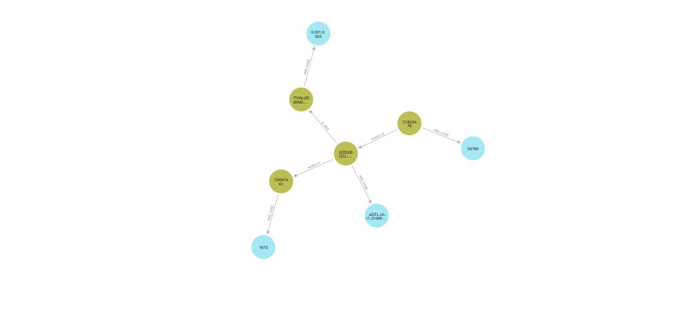


### The Human BioMolecular Atlas Program (HuBMAP)

Genes associated with HuBMAP Azimuth (node SAB `AZ`, edge SAB `HMAZ`) clusters.

```cypher
MATCH
(azimuth_term:Term)-[:PT]-
(azimuth_code:Code {SAB:"AZ"})-[:HAS_CODE]-
(azimuth_concept:Concept)-[r1 {SAB:"HMAZ"}]->
(gene_concept:Concept)-[:HAS_CODE]-
(gene_code:Code {SAB:"HGNC"})

WHERE type(r1) IN [
  "has_marker_gene_in_kidney",
  "has_marker_gene_in_liver",
  "has_marker_gene_in_heart"
]

MATCH
(azimuth_concept)-[:isa|inverse_isa]-
(az_annotation_concept:Concept)-[:HAS_CODE]-
(az_annotation_code:Code {SAB:"AZ"})-[:PT]-
(az_annotation_term:Term)

RETURN *
LIMIT 1;
```
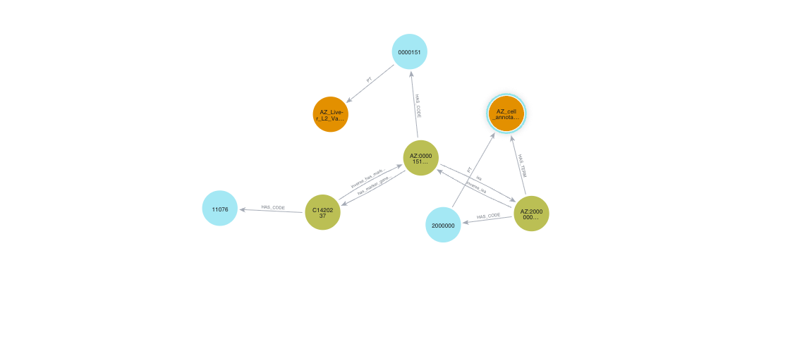


### Gabriella Miller Kids First (GMKF)

`belongs_to_cohort` between a `KFPT` patient, a `KFCOHORT`, and the `KFGENEBIN` node *(SAB `HPO`→`HP`)*:

```cypher
MATCH (kf_pt_code:Code {SAB:'KFPT'})-[r0:HAS_CODE]-(kf_pt_cui)-[r1:belongs_to_cohort]-(kf_cohort_cui:Concept)-[r2:HAS_CODE]-(kf_cohort_code:Code {SAB:'KFCOHORT'})
MATCH (kf_pt_cui)-[r3:has_phenotype]-(hpo_cui)-[r4:HAS_CODE]-(hpo_code:Code {SAB:'HP'})
MATCH (kf_cohort_cui)-[r5:belongs_to_cohort]-(kfgenebin_cui)-[r6:HAS_CODE]-(kfgenebin_code:Code {SAB:'KFGENEBIN'})
MATCH (kfgenebin_cui)-[r7:gene_has_variants]-(hgnc_cui:Concept)-[r8:HAS_CODE]-(hgnc_code:Code {SAB:'HGNC'})
RETURN * LIMIT 1
```
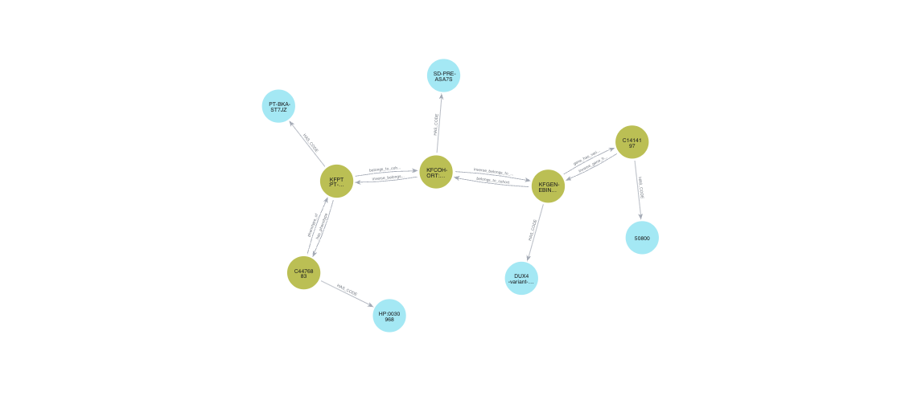

### The Library of Integrated Network-Based Cellular Signatures (LINCS)

`LINCS` mapping of `HGNC`→`PUBCHEM`, then a second compound `in_similarity_relationship_with` the first. *(Original source had a `{SAB:'LINS'}` typo; corrected to `'LINCS'`.)*

```cypher
MATCH (hgnc_cui:Concept)-[:HAS_CODE]->(hgnc_code:Code {SAB:'HGNC'})-[]->(hgnc_term:Term)
MATCH (hgnc_cui)-[:positively_regulated_by {SAB:'LINCS'}]-(pubchem_cui_1:Concept)-[:HAS_CODE]-(pubchem_code_1:Code {SAB:'PUBCHEM'})
MATCH (pubchem_cui_1:Concept)-[:in_similarity_relationship_with {SAB:'LINCS'}]-(pubchem_cui_2:Concept)-[:HAS_CODE]-(pubchem_code_2:Code {SAB:'PUBCHEM'})
RETURN * LIMIT 1
```
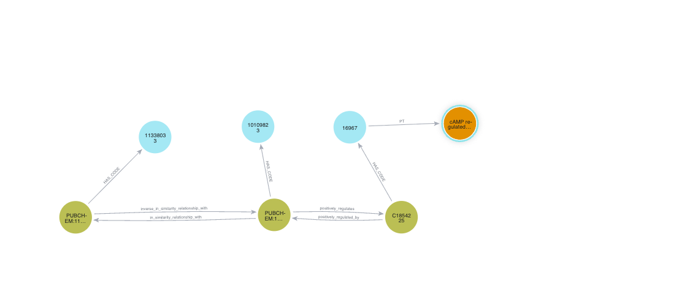

### The Molecular Transducers of Physical Activity Consortium (MoTrPAC)

`MOTRPAC` node and its links to the `ENSEMBL` rat node and the `PATO` sex node. *(`RO`→`ro`; the trailing `PREF_TERM` became Code-mediated.)*

```cypher
MATCH
(mp_cui:Concept)-[:HAS_CODE]-
(mp_code:Code {SAB:'MOTRPAC'})
WHERE mp_code.CODE CONTAINS 'liver'

MATCH
(mp_cui)-[:associated_with {SAB:'MOTRPAC'}]-
(ensRat_cui:Concept)-[:HAS_CODE]-
(ensRat_code:Code {SAB:'ENSEMBL'})

MATCH
(ensRat_cui)-[:has_human_ortholog]-
(ensHum_cui:Concept)-[:HAS_CODE]-
(ensHum_code:Code {SAB:'ENSEMBL'})

MATCH
(ensHum_cui)-[:ro]-
(hgnc_cui:Concept)-[:HAS_CODE]-
(hgnc_code:Code {SAB:'HGNC'})-[:ACR]-
(hgnc_term:Term)

MATCH
(mp_cui)-[:sex {SAB:'MOTRPAC'}]->
(pato_cui:Concept)-[:HAS_CODE]-
(pato_code:Code {SAB:'PATO'})-[:PT_PATO_BASE]-
(pato_term:Term)

RETURN *
LIMIT 1;
```
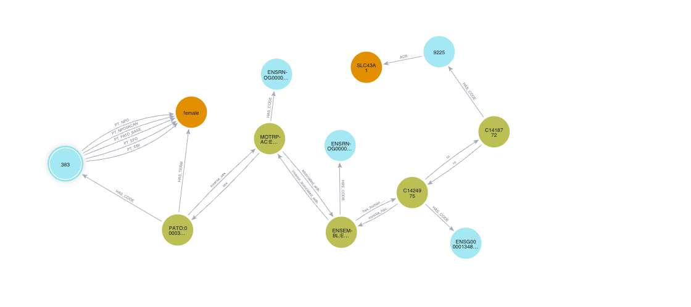

### Metabolomics Workbench (MW)

`HGNC`→`PUBCHEM` via `causally_influences`, with metabolite–condition–tissue correlations:

```cypher
MATCH (gene_code:Code {SAB:"HGNC"})<-[:HAS_CODE]-(gene_concept:Concept)-[r1:causally_influences {SAB:"MW"}]->(metabolite_concept:Concept)-[r2:correlated_with_condition {SAB:"MW"}]->(condition_concept:Concept)-[]->(tissue_concept:Concept)<-[r3:produced_by {SAB:"MW"}]-(metabolite_concept:Concept)
RETURN * LIMIT 1
```
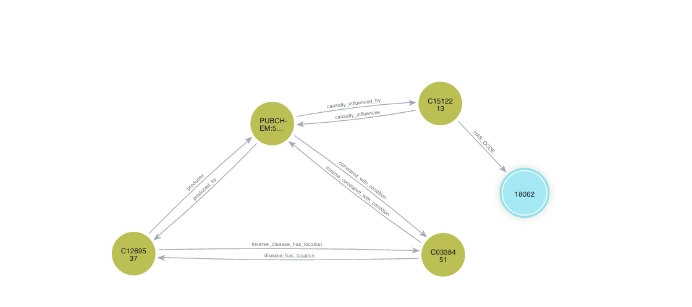

### Stimulating Peripheral Activity to Relieve Conditions (SPARC)

An `ILX` node and its relationship to a `UBERON` node.

```cypher
MATCH (ub_term:Term)-[a:PT]-(uberon_code:Code)-[b:HAS_CODE]-(ub_cui:Concept)-[c:isa {SAB:'NPO'}]-(ilx_cui:Concept)-[d:HAS_CODE]-(ilx_code:Code {SAB:'ILX'})-[e:PT_NPOSKCAN]-(ilx_term:Term)
RETURN * LIMIT 1
```


---

## Tips and Tricks

- Some queries use one `MATCH` per line; others use a single `MATCH` with comma-separated patterns. Both produce identical query plans — they are just two styles.

- To speed a query up, start from the smaller dataset or a single node. Matching the gene of interest **first**, then expanding to phenotypes, is much faster than the reverse:

```cypher
MATCH (hgnc_code:Code {CODE:'7881'})
MATCH (hgnc_code)-[:HAS_CODE]-(hgnc_cui)-[r]-(hpo_cui:Concept)-[:HAS_CODE]-(hpo_code:Code {SAB:'HP'})
RETURN DISTINCT hgnc_code.CodeID, hpo_code.CodeID
```
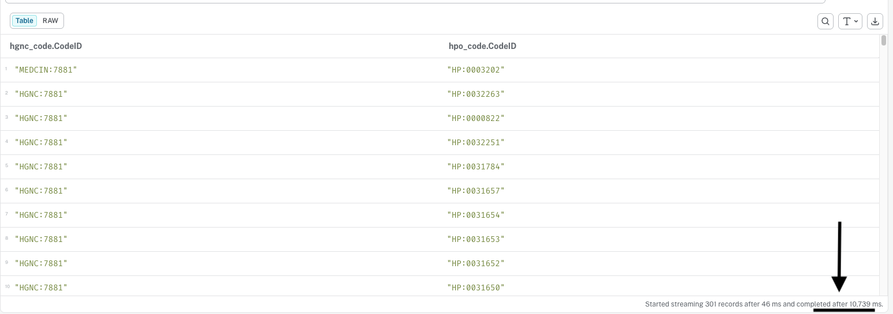


…versus matching the `HP` dataset first (same result, ~20× slower):

```cypher
MATCH (hpo_cui)-[:HAS_CODE]-(hpo_code:Code {SAB:'HP'})
MATCH (hpo_cui)-[r]-(hgnc_cui)-[:HAS_CODE]-(hgnc_code:Code {CODE:'7881'})
RETURN DISTINCT hgnc_code.CodeID, hpo_code.CodeID
```
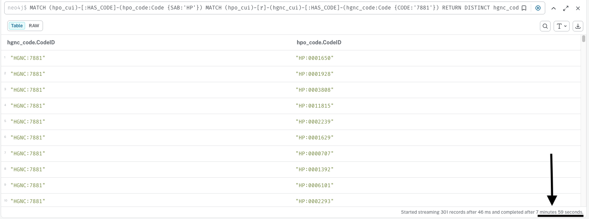

The speed-up grows with the size of the dataset (e.g. `GTEX`, `ERCC`). Note also that Neo4j caches query plans, so repeated identical runs are misleadingly fast when benchmarking.


