# CFDE Data Distillery Data Dictionary

## Introduction

The Data Distillery project aims to integrate summarized ("distilled") Common Fund data within a knowledge graph. The purpose of the Data Distillery Knowledge Graph (DDKG) is to link multiple sources of expertly curated data, thus providing data integration across multiple Common Fund data coordinating centers (DCCs). The summarized data are provided by participating DCCs and funded as part of the Common Fund Data Ecosystem (CFDE) project. The DDKG schema is based on the Unified Biomedical Knowledge Graph (UBKG) which originates from the Unifield Medical Language System (UMLS). The UBKG supports the DDKG with over 180 different ontologies and standards supporting the Common Fund data that either are native to UMLS or were explicitly added to support biomolecular data (see Figure 1). The DDKG can be used to create simple to complex queries, and use the results for a range of different applications related to the use of Common Fund data. We include some use cases with example queries and results in the [Data Distillery User Guide](https://github.com/nih-cfde/data-distillery/blob/main/CFDE_DataDistillery_UserGuide.md).

For the first phase of the project, the participating DCCs have submitted 29 different datasets for integration into the DDKG This document is focused on outlining these 29 datasets within the DDKG, and describing the schema and information on each dataset.

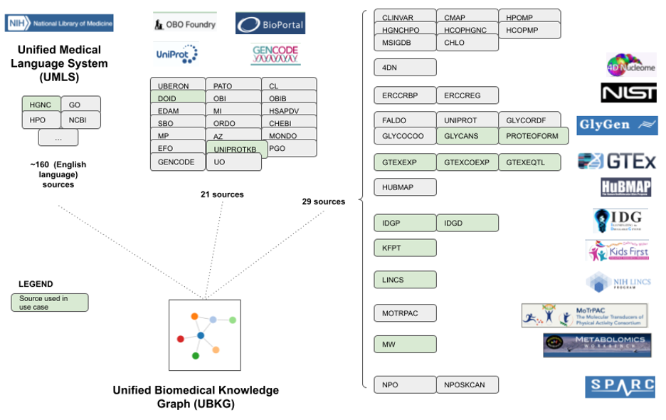

## Base Datasets

Information on the base set of ontologies included in the Data Distillery Knowledge Graph can be found in [the documentation for the Unified Biomedical Knowledge Graph (UBKG)](https://ubkg.docs.xconsortia.org/contexts/#ubkg-base-context-umls-plus), upon which the Data Distillery is built. See Figure 1 for a general schematic.

## DCC Datasets

### 4D Nucleome (4DN) DCC

#### 4DN datasets

|                                                  |                                                                                                                                                                                                                                                                                                                                                                                                                                                                                                                                                                                                                                                                                                                                                                                                                                                                                                                                                                                                                                                                                                                                                                                                                                                                                                                                                                                                                                                                                                                                                                                                                                                                                                                                                                                                                                                                               |
|--------------------------------------------------|-------------------------------------------------------------------------------------------------------------------------------------------------------------------------------------------------------------------------------------------------------------------------------------------------------------------------------------------------------------------------------------------------------------------------------------------------------------------------------------------------------------------------------------------------------------------------------------------------------------------------------------------------------------------------------------------------------------------------------------------------------------------------------------------------------------------------------------------------------------------------------------------------------------------------------------------------------------------------------------------------------------------------------------------------------------------------------------------------------------------------------------------------------------------------------------------------------------------------------------------------------------------------------------------------------------------------------------------------------------------------------------------------------------------------------------------------------------------------------------------------------------------------------------------------------------------------------------------------------------------------------------------------------------------------------------------------------------------------------------------------------------------------------------------------------------------------------------------------------------------------------|
| Dataset SAB(s)                                   | 4DNQ, 4DNL, 4DNF, 4DND                                                                                                                                                                                                                                                                                                                                                                                                                                                                                                                                                                                                                                                                                                                                                                                                                                                                                                                                                                                                                                                                                                                                                                                                                                                                                                                                                                                                                                                                                                                                                                                                                                                                                                                                                                                                                                                           |
| DCC Website                                      | data.4dnucleome.org                                                                                                                                                                                                                                                                                                                                                                                                                                                                                                                                                                                                                                                                                                                                                                                                                                                                                                                                                                                                                                                                                                                                                                                                                                                                                                                                                                                                                                                                                                                                                                                                                                                                                                                                                                                                                                                           |
| DCC                                              | 4DN-DCIC                                                                                                                                                                                                                                                                                                                                                                                                                                                                                                                                                                                                                                                                                                                                                                                                                                                                                                                                                                                                                                                                                                                                                                                                                                                                                                                                                                                                                                                                                                                                                                                                                                                                                                                                                                                                                                                                      |
| Authority                                        | Andy Schroeder (PM) Harvard Medical School, Boston                                                                                                                                                                                                                                                                                                                                                                                                                                                                                                                                                                                                                                                                                                                                                                                                                                                                                                                                                                                                                                                                                                                                                                                                                                                                                                                                                                                                                                                                                                                                                                                                                                                                                                                                                                                                                            |
| Source Information                               | Chromatin loops called from Hi-C experiments performed in select cell lines.                                                                                                                                                                                                                                                                                                                                                                                                                                                                                                                                                                                                                                                                                                                                                                                                                                                                                                                                                                                                                                                                                                                                                                                                                                                                                                                                                                                                                                                                                                                                                                                                                                                                                                                                                                                                  |
| Purpose                                          | Representing topologically associated domains and loops by chromosomal location can allow exploration of gene expression, genomic variation and other biological information in the context of chromatin architecture.                                                                                                                                                                                                                                                                                                                                                                                                                                                                                                                                                                                                                                                                                                                                                                                                                                                                                                                                                                                                                                                                                                                                                                                                                                                                                                                                                                                                                                                                                                                                                                                                                                                        |
| Description                                      | Hi-C chromatin capture assays generate information on regions of the genome that can be located far apart along the linear sequence of DNA but are in close physical proximity in nuclear chromatin. Architectural features of the chromatin including topologically associated domains (TADs), loops and dots can be generated by algorithms from the results of Hi-C experiments. Loop calls from several 4DNucleome Hi-C datasets generated from select cell lines and tissues are provided to the data distillery for ingestion. A subset of loop calls were generated by two different 4DN research labs on datasets from the H1-ESC human ES cell line, H1 differentiated to endoderm and HFFc6, a human foreskin derived cell line. Loop calls from the Dekker lab were generated using the cooltools re-implementation of HICCUPS as described in Oksuz et al. 2021 <https://pubmed.ncbi.nlm.nih.gov/34480151/.> Loop calls from the Cremins lab were generated as described in Emerson et al. 2022 <https://pubmed.ncbi.nlm.nih.gov/35676475/.> Additional calls from the Cremins lab generated and part of the data from the Emerson paper from the HCT116 colorectal cancer cell line with or without depletion of WAPL or RAD21, genes that encode protein important for chromatin architecture are also provided. In addition, the 4DN-DCIC generated loop calls on 4 additional datasets, in situ Hi-C performed on H1-ESC or GM12878 cell lines, 4DNESFSCP5L8 and 4DNES3JX38V5, respectively and DNase-Hi-C in fetal heart tissue (4DNESZFHB53P) or RUES2 stem cells differentiated to cardiomyocytes (4DNESGTHHJAC). These loop calls from the 25 kb resolution matrices of these datasets were further filtered for those loops that overlapped expressed genes identified from gene expression data from the same or comparable cells and tissues. |
| Summarization of Methodology                     | [This document](https://docs.google.com/spreadsheets/d/1dj51N-MYRQ_CYPPDp_zAX0thJcfXcsFBDi_jxYAcRq0/edit?usp=sharing) indicates the datasets and files used as input to the 4DN distilled data. For the genome-wide loop calls from the Dekker and Cremins groups the indicated files were the direct input into the summarization process. For the 4DN-DCIC loop calls the mcool files indicated were used to call loops and further summarized utilizing expression data to provide a file of loops that overlap expressed genes as described in [this document](https://docs.google.com/document/d/1GeTbwshqr2HD1JIb8z33Z_3nspTVTJdyRoUmQl6o9Xo/edit?usp=sharing). Provided loop files were further prepared for ingestion by first creating dataset nodes (SAB: '**4DND**') with the respective terms containing the dataset information (assay type, lab and cell type involved), file nodes (SAB: '**4DNF**') with the respective terms containing the file information, loop nodes (SAB: '**4DNL**') attached to HSCLO nodes at 1kpb resolution level corresponding to upstream start and end and downstream start and end nodes of the characteristic anchor of the loop and q-value nodes (SAB: '**4DNQ**') corresponding to donut q-value of the loops. The mentioned nodes are then used to create concept nodes with connections depicted in the schematic below.                                                                                                                                                                                                                                                                                                                                                                                                                                                                                              |
| Summarization of Methodology Code Repository URL | <https://github.com/TaylorResearchLab/CFDE_DataDistillery/tree/main/DCC_workflows/4DN>                                                                                                                                                                                                                                                                                                                                                                                                                                                                                                                                                                                                                                                                                                                                                                                                                                                                                                                                                                                                                                                                                                                                                                                                                                                                                                                                                                                                                                                                                                                                                                                                                                                                                                                                                                                        |
| Total Nodes                                      | 216,212                                                                                                                                                                                                                                                                                                                                                                                                                                                                                                                                                                                                                                                                                                                                                                                                                                                                                                                                                                                                                                                                                                                                                                                                                                                                                                                                                                                                                                                                                                                                                                                                                                                                                                                                                                                                                                                                       |
| Total Edges                                      | 1,294,980                                                                                                                                                                                                                                                                                                                                                                                                                                                                                                                                                                                                                                                                                                                                                                                                                                                                                                                                                                                                                                                                                                                                                                                                                                                                                                                                                                                                                                                                                                                                                                                                                                                                                                                                                                                                                                                                     |

##### 4DN Schema Diagram

##### 4DN Node Counts

| **SAB** | **Count** |
|---------|-----------|
| 4DND    | 12        |
| 4DNF    | 12        |
| 4DNL    | 215,822   |
| 4DNQ    | 354       |

##### 4DN Edge Counts

| **Subject SAB** | **Predicate**              | **Object SAB** | **Count** |
|-----------------|----------------------------|----------------|-----------|
| 4DND            | has_assay_type             | EFO            | 12        |
| 4DND            | has_assay_type             | OBI            | 12        |
| 4DND            | dataset_involved_cell_type | EFO            | 11        |
| 4DND            | dataset_involved_cell_type | UBERON         | 1         |
| 4DND            | dataset_has_file           | 4DNF           | 12        |
| 4DNF            | file_has_loop              | 4DNL           | 215,822   |
| 4DNL            | loop_has_qvalue_bin        | 4DNQ           | 215,822   |
| 4DNL            | loop_us_start              | HSCLO          | 215,822   |
| 4DNL            | loop_us_end                | HSCLO          | 215,822   |
| 4DNL            | loop_ds_start              | HSCLO          | 215,822   |
| 4DNL            | loop_ds_end                | HSCLO          | 215,822   |

### Extracellular RNA Communication Program (ERCC) DCC

#### ERCC RBP dataset

|                                                  |                                                                                                                                                                                                                                                                                                                                                         |
|--------------------------------------------------|---------------------------------------------------------------------------------------------------------------------------------------------------------------------------------------------------------------------------------------------------------------------------------------------------------------------------------------------------------|
| Dataset SAB(s)                                   | ENSEMBL, UBERON, UNIPROTKB, ENCODE.RBS.150.NO.OVERLAP, ENCODE.RBS.HepG2, ENCODE.RBS.HepG2.K562, ENCODE.RBS.K562                                                                                                                                                                                                                                         |
| DCC Website                                      | [https://exrna.org/](https://exrna.org)                                                                                                                                                                                                                                                                                                                 |
| DCC                                              | Extracellular RNA Communication Consortium (ERCC)                                                                                                                                                                                                                                                                                                       |
| Authority                                        | Aleksandar Milosavljevic                                                                                                                                                                                                                                                                                                                                |
| Source Information                               | The genomic coordinates of eCLIP peaks of 150 RNA binding proteins (RBPs) were taken from eCLIP-seq analysis results published by the ENCODE project. Control extracellular RNA (exRNA) sequencing profiles available through the exRNA Atlas were used to draw several relationships.                                                                  |
| Purpose                                          | To help identify minimally invasive biomarkers of disease.                                                                                                                                                                                                                                                                                              |
| Description                                      | Assertions describe relationships between RBPs, RBP binding sites, genes, and biofluids. RBP binding sites refers to both eCLIP peaks and a second type of genomic locus. The group is the result of trimming the eCLIP loci so that there are no overlaps between sets of loci from a given pair of RBPs.                                              |
| Summarization of Methodology                     | Relationships between RBPs and biofluids, and between eCLIP loci and biofluids are the result of a correlation-based analysis. This analysis was performed using the coverage of trimmed eCLIP loci within control exRNA profiles made available through the exRNA Atlas. This analysis is described in detail by LaPlante et al., Cell Genomics, 2023. |
| Summarization of Methodology Code Repository URL | <https://github.com/TaylorResearchLab/CFDE_DataDistillery/blob/main/DCC_workflows/ERCC/check_ERCC_submissions.ipynb>                                                                                                                                                                                                                                    |
| Total Nodes                                      | 1,169,178                                                                                                                                                                                                                                                                                                                                               |
| Total Edges                                      | 2,431,786                                                                                                                                                                                                                                                                                                                                               |
| Source Data DOI(s)                               | <https://doi.org/10.1038/nmeth.3810>                                                                                                                                                                                                                                                                                                                    |
| Source Data URL(s)                               | <https://www.encodeproject.org/encore-matrix/?type=Experiment&status=released&internal_tags=ENCORE>                                                                                                                                                                                                                                                     |

##### ERCC RBP Schema Diagram

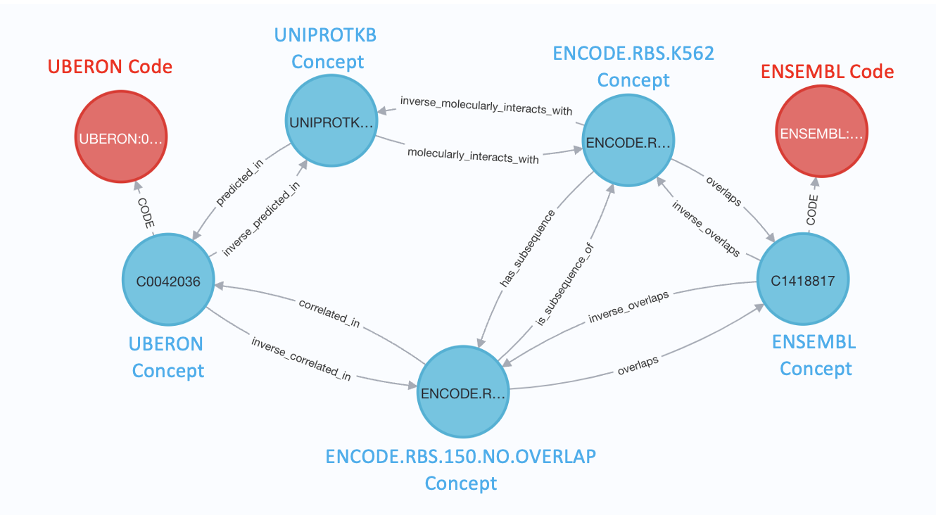

##### ERCC RBP Node Counts

| **SAB**                   | **Count** |
|---------------------------|-----------|
| UBERON                    | 5         |
| UNIPROTKB                 | 150       |
| ENSEMBL                   | 15,807    |
| ENCODE.RBS.150.NO.OVERLAP | 462,297   |
| ENCODE.RBS.K562           | 304,175   |
| ENCODE.RBS.HepG2          | 335,238   |
| ENCODE.RBS.HepG2.K562     | 51,506    |

##### ERCC RBP Edge Counts

| **Subject SAB**           | **Predicate**              | **Object SAB**        | **Count** |
|---------------------------|----------------------------|-----------------------|-----------|
| ENCODE.RBS.150.NO.OVERLAP | overlaps                   | ENSEMBL               | 500,660   |
| ENCODE.RBS.HepG2          | overlaps                   | ENSEMBL               | 265,453   |
| UNIPROTKB                 | molecularly_interacts_with | ENCODE.RBS.HepG2      | 335,238   |
| ENCODE.RBS.K562           | overlaps                   | ENSEMBL               | 333,141   |
| UNIPROTKB                 | molecularly_interacts_with | ENCODE.RBS.K562       | 304,175   |
| ENCODE.RBS.150.NO.OVERLAP | is_subsequence_of          | ENCODE.RBS.HepG2      | 225,437   |
| ENCODE.RBS.150.NO.OVERLAP | is_subsequence_of          | ENCODE.RBS.K562       | 192,320   |
| ENCODE.RBS.HepG2.K562     | overlaps                   | ENSEMBL               | 56,565    |
| UNIPROTKB                 | molecularly_interacts_with | ENCODE.RBS.HepG2.K562 | 51,506    |
| ENCODE.RBS.150.NO.OVERLAP | is_subsequence_of          | ENCODE.RBS.HepG2.K562 | 44,713    |
| ENCODE.RBS.150.NO.OVERLAP | correlated_in              | UBERON                | 22,092    |
| UNIPROTKB                 | predicted_in               | UBERON                | 268       |
| UNIPROTKB                 | not_predicted_in           | UBERON                | 116       |
| ENCODE.RBS.150.NO.OVERLAP | not_correlated_in          | UBERON                | 102       |

#### ERCC Regulatory Element dataset

|                                                  |                                                                                                                                                                                                                                                                                                                                                                                                                                                                                                                                                                                                                                                                                                                                                                                                                                                                                                                                                                                                                                                                                                                                                                                                              |
|--------------------------------------------------|--------------------------------------------------------------------------------------------------------------------------------------------------------------------------------------------------------------------------------------------------------------------------------------------------------------------------------------------------------------------------------------------------------------------------------------------------------------------------------------------------------------------------------------------------------------------------------------------------------------------------------------------------------------------------------------------------------------------------------------------------------------------------------------------------------------------------------------------------------------------------------------------------------------------------------------------------------------------------------------------------------------------------------------------------------------------------------------------------------------------------------------------------------------------------------------------------------------|
| Dataset SAB(s)                                   | CLINGEN.ALLELE.REGISTRY, ENSEMBL, GTEXEQTL, UBERON, ENCODE.CCRE, ENCODE.CCRE.ACTIVITY, ENCODE.CCRE.CTCF, ENCODE.CCRE.H3K27AC, ENCODE.CCRE.H3K4ME3 (node SABs) **ERCCREG, ERCCRBP** (edge SABs)                                                                                                                                                                                                                                                                                                                                                                                                                                                                                                                                                                                                                                                                                                                                                                                                                                                                                                                                                                                                                                                                                                                                                                             |
| DCC Website                                      | [https://exrna.org/](https://exrna.org)                                                                                                                                                                                                                                                                                                                                                                                                                                                                                                                                                                                                                                                                                                                                                                                                                                                                                                                                                                                                                                                                                                                                                                      |
| DCC                                              | Extracellular RNA Communication Consortium (ERCC)                                                                                                                                                                                                                                                                                                                                                                                                                                                                                                                                                                                                                                                                                                                                                                                                                                                                                                                                                                                                                                                                                                                                                            |
| Authority                                        | Aleksandar Milosavljevic                                                                                                                                                                                                                                                                                                                                                                                                                                                                                                                                                                                                                                                                                                                                                                                                                                                                                                                                                                                                                                                                                                                                                                                     |
| Source Information                               | The results of CHIP-seq experiments conducted by the ENCODE project were used to identify regulatory elements active within specific tissues and their transcriptional role. Similarly, we used data published by the GTEx project to identify eQTLs active within specific tissues.                                                                                                                                                                                                                                                                                                                                                                                                                                                                                                                                                                                                                                                                                                                                                                                                                                                                                                                         |
| Purpose                                          | To identify regulatory elements active within a specific tissue which are also supported by having an active eQTL within the range of its genomic coordinates.                                                                                                                                                                                                                                                                                                                                                                                                                                                                                                                                                                                                                                                                                                                                                                                                                                                                                                                                                                                                                                               |
| Description                                      | The tissue specific regulation of a gene by an eQTL is modeled using variant, tissue, eQTL, and gene nodes. The same model structure is also used for regulatory elements. In this case a "regulatory element activity" (SAB=**ENCODE.CCRE.ACTIVITY**) node is used as the central node rather than the eQTL node. Regulatory element activity nodes are also decorated with relationships to other nodes to assist in determining the tissue specific transcriptional role of the regulatory element. eQTL and regulatory element models are connected by a relationship between variant and regulatory element nodes.                                                                                                                                                                                                                                                                                                                                                                                                                                                                                                                                                                                      |
| Summarization of Methodology                     | To summarize regulatory element data, ENCODE biosamples were grouped by their respective tissue or cell line ontology code. These groups were then further grouped by the number of samples within each biosample group. Next, within the DNase Z-score data matrix provided by ENCODE, for each larger group and each regulatory element, the number of z-scores that were above 1.64 were counted within samples of each biosample (or small) group. This process was used to build a reference distribution of counts specific to a biosample group with a specific number of members. Regulatory elements were then classified as active within a specific tissue or cell type if the count of z-scores greater than 1.64 within ENCODE biosamples belonging to that group was above the median value of the reference distribution. Only regulatory elements classified as active in at least one tissue or cell type are included. The process described above was repeated for the H3K4me3, H3K27Ac, and CTCF z-score data matrices to decorate regulatory element activity nodes with relationships to other nodes to help the user identify the transcriptional role of each regulatory element. |
| Summarization of Methodology Code Repository URL | <https://github.com/TaylorResearchLab/CFDE_DataDistillery/blob/main/DCC_workflows/ERCC/check_ERCC_submissions.ipynb>                                                                                                                                                                                                                                                                                                                                                                                                                                                                                                                                                                                                                                                                                                                                                                                                                                                                                                                                                                                                                                                                                         |
| Total Nodes                                      | 2,918,828                                                                                                                                                                                                                                                                                                                                                                                                                                                                                                                                                                                                                                                                                                                                                                                                                                                                                                                                                                                                                                                                                                                                                                                                    |
| Total Edges                                      | 14,897,093                                                                                                                                                                                                                                                                                                                                                                                                                                                                                                                                                                                                                                                                                                                                                                                                                                                                                                                                                                                                                                                                                                                                                                                                   |
| Source Data DOI(s)                               | <https://doi.org/10.1038/s41586-020-2493-4>                                                                                                                                                                                                                                                                                                                                                                                                                                                                                                                                                                                                                                                                                                                                                                                                                                                                                                                                                                                                                                                                                                                                                                  |
| Source Data URL(s)                               | <https://screen.wenglab.org/> <https://www.gtexportal.org/home/>                                                                                                                                                                                                                                                                                                                                                                                                                                                                                                                                                                                                                                                                                                                                                                                                                                                                                                                                                                                                                                                                                                                                                                           |

##### ERCC Regulatory Element Schema Diagram

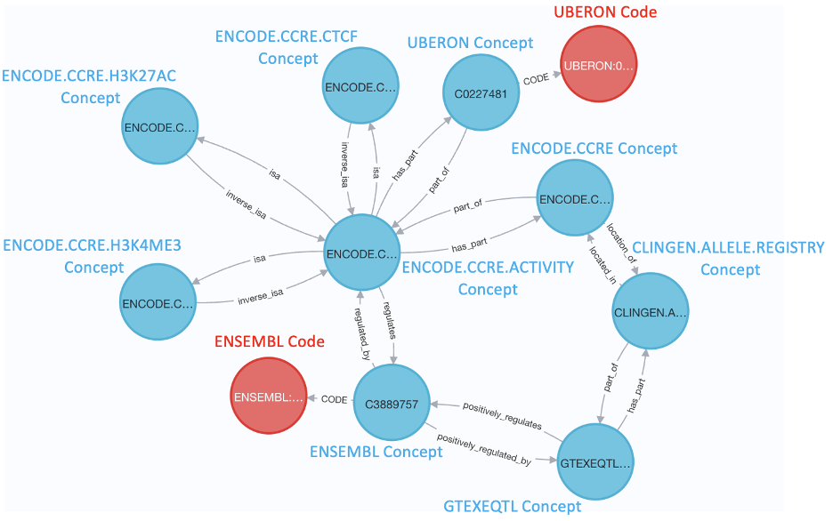

##### ERCC Regulatory Element Node Counts

| **SAB**                 | **Count** |
|-------------------------|-----------|
| UBERON                  | 34        |
| ENSEMBL                 | 49,987    |
| GTEXEQTL                | 265,965   |
| ENCODE.CCRE.ACTIVITY    | 2,196,935 |
| ENCODE.CCRE             | 342,850   |
| CLINGEN.ALLELE.REGISTRY | 63,051    |
| ENCODE.CCRE.H3K4ME3     | 2         |
| ENCODE.CCRE.CTCF        | 2         |
| ENCODE.CCRE.H3K27AC     | 2         |

##### ERCC Regulatory Element Edge Counts

| **Subject SAB**         | **Predicate**        | **Object SAB**       | **Count** |
|-------------------------|----------------------|----------------------|-----------|
| ENCODE.CCRE.ACTIVITY    | regulates            | ENSEMBL              | 4,804,247 |
| ENCODE.CCRE             | part_of              | ENCODE.CCRE.ACTIVITY | 2,196,935 |
| UBERON                  | part_of              | ENCODE.CCRE.ACTIVITY | 2,196,935 |
| ENCODE.CCRE.ACTIVITY    | isa                  | ENCODE.CCRE.H3K4ME3  | 1,712,682 |
| ENCODE.CCRE.ACTIVITY    | isa                  | ENCODE.CCRE.H3K27AC  | 1,570,234 |
| ENCODE.CCRE.ACTIVITY    | isa                  | ENCODE.CCRE.CTCF     | 1,510,150 |
| CLINGEN.ALLELE.REGISTRY | part_of              | GTEXEQTL             | 265,965   |
| UBERON                  | part_of              | GTEXEQTL             | 265,965   |
| GTEXEQTL                | negatively_regulates | ENSEMBL              | 156,836   |
| GTEXEQTL                | positively_regulates | ENSEMBL              | 154,093   |
| CLINGEN.ALLELE.REGISTRY | located_in           | ENCODE.CCRE          | 63,051    |

### GlyGen DCC

#### GlyGen datasets

|                                                  |                                                                                                                                                                                                                                                                                                                                                                                                                                                                                                                                                                                                                                                                                                                                                                                                                                                                                                                                                                                                                                                                                                                                                                                                                                                                                                                                 |
|--------------------------------------------------|---------------------------------------------------------------------------------------------------------------------------------------------------------------------------------------------------------------------------------------------------------------------------------------------------------------------------------------------------------------------------------------------------------------------------------------------------------------------------------------------------------------------------------------------------------------------------------------------------------------------------------------------------------------------------------------------------------------------------------------------------------------------------------------------------------------------------------------------------------------------------------------------------------------------------------------------------------------------------------------------------------------------------------------------------------------------------------------------------------------------------------------------------------------------------------------------------------------------------------------------------------------------------------------------------------------------------------|
| Dataset SAB(s)                                   | FALDO, GLYCOCOO,GLYCORDF, UNIPROTKB, PROTEOFORM, GLACANS                                                                                                                                                                                                                                                                                                                                                                                                                                                                                                                                                                                                                                                                                                                                                                                                                                                                                                                                                                                                                                                                                                                                                                                                                                                                        |
| DCC Website                                      | <https://www.glygen.org/>                                                                                                                                                                                                                                                                                                                                                                                                                                                                                                                                                                                                                                                                                                                                                                                                                                                                                                                                                                                                                                                                                                                                                                                                                                                                                                       |
| DCC                                              | GlyGen                                                                                                                                                                                                                                                                                                                                                                                                                                                                                                                                                                                                                                                                                                                                                                                                                                                                                                                                                                                                                                                                                                                                                                                                                                                                                                                          |
| Authority                                        | Raja Mazumder (PI) George Washington University; Mike Tiemeyer (PI) University of Georgia                                                                                                                                                                                                                                                                                                                                                                                                                                                                                                                                                                                                                                                                                                                                                                                                                                                                                                                                                                                                                                                                                                                                                                                                                                       |
| Source Information                               | Data for GlyGen is retrieved from multiple glycomics database (e.g. GlyTouCan, GlyConnect, MatrixDB), proteomics database (e.g. UniProtKB) and other domain database (e.g. Ensembl, RefSeq, BioMuta, OMA, MGI, Bgee). All data is transformed in standardized representation and integrate in GlyGen                                                                                                                                                                                                                                                                                                                                                                                                                                                                                                                                                                                                                                                                                                                                                                                                                                                                                                                                                                                                                            |
| Purpose                                          | Provide computational and informatics resources and tools for glycosciences research. Integrate data and knowledge from diverse disciplines relevant to glycobiology. Address needs inside and outside the glycoscience community.                                                                                                                                                                                                                                                                                                                                                                                                                                                                                                                                                                                                                                                                                                                                                                                                                                                                                                                                                                                                                                                                                              |
| Description                                      | GlyGen is a data integration and dissemination project for carbohydrate and glycoconjugate related data. GlyGen retrieves information from multiple international data sources and integrates and harmonizes this data. This web portal allows exploring this data and performing unique searches that cannot be executed in any of the integrated databases alone.                                                                                                                                                                                                                                                                                                                                                                                                                                                                                                                                                                                                                                                                                                                                                                                                                                                                                                                                                             |
| Summarization of Methodology                     | The data ingested for the KnowledgeGraph are from ontologies associated with glycan and proteoform domain. Select nodes and edges for glycans are retrieved from GlyCoCoo and GlyCoRDF. ontologies that describe the properties of glycans. The assertion data received from GlyGen in n-triples format (glycan.nt and proteoform.nt) were imported into the No4j environment using the n10s plug-in functions. Once the data was imported for each of the glycans and proteoform datasets, subgraphs were created. Finally, the resulting graph nodes and edges were exported as .csv files using APOC plug-in procedures.The resulting nodes and edges were reformatted by curating the relationship names and adding SABs for all entities (either by using existing SABs e.g. **UNIPROTKB** and **GLYTOUCAN** or creating custom SABs such as **GLYGEN.MOTIF** or **GLYCOPROTEIN**) and saved as the OWLNETS_node_metadata.tsv and OWLNETS_edgelist.tsv for ingestion. More information on FALDO can be found here: <https://bioportal.bioontology.org/ontologies/FALDO>. More information on GlycoRDF can be found here: <https://github.com/glycoinfo/GlycoRDF>. More information on GlycoCoO can be found here: <https://github.com/glycoinfo/GlycoCoO>. |
| Summarization of Methodology Code Repository URL | <https://github.com/TaylorResearchLab/CFDE_DataDistillery/blob/main/DCC_workflows/GLYGEN/GlyGen_workfolw.md>                                                                                                                                                                                                                                                                                                                                                                                                                                                                                                                                                                                                                                                                                                                                                                                                                                                                                                                                                                                                                                                                                                                                                                                                                    |
| Total Nodes                                      | 241,770 (PROTEOFORM) 182,269 (GLYCANS)                                                                                                                                                                                                                                                                                                                                                                                                                                                                                                                                                                                                                                                                                                                                                                                                                                                                                                                                                                                                                                                                                                                                                                                                                                                                                   |
| Total Edges                                      | 455,469 (PROTEOFORM) 464,659 (GLYCANS)                                                                                                                                                                                                                                                                                                                                                                                                                                                                                                                                                                                                                                                                                                                                                                                                                                                                                                                                                                                                                                                                                                                                                                                                                                                                                   |
| Source Data URL(s)                               | Download from <https://sparql.glygen.org/> Data file: <https://sparql.glygen.org/ln2triplestoredata/triples.tar.gz>                                                                                                                                                                                                                                                                                                                                                                                                                                                                                                                                                                                                                                                                                                                                                                                                                                                                                                                                                                                                                                                                                                                                                                                                          |

##### GlyGen Schema Diagram

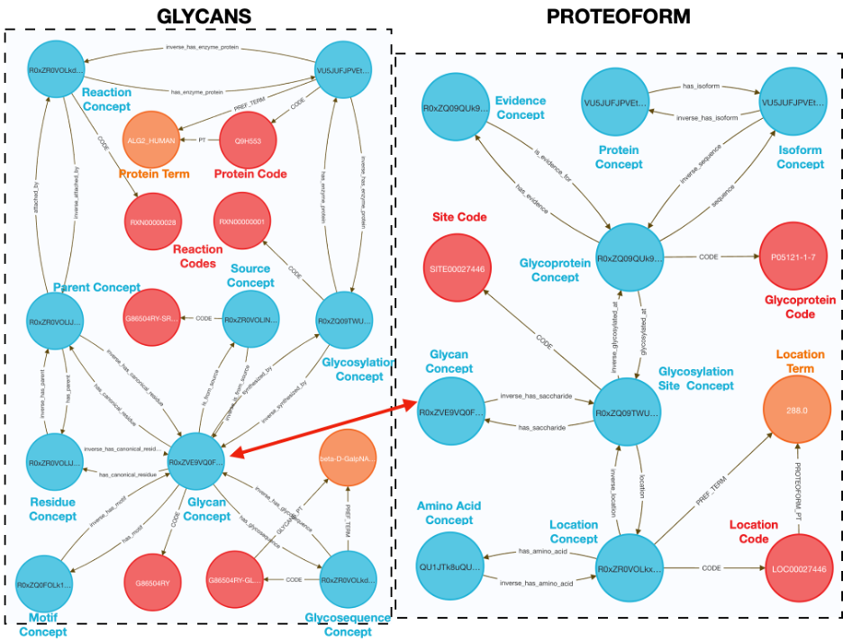

##### GlyGen FALDO Node Counts

| **SAB** | **Count** |
|---------|-----------|
| FALDO   | 16        |

##### GlyGen FALDO Edge Counts

| **Subject SAB** | **Predicate** | **Object SAB** | **Count** |
|-----------------|---------------|----------------|-----------|
| FALDO           | isa           | FALDO          | 13        |
| FALDO           | begin         | FALDO          | 2         |
| FALDO           | end           | FALDO          | 2         |
| FALDO           | member        | FALDO          | 2         |
| FALDO           | after         | FALDO          | 1         |
| FALDO           | before        | FALDO          | 1         |

##### GlyGen GLYCOCOO Node Counts

| **SAB**       | **Count** |
|---------------|-----------|
| GLYCAN        | 10        |
| FALDO         | 4         |
| SIO           | 5         |
| CODAO         | 1         |
| CONJUGATE     | 4         |
| PROTEIN       | 1         |
| GLYCOSYLATION | 1         |

##### GlyGen GLYCOCOO Edge Counts

| **Subject SAB** | **Predicate** | **Object SAB** | **Count** |
|-----------------|---------------|----------------|-----------|
| GLYCAN          | isa           | GLYCOSYLATION  | 1         |
| GLYCAN          | isa           | PROTEIN        | 1         |
| SIO             | isa           | SIO            | 3         |
| SIO             | SIO_000628    | SIO            | 1         |
| CODAO           | isa           | SIO            | 1         |
| FALDO           | isa           | FALDO          | 3         |
| GLYCAN          | isa           | GLYCAN         | 5         |
| CONJUGATE       | isa           | GLYCAN         | 4         |

##### GlyGen GLYCORDF Node Counts

| **SAB**       | **Count** |
|---------------|-----------|
| GLYCAN        | 107       |
| IMAGE         | 1         |
| PROTEIN       | 1         |
| GLYCOSYLATION | 1         |

##### GlyGen GLYCORDF Edge Counts

| **Subject SAB** | **Predicate**             | **Object SAB** | **Count** |
|-----------------|---------------------------|----------------|-----------|
| GLYCAN          | isa                       | GLYCOSYLATION  | 1         |
| GLYCAN          | isa                       | IMAGE          | 1         |
| GLYCAN          | isa                       | GLYCAN         | 92        |
| PROTEIN         | isa                       | GLYCAN         | 1         |
| GLYCAN          | glycan_has_monosaccharide | GLYCAN         | 1         |
| GLYCAN          | glycan_has_signal         | GLYCAN         | 1         |

##### GlyGen PROTEOFORM Node Counts

| **SAB**               | **Count** |
|-----------------------|-----------|
| UNIPROTKB             | 16,810    |
| GLYCOPROTEIN          | 63,441    |
| GLYCOPROTEIN.EVIDENCE | 2,088     |
| GLYCOSYLATION.SITE    | 52,451    |
| GLYGEN.LOCATION       | 52,450    |
| UNIPROTKB.ISOFORM     | 8,406     |
| GLYGEN.CITATION       | 2,088     |
| GP.ID2PRO             | 61,353    |
| GLYTOUCAN             | 1,554     |
| AMINO.ACID            | 7         |

##### GlyGen PROTEOFORM Edge Counts

| **Subject SAB**       | **Predicate**   | **Object SAB**        | **Count** |
|-----------------------|-----------------|-----------------------|-----------|
| UNIPROTKB             | has_isoform     | UNIPROTKB.ISOFORM     | 8,404     |
| GLYCOPROTEIN          | has_evidence    | GLYCOPROTEIN.EVIDENCE | 120,158   |
| GLYCOPROTEIN          | sequence        | UNIPROTKB.ISOFORM     | 61,353    |
| GLYCOPROTEIN.EVIDENCE | citation        | GLYGEN.CITATION       | 2,088     |
| GLYCOPROTEIN          | has_pro_entry   | GP.ID2PRO             | 61,353    |
| GLYCOPROTEIN          | glycosylated_at | GLYCOSYLATION.SITE    | 52,450    |
| GLYCOSYLATION.SITE    | location        | GLYGEN.LOCATION       | 52,450    |
| GLYCOSYLATION.SITE    | has_saccharide  | GLYTOUCAN             | 44,763    |
| GLYGEN.LOCATION       | has_amino_acid  | AMINO.ACID            | 52,450    |

##### GlyGen GLYCANS Node Counts

| **SAB**                      | **Count** |
|------------------------------|-----------|
| GLYGEN.GLYCOSYLATION         | 91        |
| GLYCOSYLTRANSFERASE.REACTION | 91        |
| GLYTOUCAN                    | 33,755    |
| GLYGEN.RESIDUE               | 80        |
| GLYGEN.SRC                   | 30,986    |
| GLYGEN.GLYCOSEQUENCE         | 117,146   |
| GLYCAN.MOTIF                 | 120       |

##### GlyGen GLYCANS Edge Counts

| **Subject SAB**              | **Predicate**         | **Object SAB**               | **Count** |
|------------------------------|-----------------------|------------------------------|-----------|
| GLYGEN.GLYCOSYLATION         | has_enzyme_protein    | UNIPROTKB                    | 91        |
| GLYCOSYLTRANSFERASE.REACTION | has_enzyme_protein    | UNIPROTKB                    | 91        |
| GLYTOUCAN                    | is_from_source        | GLYGEN.SRC                   | 30,986    |
| GLYTOUCAN                    | has_glycosequence     | GLYGEN.GLYCOSEQUENCE         | 117,146   |
| GLYGEN.RESIDUE               | attached_by           | GLYGEN.GLYCOSYLATION         | 349       |
| GLYTOUCAN                    | synthesized_by        | GLYCOSYLTRANSFERASE.REACTION | 210,563   |
| GLYTOUCAN                    | has_motif             | GLYCAN.MOTIF                 | 19,321    |
| GLYTOUCAN                    | has_canonical_residue | GLYGEN.RESIDUE               | 86,033    |
| GLYGEN.RESIDUE               | has_parent            | GLYGEN.RESIDUE               | 79        |

### Genotype Tissue Expression (GTEx) DCC

#### GTEx datasets

|                                                  |                                                                                                                                                                                                                                                                                                                                                                                                                                                                                                                                                                                                                                                                                                                                                                                                                                                                                                                                                                                                                                                                                                                                                                                                  |
|--------------------------------------------------|--------------------------------------------------------------------------------------------------------------------------------------------------------------------------------------------------------------------------------------------------------------------------------------------------------------------------------------------------------------------------------------------------------------------------------------------------------------------------------------------------------------------------------------------------------------------------------------------------------------------------------------------------------------------------------------------------------------------------------------------------------------------------------------------------------------------------------------------------------------------------------------------------------------------------------------------------------------------------------------------------------------------------------------------------------------------------------------------------------------------------------------------------------------------------------------------------|
| Dataset SAB(s)                                   | GTEXEXP, GTEXEQTL, EXPBINS, PVALUEBINS                                                                                                                                                                                                                                                                                                                                                                                                                                                                                                                                                                                                                                                                                                                                                                                                                                                                                                                                                                                                                                                                                                                                                           |
| DCC Website                                      | <https://www.gtexportal.org/home/>                                                                                                                                                                                                                                                                                                                                                                                                                                                                                                                                                                                                                                                                                                                                                                                                                                                                                                                                                                                                                                                                                                                                                               |
| DCC                                              | GTEx                                                                                                                                                                                                                                                                                                                                                                                                                                                                                                                                                                                                                                                                                                                                                                                                                                                                                                                                                                                                                                                                                                                                                                                             |
| Authority                                        | Kristen Ardlie                                                                                                                                                                                                                                                                                                                                                                                                                                                                                                                                                                                                                                                                                                                                                                                                                                                                                                                                                                                                                                                                                                                                                                                   |
| Source Information                               | Documentation on the sources of GTEx data can be found here: <https://biospecimens.cancer.gov/resources/sops/docs/GTEx_SOPs/BBRB-PR-0004-W1%20GTEx%20Tissue%20Harvesting%20Work%20Instruction.pdf>                                                                                                                                                                                                                                                                                                                                                                                                                                                                                                                                                                                                                                                                                                                                                                                                                                                                                                                                                                                               |
| Purpose                                          | To include bulk RNA-seq gene expression levels from adult tissues as well as correlations between genotype and tissue-specific gene expression levels as expression quantitative trait loci (eQTLs) that identify regions of the genome that influence whether and how much a gene is expressed.                                                                                                                                                                                                                                                                                                                                                                                                                                                                                                                                                                                                                                                                                                                                                                                                                                                                                                 |
| Description                                      | The Genotype-Tissue Expression (GTEx) project is an ongoing effort to build a comprehensive public resource to study tissue-specific gene expression and regulation. Samples were collected from 54 non-diseased tissue sites across nearly 1000 individuals, primarily for molecular assays including WGS, WES, and RNA-Seq. This database includes expression levels for genes by tissue in terms of transcripts per mission (TPM). The database also contains the p-values and relationships between loci and genes as expression quantitative trait loci (eQTLs).                                                                                                                                                                                                                                                                                                                                                                                                                                                                                                                                                                                                                            |
| Summarization of Methodology                     | Three types of GTEx data were summarized and ingested into the knowledge graph listed below by SAB:  1. **GTEXEXP** - Transcript per million (TPM) values, which represent gene-tissue expression levels, were ingested as is except that edges to 'bin nodes' (EXPBINS) were created. For example, a GTEXEXP node with a TPM of 10.5 will have an edge to the bin node that represents [10,11] TPM. 2. **GTEXEQTL** - GTEx eQTLs were filtered to include only those that are present in every tissue. This reduced the total set of eQTLs to \~2 million. P-values for the eQTLs are also included in the graph, however, they are represented as bin nodes just like the TPM values for the GTEXEXP dataset. 3. **GTEXCOEXP** - A GTEx co-expression dataset was made by first calculating the Pearson's correlation coefficient of all genes in GTEx intersection with HGNC master list separately for each of 54 tissues listed in GTEx using the provided TPMs. Then pairs of genes with correlation coefficient \> 0.99 were tagged in each tissue as strongly correlated and reported as assertions with relationship types and counts in the attached table (please see below) |
| Summarization of Methodology Code Repository URL | <https://github.com/TaylorResearchLab/CFDE_DataDistillery/tree/main/DCC_workflows/GTEx>                                                                                                                                                                                                                                                                                                                                                                                                                                                                                                                                                                                                                                                                                                                                                                                                                                                                                                                                                                                                                                                                                                          |
| Total Nodes                                      | 6,280,011                                                                                                                                                                                                                                                                                                                                                                                                                                                                                                                                                                                                                                                                                                                                                                                                                                                                                                                                                                                                                                                                                                                                                                                        |
| Total Edges                                      | 31,904,034                                                                                                                                                                                                                                                                                                                                                                                                                                                                                                                                                                                                                                                                                                                                                                                                                                                                                                                                                                                                                                                                                                                                                                                       |
| Source Data DOI(s)                               | N/A                                                                                                                                                                                                                                                                                                                                                                                                                                                                                                                                                                                                                                                                                                                                                                                                                                                                                                                                                                                                                                                                                                                                                                                     |
| Source Data URL(s)                               | <https://www.gtexportal.org/home/datasets> (GTEx_Analysis_v8_eQTL.tar and GTEx_Analysis_2017-06-05_v8_RNASeQCv1.1.9_gene_median_tpm.gct.gz)                                                                                                                                                                                                                                                                                                                                                                                                                                                                                                                                                                                                                                                                                                                                                                                                                                                                                                                                                                                                                                                   |

##### GTEx GTEXEXP Schema Diagram

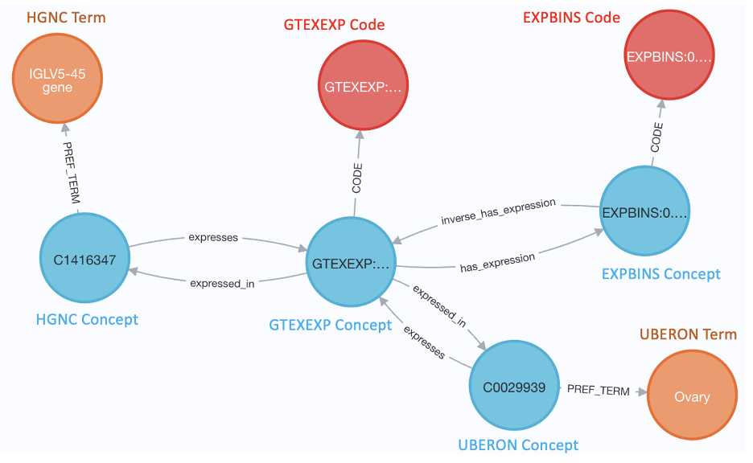

##### GTEx GTEXQTL Schema Diagram

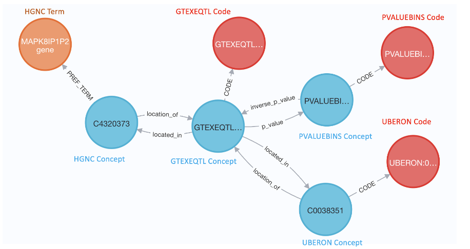

##### GTEx GTEXEXP/EXPBINS Node Counts

| **SAB** | **Count** |
|---------|-----------|
| UBERON  | 42        |
| GTEXEXP | 1,573,380 |
| EXPBINS | 159       |

##### GTEx GTEXEXP/EXPBINS Edge Counts

| **Subject SAB** | **Predicate**  | **Object SAB** | **Count** |
|-----------------|----------------|----------------|-----------|
| GTEXEXP         | expressed_in   | HGNC           | 1,573,380 |
| GTEXEXP         | has_expression | EXPBINS        | 1,573,380 |
| GTEXEXP         | expressed_in   | UBERON         | 1,503,452 |
| GTEXEXP         | expressed_in   | EFO            | 69,928    |

##### GTEx GTEXEQTL/PVALUEBINS Node Counts

| **SAB**    | **Count** |
|------------|-----------|
| GTEXEQTL   | 1,240,810 |
| PVALUEBINS | 17        |
| HSCLO      | 3,431,153 |

##### GTEx GTEXEQTL/PVALUEBINS Edge Counts

| **Subject SAB** | **Predicate** | **Object SAB** | **Count** |
|-----------------|---------------|----------------|-----------|
| GTEXEQTL        | located_in    | HGNC           | 2,047,088 |
| GTEXEQTL        | p_value       | PVALUEBINS     | 1,251,403 |
| GTEXEQTL        | located_in    | HSCLO          | 1,240,810 |
| GTEXEQTL        | located_in    | UBERON         | 1,193,338 |
| GTEXEQTL        | located_in    | EFO            | 47,472    |

##### GTEx GTEXCOEXP Node Counts

| **SAB** | **Count** |
|---------|-----------|
| HGNC    | 34,448    |

##### GTEx GTEXCOEXP Edge Counts

| **Subject SAB** | **Predicate**                                              | **Object SAB** | **Count**  |
|-----------------|------------------------------------------------------------|----------------|------------|
| GTEXCOEXP       | coexpression_Adipose\_\_\_Subcutaneous                     | HGNC           | 15,485     |
| GTEXCOEXP       | coexpression_Adipose\_\_\_Visceral\_(Omentum)              | HGNC           | 2,646      |
| GTEXCOEXP       | coexpression_Adrenal_Gland                                 | HGNC           | 37,897     |
| GTEXCOEXP       | coexpression_Artery\_\_\_Aorta                             | HGNC           | 642,521    |
| GTEXCOEXP       | coexpression_Artery\_\_\_Coronary                          | HGNC           | 612,950    |
| GTEXCOEXP       | coexpression_Artery\_\_\_Tibial                            | HGNC           | 10,237     |
| GTEXCOEXP       | coexpression_Bladder                                       | HGNC           | 529,181    |
| GTEXCOEXP       | coexpression_Brain\_\_\_Amygdala                           | HGNC           | 22,221     |
| GTEXCOEXP       | coexpression_Brain\_\_\_Anterior_cingulate_cortex\_(BA24)  | HGNC           | 102,887    |
| GTEXCOEXP       | coexpression_Brain\_\_\_Caudate\_(basal_ganglia)           | HGNC           | 7,309      |
| GTEXCOEXP       | coexpression_Brain\_\_\_Cerebellar_Hemisphere              | HGNC           | 40,983     |
| GTEXCOEXP       | coexpression_Brain\_\_\_Cerebellum                         | HGNC           | 106,195    |
| GTEXCOEXP       | coexpression_Brain\_\_\_Cortex                             | HGNC           | 764,276    |
| GTEXCOEXP       | coexpression_Brain\_\_\_Frontal_Cortex\_(BA9)              | HGNC           | 27,760     |
| GTEXCOEXP       | coexpression_Brain\_\_\_Hippocampus                        | HGNC           | 84,051     |
| GTEXCOEXP       | coexpression_Brain\_\_\_Hypothalamus                       | HGNC           | 185,487    |
| GTEXCOEXP       | coexpression_Brain\_\_\_Nucleus_accumbens\_(basal_ganglia) | HGNC           | 1,198,329  |
| GTEXCOEXP       | coexpression_Brain\_\_\_Putamen\_(basal_ganglia)           | HGNC           | 1,146,393  |
| GTEXCOEXP       | coexpression_Brain\_\_\_Spinal_cord\_(cervical_c_1)        | HGNC           | 267,533    |
| GTEXCOEXP       | coexpression_Brain\_\_\_Substantia_nigra                   | HGNC           | 143,792    |
| GTEXCOEXP       | coexpression_Breast\_\_\_Mammary_Tissue                    | HGNC           | 3,094      |
| GTEXCOEXP       | coexpression_Cells\_\_\_Cultured_fibroblasts               | HGNC           | 11,652     |
| GTEXCOEXP       | coexpression_Cells\_\_\_EBV_transformed_lymphocytes        | HGNC           | 90,051     |
| GTEXCOEXP       | coexpression_Cervix\_\_\_Ectocervix                        | HGNC           | 817,624    |
| GTEXCOEXP       | coexpression_Cervix\_\_\_Endocervix                        | HGNC           | 805,252    |
| GTEXCOEXP       | coexpression_Colon\_\_\_Sigmoid                            | HGNC           | 11,358     |
| GTEXCOEXP       | coexpression_Colon\_\_\_Transverse                         | HGNC           | 22,786     |
| GTEXCOEXP       | coexpression_Esophagus\_\_\_Gastroesophageal_Junction      | HGNC           | 12,874     |
| GTEXCOEXP       | coexpression_Esophagus\_\_\_Mucosa                         | HGNC           | 20,463     |
| GTEXCOEXP       | coexpression_Esophagus\_\_\_Muscularis                     | HGNC           | 79,416     |
| GTEXCOEXP       | coexpression_Fallopian_Tube                                | HGNC           | 769,999    |
| GTEXCOEXP       | coexpression_Heart\_\_\_Atrial_Appendage                   | HGNC           | 168,057    |
| GTEXCOEXP       | coexpression_Heart\_\_\_Left_Ventricle                     | HGNC           | 600,676    |
| GTEXCOEXP       | coexpression_Kidney\_\_\_Cortex                            | HGNC           | 583,782    |
| GTEXCOEXP       | coexpression_Kidney\_\_\_Medulla                           | HGNC           | 10,461,695 |
| GTEXCOEXP       | coexpression_Liver                                         | HGNC           | 20,645     |
| GTEXCOEXP       | coexpression_Lung                                          | HGNC           | 17,156     |
| GTEXCOEXP       | coexpression_Minor_Salivary_Gland                          | HGNC           | 47,164     |
| GTEXCOEXP       | coexpression_Muscle\_\_\_Skeletal                          | HGNC           | 4,061      |
| GTEXCOEXP       | coexpression_Nerve\_\_\_Tibial                             | HGNC           | 12,460     |
| GTEXCOEXP       | coexpression_Ovary                                         | HGNC           | 20,177     |
| GTEXCOEXP       | coexpression_Pancreas                                      | HGNC           | 24,183     |
| GTEXCOEXP       | coexpression_Pituitary                                     | HGNC           | 28,152     |
| GTEXCOEXP       | coexpression_Prostate                                      | HGNC           | 4,197      |
| GTEXCOEXP       | coexpression_Skin\_\_\_Not_Sun_Exposed\_(Suprapubic)       | HGNC           | 1,516      |
| GTEXCOEXP       | coexpression_Skin\_\_\_Sun_Exposed\_(Lower_leg)            | HGNC           | 84,793     |
| GTEXCOEXP       | coexpression_Small_Intestine\_\_\_Terminal_Ileum           | HGNC           | 73,157     |
| GTEXCOEXP       | coexpression_Spleen                                        | HGNC           | 375,064    |
| GTEXCOEXP       | coexpression_Stomach                                       | HGNC           | 12,964     |
| GTEXCOEXP       | coexpression_Testis                                        | HGNC           | 141,440    |
| GTEXCOEXP       | coexpression_Thyroid                                       | HGNC           | 31,593     |
| GTEXCOEXP       | coexpression_Uterus                                        | HGNC           | 16,498     |
| GTEXCOEXP       | coexpression_Vagina                                        | HGNC           | 20,584     |
| GTEXCOEXP       | coexpression_Whole_Blood                                   | HGNC           | 13,845     |

### The Human BioMolecular Atlas Program (HuBMAP) DCC

#### HuBMAP datasets

|                                                  |                                                                                                                                                                                                                                                                                                                                                                       |
|--------------------------------------------------|-----------------------------------------------------------------------------------------------------------------------------------------------------------------------------------------------------------------------------------------------------------------------------------------------------------------------------------------------------------------------|
| Dataset SAB(s)                                   | AZ, HUBMAP                                                                                                                                                                                                                                                                                                                                                            |
| DCC Website                                      | <https://hubmapconsortium.org/>                                                                                                                                                                                                                                                                                                                                       |
| DCC                                              | HuBMAP                                                                                                                                                                                                                                                                                                                                                                |
| Authority                                        | Jonathan Silverstein, Phil Blood                                                                                                                                                                                                                                                                                                                                      |
| Source Information                               | <https://azimuth.hubmapconsortium.org/>                                                                                                                                                                                                                                                                                                                               |
| Purpose                                          | HuBMAP data provides tissue, cell-type and gene specific markers from single-cell data. The purpose of the Hubmap/AZ data is to provide cell-type-specific gene expression markers from single-cell experiments across each tissue.                                                                                                                                   |
| Description                                      | HuBMAP is working to catalyze the development of a framework for mapping the human body at single cell resolution and developing the tools to create an open, global atlas of the human body at the cellular level. In this database, we include cell-type specific gene markers from the Azimuth project form a subset of tissues including heart, liver and kidney. |
| Summarization of Methodology                     | <https://azimuth.hubmapconsortium.org/references/>                                                                                                                                                                                                                                                                                                                    |
| Summarization of Methodology Code Repository URL | <https://azimuth.hubmapconsortium.org/references/>                                                                                                                                                                                                                                                                                                                    |
| Total Nodes                                      | 769                                                                                                                                                                                                                                                                                                                                                                   |
| Total Edges                                      | 910                                                                                                                                                                                                                                                                                                                                                                   |

##### HuBMAP Az Schema Diagram

##### HuBMAP Az Node Counts

| **SAB** | **Count** |
|---------|-----------|
| HGNC    | 677       |
| AZ      | 92        |

##### HuBMAP Az Edge Counts

| **Subject SAB** | **Predicate**             | **Object SAB** | **Count** |
|-----------------|---------------------------|----------------|-----------|
| AZ              | has_marker_gene_in_kidney | HGNC           | 485       |
| AZ              | has_marker_gene_in_liver  | HGNC           | 225       |
| AZ              | has_marker_gene_in_heart  | HGNC           | 200       |

### Illuminating the Druggable Genome (IDG) DCC

#### IDG datasets

|                                                  |                                                                                                                                                                                                                                                                                                                                                                                                                                                                                                                                                                                                                                                                                                                                                                                                                                                                                                                                                                                                                                                                                                                                                                                                                                                                                                                                                                                                                                                                                                                                                                                                                                                                                                                                                                          |
|--------------------------------------------------|--------------------------------------------------------------------------------------------------------------------------------------------------------------------------------------------------------------------------------------------------------------------------------------------------------------------------------------------------------------------------------------------------------------------------------------------------------------------------------------------------------------------------------------------------------------------------------------------------------------------------------------------------------------------------------------------------------------------------------------------------------------------------------------------------------------------------------------------------------------------------------------------------------------------------------------------------------------------------------------------------------------------------------------------------------------------------------------------------------------------------------------------------------------------------------------------------------------------------------------------------------------------------------------------------------------------------------------------------------------------------------------------------------------------------------------------------------------------------------------------------------------------------------------------------------------------------------------------------------------------------------------------------------------------------------------------------------------------------------------------------------------------------|
| Dataset SAB(s)                                   | IDGP (compound/protein), IDGD (compound/disease) (both are edge SABs)                                                                                                                                                                                                                                                                                                                                                                                                                                                                                                                                                                                                                                                                                                                                                                                                                                                                                                                                                                                                                                                                                                                                                                                                                                                                                                                                                                                                                                                                                                                                                                                                                                                                                                                                                     |
| DCC Website                                      | <https://pharos.nih.gov/> <https://commonfund.nih.gov/idg>                                                                                                                                                                                                                                                                                                                                                                                                                                                                                                                                                                                                                                                                                                                                                                                                                                                                                                                                                                                                                                                                                                                                                                                                                                                                                                                                                                                                                                                                                                                                                                                                                                                                                                               |
| DCC                                              | Illuminating the Druggable Genome Data Coordinating Center - Engagement Plan with the CFDE                                                                                                                                                                                                                                                                                                                                                                                                                                                                                                                                                                                                                                                                                                                                                                                                                                                                                                                                                                                                                                                                                                                                                                                                                                                                                                                                                                                                                                                                                                                                                                                                                                                                               |
| Authority                                        | Christophe Lambert (PI), University of New Mexico Health Sciences Center                                                                                                                                                                                                                                                                                                                                                                                                                                                                                                                                                                                                                                                                                                                                                                                                                                                                                                                                                                                                                                                                                                                                                                                                                                                                                                                                                                                                                                                                                                                                                                                                                                                                                                 |
| Source Information                               | Relationships between compounds, diseases, and proteins drawn from the IDG Target Central Resource Database (TCRD) hosted at <https://pharos.nih.gov> and at DrugCentral <https://drugcentral.org/>.                                                                                                                                                                                                                                                                                                                                                                                                                                                                                                                                                                                                                                                                                                                                                                                                                                                                                                                                                                                                                                                                                                                                                                                                                                                                                                                                                                                                                                                                                                                                                                     |
| Purpose                                          | The Illuminating the Druggable Genome (IDG) project elucidates the relationships between diseases, targets, and compounds, providing insights into lesser-known proteins, empowering researchers to discover novel therapeutic targets and accelerate drug development for various diseases.                                                                                                                                                                                                                                                                                                                                                                                                                                                                                                                                                                                                                                                                                                                                                                                                                                                                                                                                                                                                                                                                                                                                                                                                                                                                                                                                                                                                                                                                             |
| Description                                      | The IDG contributions to the Knowledge Graph include compounds, diseases and proteins and their relationships. A full description of IDG data sources is here: <https://pharos.nih.gov/about>.  Target Central Resource Database (TCRD) is the central resource supporting the IDG-KMC. TCRD has information about human drug targets with a focus on GPCRs, kinases, and ion channels. TCRD categorizes all drug targets into four Target Development Levels (TDLs) by making use of activity thresholds. Protein drug targets from TCRD with known bioactive compounds were incorporated into the IDG KG. Also included in our KG are diseases from TCRD that have known "indication" relationships to approved drugs from DrugCentral. The IDG KG can be used to explore compounds and proteins related to a specific disease among other similar queries. The IDG KG can be combined with data from other DCCs such as LINCS, GTeX, and others to create interesting scientific use cases.                                                                                                                                                                                                                                                                                                                                                                                                                                                                                                                                                                                                                                                                                                                                                                        |
| Summarization of Methodology                     | Compound nodes were sourced using TCRD, DrugCentral, and PubChem using PUBCHEM_CID ontology. Specifically, chemical compounds from DrugCentral were included if TCRD indicated known bioactivity against protein targets. Compound node properties include SMILES as the node_definition, drugbank ID as node_dbxrefs, name as node_label, and 'IDG' as the node_namespace. The PubChem API was used to assign the node_synonyms and node_dbxrefs node properties. Protein nodes were obtained from TCRD and DrugCentral, and rely on UNIPROTKB ontology. Protein targets from DrugCentral and TCRD with known bioactive compounds were included. A protein's symbol is denoted as node_label, protein names as node_definition, EnsEMBL IDs as node_dbxrefs, and 'IDG' as node_namespace. The disease nodes use SNOMED_US ontology and are sourced from TCRD and DrugCentral. Diseases from DrugCentral and TCRD with known indication relationships to approved drugs were included. The disease OMOP concept names are included as the node property node_label. Additionally, OMOP IDs are included as node_dbxrefs and 'IDG' as the node_namespace. The bioactivity relationship is defined between compounds and proteins. While ChEMBL and PubChem offer complex and differing ontologies for bioactivity relationships, for the sake of simplicity and efficiency in this early version we use the custom term "bioactivity". The type of bioactivity measurement (e.g. IC50, Kd, EC50) is included as evidence_class. The indication relationship links compounds and diseases. For simplicity, we introduce the custom, simple term "indication". These indication relationships are defined between diseases and approved drugs from DrugCentral. |
| Summarization of Methodology Code Repository URL | Code by IDG team: <https://github.com/unmtransinfo/cfde-distillery> Code from core DD team (further processing and formatting): <https://github.com/TaylorResearchLab/CFDE_DataDistillery/blob/main/DCC_workflows/IDG/check_IDG.ipynb>                                                                                                                                                                                                                                                                                                                                                                                                                                                                                                                                                                                                                                                                                                                                                                                                                                                                                                                                                                                                                                                                                                                                                                                                                                                                                                                                                                                                                                                                                                                          |
| Total Nodes                                      | Total: 331788; compounds: 327951; disease: 1472; protein: 2365                                                                                                                                                                                                                                                                                                                                                                                                                                                                                                                                                                                                                                                                                                                                                                                                                                                                                                                                                                                                                                                                                                                                                                                                                                                                                                                                                                                                                                                                                                                                                                                                                                                                                                           |
| Total Edges                                      | Total: 463972; compound/protein (Bioactivity): 454957; compound/disease (Indication): 9015                                                                                                                                                                                                                                                                                                                                                                                                                                                                                                                                                                                                                                                                                                                                                                                                                                                                                                                                                                                                                                                                                                                                                                                                                                                                                                                                                                                                                                                                                                                                                                                                                                                                               |
| Source Data DOI(s)                               | N/A                                                                                                                                                                                                                                                                                                                                                                                                                                                                                                                                                                                                                                                                                                                                                                                                                                                                                                                                                                                                                                                                                                                                                                                                                                                                                                                                                                                                                                                                                                                                                                                                                                                                                                                                                             |
| Source Data URL(s)                               | <https://app.globus.org/file-manager?origin_id=24c2ee95-146d-4513-a1b3-ac0bfdb7856f&origin_path=%2Fprojects%2Fdata-distillery%2FImport%2FIDG%2F>                                                                                                                                                                                                                                                                                                                                                                                                                                                                                                                                                                                                                                                                                                                                                                                                                                                                                                                                                                                                                                                                                                                                                                                                                                                                                                                                                                                                                                                                                                                                                                                                                         |

##### IDG Schema Diagram

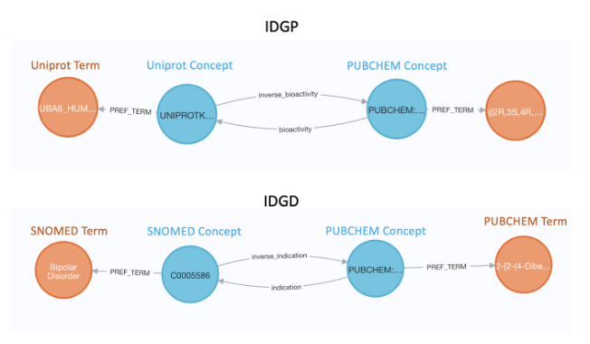

##### IDG IDGP (compound/protein) Node Counts

| **SAB**   | **Count** |
|-----------|-----------|
| UNIPROTKB | 2,365     |
| PUBCHEM   | 324,293   |

##### IDG IDGP (compound/protein) Edge Counts

| **Subject SAB** | **Predicate** | **Object SAB** | **Count** |
|-----------------|---------------|----------------|-----------|
| PUBCHEM         | bioactivity   | UNIPROTKB      | 454,957   |

##### IDG IDGD (compound/disease) Node Counts

| **SAB**     | **Count** |
|-------------|-----------|
| SNOMEDCT_US | 1,472     |
| PUBCHEM     | 325,299   |

##### IDG IDGD (compound/disease) Edge Counts

| **Subject SAB** | **Predicate** | **Object SAB** | **Count** |
|-----------------|---------------|----------------|-----------|
| PUBCHEM         | indication    | SNOMEDCT_US    | 9,015     |

### Gabriella Miller Kids First (GMKF) DCC

#### GMKF datasets

|                                                  |                                                                                                                                                                                                                                                                                                                                                                                                                                                                                                                                                                                                                                                                           |
|--------------------------------------------------|---------------------------------------------------------------------------------------------------------------------------------------------------------------------------------------------------------------------------------------------------------------------------------------------------------------------------------------------------------------------------------------------------------------------------------------------------------------------------------------------------------------------------------------------------------------------------------------------------------------------------------------------------------------------------|
| Dataset SAB(s)                                   | KFGENEBIN, KFPT, KFCOHORT                                                                                                                                                                                                                                                                                                                                                                                                                                                                                                                                                                                                                                                 |
| DCC Website                                      | <https://kidsfirstdrc.org/>                                                                                                                                                                                                                                                                                                                                                                                                                                                                                                                                                                                                                                               |
| DCC                                              | Gabriella Miller Kids First (GMKF) Pediatric Research Program Data Resource Center (DRC)                                                                                                                                                                                                                                                                                                                                                                                                                                                                                                                                                                                  |
| Authority                                        | Deanne Taylor (PI), Children's Hospital of Philadelphia                                                                                                                                                                                                                                                                                                                                                                                                                                                                                                                                                                                                                   |
| Source Information                               | Genomic and phenotypic data, broadly summarized from trio cohorts with cardiac birth defects from the Pediatric Cardiac Genetics Consortium cohort in Kids First,cohort SD_PREASA7S                                                                                                                                                                                                                                                                                                                                                                                                                                                                                       |
| Purpose                                          | The main purpose of the KF DRC is to better understand the genetic causes and links between childhood cancer and structural birth defects.                                                                                                                                                                                                                                                                                                                                                                                                                                                                                                                                |
| Description                                      | The Kids First DRC is a collaborative pediatric research effort created to accelerate data-driven discoveries and the development of novel precision-based approaches for children diagnosed with cancer or a structural birth defect using large genomic datasets. The Kids First DRC is comprised of integrated core teams that support development of leading-edge big data infrastructure and provide the necessary resources and tools to empower researchers and clinicians.                                                                                                                                                                                        |
| Summarization of Methodology                     | Variant data from a Congenital Heart Defects (CHD) cohort was queried and filtered using the Kids First variant workbench platform. We filtered for variants that were scored as 'high impact' by the variant effect predictor tool (VEP). Variant counts per gene were then computed by counting how many times each gene appeared. The number of variations per gene is stored in the 'value' property of the SAB **KFGENEBIN** Code nodes. Kids First cohorts are stored in the graph as their own nodes and have an SAB of **KFCOHORT.** Patient IDs from the CHD cohort have also been ingested into the graph as their own nodes and have an SAB of **KFPT**. |
| Summarization of Methodology Code Repository URL | <https://github.com/TaylorResearchLab/CFDE_DataDistillery/tree/main/DCC_workflows/KidsFirst>                                                                                                                                                                                                                                                                                                                                                                                                                                                                                                                                                                              |
| Total Nodes                                      | 18,719                                                                                                                                                                                                                                                                                                                                                                                                                                                                                                                                                                                                                                                                    |
| Total Edges                                      | 76,690                                                                                                                                                                                                                                                                                                                                                                                                                                                                                                                                                                                                                                                                    |

##### GMKF Schema Diagram

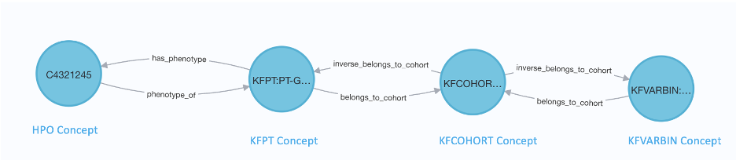

##### GMKF Node Counts

| **SAB**   | **Count** |
|-----------|-----------|
| KFGENEBIN | 13,375    |
| KFPT      | 5,329     |
| KFCOHORT  | 15        |

##### GMKF Edge Counts

| **Subject SAB** | **Predicate**     | **Object SAB** | **Count** |
|-----------------|-------------------|----------------|-----------|
| KFPT            | has_phenotype     | HPO            | 44,611    |
| KFGENEBIN       | belongs_to_cohort | KFCOHORT       | 13,375    |
| KFGENEBIN       | gene_has_variants | HGNC           | 13,375    |
| KFPT            | belongs_to_cohort | KFCOHORT       | 5,329     |

### The Library of Integrated Network-Based Cellular Signatures (LINCS) DCC

#### LINCS datasets

|                                                  |                                                                                                                                                                                                                                                                                                                                                                                                                                                                                                                                                                                                                                                                                                                                                                                                                                                                                                                                                                                                                                                                                                                                                                                                                                                                                                                                                                                                                                                                                                             |
|--------------------------------------------------|-------------------------------------------------------------------------------------------------------------------------------------------------------------------------------------------------------------------------------------------------------------------------------------------------------------------------------------------------------------------------------------------------------------------------------------------------------------------------------------------------------------------------------------------------------------------------------------------------------------------------------------------------------------------------------------------------------------------------------------------------------------------------------------------------------------------------------------------------------------------------------------------------------------------------------------------------------------------------------------------------------------------------------------------------------------------------------------------------------------------------------------------------------------------------------------------------------------------------------------------------------------------------------------------------------------------------------------------------------------------------------------------------------------------------------------------------------------------------------------------------------------|
| Dataset SAB(s)                                   | LINCS (edge SAB only)                                                                                                                                                                                                                                                                                                                                                                                                                                                                                                                                                                                                                                                                                                                                                                                                                                                                                                                                                                                                                                                                                                                                                                                                                                                                                                                                                                                                                                                                                       |
| DCC Website                                      | <https://lincsproject.org/>                                                                                                                                                                                                                                                                                                                                                                                                                                                                                                                                                                                                                                                                                                                                                                                                                                                                                                                                                                                                                                                                                                                                                                                                                                                                                                                                                                                                                                                                                 |
| DCC                                              | Library of Integrated Network-Based Cellular Signatures (LINCS) Data Coordination and Integration Center (DCIC)                                                                                                                                                                                                                                                                                                                                                                                                                                                                                                                                                                                                                                                                                                                                                                                                                                                                                                                                                                                                                                                                                                                                                                                                                                                                                                                                                                                             |
| Authority                                        | Avi Ma'ayan (PI), Icahn School of Medicine at Mount Sinai                                                                                                                                                                                                                                                                                                                                                                                                                                                                                                                                                                                                                                                                                                                                                                                                                                                                                                                                                                                                                                                                                                                                                                                                                                                                                                                                                                                                                                                   |
| Source Information                               | Gene expression changes resulting from drug/small molecule perturbations across cell lines, and gene expression signature similarity between drug/small molecule based on LINCS L1000 signature similarity                                                                                                                                                                                                                                                                                                                                                                                                                                                                                                                                                                                                                                                                                                                                                                                                                                                                                                                                                                                                                                                                                                                                                                                                                                                                                                  |
| Purpose                                          | Understand cellular responses to various drug and pre-clinical compound treatments through L1000 transcriptomics assays                                                                                                                                                                                                                                                                                                                                                                                                                                                                                                                                                                                                                                                                                                                                                                                                                                                                                                                                                                                                                                                                                                                                                                                                                                                                                                                                                                                     |
| Description                                      | The LINCS assertions include drug-gene associations and drug-drug similarity associations computed from the LINCS L1000 consensus signatures dataset. Each drug is linked to the top 25 most up-regulated and top 25 most down-regulated genes in the L1000 consensus signatures for the drug/small-molecule, as well as to the top 5 most similar other drugs in the dataset based on the correlation between the consensus signatures for each drug.                                                                                                                                                                                                                                                                                                                                                                                                                                                                                                                                                                                                                                                                                                                                                                                                                                                                                                                                                                                                                                                      |
| Summarization of Methodology                     | Level 3 L1000 profiles, drug metadata, and gene metadata were first downloaded from CLUE.io. The L1000 Level 5 signatures were then computed using the Characteristic Direction method [BMC Bioinformatics 15, 79 (2014)]. For each signature, replicate L1000 profiles for a given perturbagen and dosage were compared against all other L1000 profiles from the same cell line batch. Consensus signatures for each drug were then computed by taking the mean of all gene expression vectors corresponding to the given drug across cell lines, timepoints, and dosages. Drugs were filtered to only those with known PubChem IDs in the original CLUE.io metadata, resulting in a final set of 4,523 drugs. The top 25 up- and down-regulated genes in each consensus signature with known Ensembl IDs from the metadata were determined by the greatest positive and negative Characteristic Direction coefficients, respectively. In total, 225,509 edges and 4,419 unique genes are represented in this collection of knowledge graph assertions. Additionally, a drug-drug similarity matrix was generated by computing the cosine similarity between all possible pairs of the consensus drug signatures. For each drug, the top 5 other drugs with the greatest positive cosine similarity values were retained. Duplicate edges were removed, resulting in 20,785 total edges representing consensus signature-based drug-drug similarity between the 4,523 drugs with known PubChem IDs. |
| Summarization of Methodology Code Repository URL | The methods are described in the following publication: Evangelista, J.E., Clarke, D.J.B., Xie, Z. et al. Toxicology knowledge graph for structural birth defects. Commun Med 3, 98 (2023). The code to produce the assertions can be found at: <https://github.com/nih-cfde/ReproToxTables>                                                                                                                                                                                                                                                                                                                                                                                                                                                                                                                                                                                                                                                                                                                                                                                                                                                                                                                                                                                                                                                                                                                                                                                                       |
| Total Nodes                                      | 8,942 (drugs: 4523; genes: 4419)                                                                                                                                                                                                                                                                                                                                                                                                                                                                                                                                                                                                                                                                                                                                                                                                                                                                                                                                                                                                                                                                                                                                                                                                                                                                                                                                                                                                                                                                            |
| Total Edges                                      | 246,294 (drug-gene: 225,509; drug-drug: 20,785)                                                                                                                                                                                                                                                                                                                                                                                                                                                                                                                                                                                                                                                                                                                                                                                                                                                                                                                                                                                                                                                                                                                                                                                                                                                                                                                                                                                                                                                             |
| Source Data DOI(s)                               | N/A                                                                                                                                                                                                                                                                                                                                                                                                                                                                                                                                                                                                                                                                                                                                                                                                                                                                                                                                                                                                                                                                                                                                                                                                                                                                                                                                                                                                                                                                                                         |
| Source Data URL(s)                               | <https://maayanlab.cloud/sigcom-lincs/#/Download>                                                                                                                                                                                                                                                                                                                                                                                                                                                                                                                                                                                                                                                                                                                                                                                                                                                                                                                                                                                                                                                                                                                                                                                                                                                                                                                                                                                                                                                           |

##### LINCS Schema Diagram

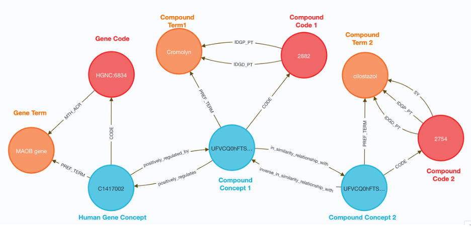

##### LINCS Node Counts

| **SAB** | **Count** |
|---------|-----------|
| NCBI    | 1         |
| PUBCHEM | 4,523     |
| HGNC    | 4,418     |

##### LINCS Edge Counts

| **Subject SAB** | **Predicate**                   | **Object SAB** | **Count** |
|-----------------|---------------------------------|----------------|-----------|
| HGNC            | negatively_regulated_by         | PUBCHEM        | 112,759   |
| HGNC            | positively_regulated_by         | PUBCHEM        | 112,747   |
| PUBCHEM         | in_similarity_relationship_with | PUBCHEM        | 20,785    |
| NCBI            | positively_regulated_by         | PUBCHEM        | 3         |

### The Molecular Transducers of Physical Activity Consortium (MoTrPAC) DCC

#### MoTrPAC datasets

|                                                  |                                                                                                                                                                                                                                                                                                                                                                                                                                                                                                                                                                                                                                                                                                                                                                                                                                                                                                                                                                                                                                                                                                                                                                                                                                                                                                                                                                                                                                                                                                                                                                                      |
|--------------------------------------------------|--------------------------------------------------------------------------------------------------------------------------------------------------------------------------------------------------------------------------------------------------------------------------------------------------------------------------------------------------------------------------------------------------------------------------------------------------------------------------------------------------------------------------------------------------------------------------------------------------------------------------------------------------------------------------------------------------------------------------------------------------------------------------------------------------------------------------------------------------------------------------------------------------------------------------------------------------------------------------------------------------------------------------------------------------------------------------------------------------------------------------------------------------------------------------------------------------------------------------------------------------------------------------------------------------------------------------------------------------------------------------------------------------------------------------------------------------------------------------------------------------------------------------------------------------------------------------------------|
| Dataset SAB(s)                                   | MOTRPAC                                                                                                                                                                                                                                                                                                                                                                                                                                                                                                                                                                                                                                                                                                                                                                                                                                                                                                                                                                                                                                                                                                                                                                                                                                                                                                                                                                                                                                                                                                                                                                              |
| DCC Website                                      | <https://motrpac-data.org>                                                                                                                                                                                                                                                                                                                                                                                                                                                                                                                                                                                                                                                                                                                                                                                                                                                                                                                                                                                                                                                                                                                                                                                                                                                                                                                                                                                                                                                                                                                                                           |
| DCC                                              | Molecular Transducers of Physical Activity Consortium (MoTrPAC) Bioinformatics Center (BIC)                                                                                                                                                                                                                                                                                                                                                                                                                                                                                                                                                                                                                                                                                                                                                                                                                                                                                                                                                                                                                                                                                                                                                                                                                                                                                                                                                                                                                                                                                          |
| Authority                                        | Euan Ashley MD PhD (PI), Matthew Wheeler MD PhD (PI)                                                                                                                                                                                                                                                                                                                                                                                                                                                                                                                                                                                                                                                                                                                                                                                                                                                                                                                                                                                                                                                                                                                                                                                                                                                                                                                                                                                                                                                                                                                                 |
| Source Information                               | Gene differential expression changes resulting from the RNA-seq data of young adult rats (6 month old) performing endurance training exercise at the 1 week, 2 week, 4 week and 8 week time points.                                                                                                                                                                                                                                                                                                                                                                                                                                                                                                                                                                                                                                                                                                                                                                                                                                                                                                                                                                                                                                                                                                                                                                                                                                                                                                                                                                                  |
| Purpose                                          | The Molecular Transducers of Physical Activity Consortium (MoTrPAC) aims to elucidate how exercise improves health and ameliorates diseases by building a map of the molecular responses to endurance exercise.                                                                                                                                                                                                                                                                                                                                                                                                                                                                                                                                                                                                                                                                                                                                                                                                                                                                                                                                                                                                                                                                                                                                                                                                                                                                                                                                                                      |
| Description                                      | MoTrPAC is a multi-site collaboration across the US encompassing various scientific disciplines: preclinical animal study sites and human clinical exercise sites, which perform the exercise testing and biospecimen collection; a consortium coordinating center and biorepository, which manages sample collection, distribution of samples, and consortium logistics; chemical analysis sites, which are responsible for omics analysis from the samples collected; and a bioinformatics center to collaboratively analyze and map the data generated by the other sites along with data dissemination to make the data and other resources available to the public. The animal studies enable analysis of the effects of exercise on many different tissues that are not readily obtainable in humans, whereas the collection of accessible human tissues (muscle, blood, and adipose) will permit the analysis of the direct effect of exercise in humans. Additional information can be found at the main consortium page ([https://motrpac.org)](https://motrpac.org)) or at the data portal (<https://motrpac-data.org>). The MoTrPAC study is divided into two main parts - animal (rats) and human, with multiple phases or interventions in each of them. Preclinical animal study sites conduct the endurance exercise and training intervention in young adult (6 month old) and middle-aged adult (18 month old) rats, while Clinical study sites conduct the human endurance and resistance training interventions in pediatric, adults and highly active adults. |
| Summarization of Methodology                     |                                                                                                                                                                                                                                                                                                                                                                                                                                                                                                                                                                                                                                                                                                                                                                                                                                                                                                                                                                                                                                                                                                                                                                                                                                                                                                                                                                                                                                                                                                                                                                                      |
| Summarization of Methodology Code Repository URL | <https://github.com/TaylorResearchLab/CFDE_DataDistillery/blob/main/DCC_workflows/MoTrPAC/MOTRPAC.ipynb>                                                                                                                                                                                                                                                                                                                                                                                                                                                                                                                                                                                                                                                                                                                                                                                                                                                                                                                                                                                                                                                                                                                                                                                                                                                                                                                                                                                                                                                                             |
| Total Nodes                                      | 16,149                                                                                                                                                                                                                                                                                                                                                                                                                                                                                                                                                                                                                                                                                                                                                                                                                                                                                                                                                                                                                                                                                                                                                                                                                                                                                                                                                                                                                                                                                                                                                                               |
| Total Edges                                      | 25,714                                                                                                                                                                                                                                                                                                                                                                                                                                                                                                                                                                                                                                                                                                                                                                                                                                                                                                                                                                                                                                                                                                                                                                                                                                                                                                                                                                                                                                                                                                                                                                               |

##### MoTrPAC Schema Diagram

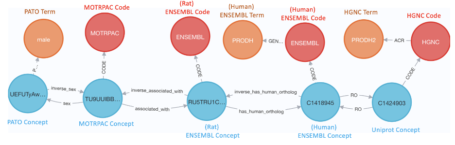

##### MoTrPAC Node Counts

| **SAB** | **Count** |
|---------|-----------|
| ENSEMBL | 5,919     |
| MOTRPAC | 8,571     |

##### MoTrPAC Edge Counts

| **Subject SAB** | **Predicate**   | **Object SAB** | **Count** |
|-----------------|-----------------|----------------|-----------|
| MOTRPAC         | associated_with | ENSEMBL        | 8,570     |
| MOTRPAC         | located_in      | UBERON         | 8,571     |
| MOTRPAC         | sex             | PATO           | 8,571     |

### Metabolomics Workbench (MW) DCC

#### MW datasets

|                                                  |                                                                                                                                                                                                                                                                                                                                                                                                                                                                                                                                                                                                                                                                                                                                                                                                                                                                                                                                                                                                                                                                                                                                                                                                                                                                                                                                                                                                                                                                                                                                                                                                                                                                                                   |
|--------------------------------------------------|---------------------------------------------------------------------------------------------------------------------------------------------------------------------------------------------------------------------------------------------------------------------------------------------------------------------------------------------------------------------------------------------------------------------------------------------------------------------------------------------------------------------------------------------------------------------------------------------------------------------------------------------------------------------------------------------------------------------------------------------------------------------------------------------------------------------------------------------------------------------------------------------------------------------------------------------------------------------------------------------------------------------------------------------------------------------------------------------------------------------------------------------------------------------------------------------------------------------------------------------------------------------------------------------------------------------------------------------------------------------------------------------------------------------------------------------------------------------------------------------------------------------------------------------------------------------------------------------------------------------------------------------------------------------------------------------------|
| Dataset SAB(s)                                   | MW (REFMET; metabolite nodes)                                                                                                                                                                                                                                                                                                                                                                                                                                                                                                                                                                                                                                                                                                                                                                                                                                                                                                                                                                                                                                                                                                                                                                                                                                                                                                                                                                                                                                                                                                                                                                                                                                                                     |
| DCC Website                                      | <https://www.metabolomicsworkbench.org/>                                                                                                                                                                                                                                                                                                                                                                                                                                                                                                                                                                                                                                                                                                                                                                                                                                                                                                                                                                                                                                                                                                                                                                                                                                                                                                                                                                                                                                                                                                                                                                                                                                                          |
| DCC                                              | Metabolomics Workbench                                                                                                                                                                                                                                                                                                                                                                                                                                                                                                                                                                                                                                                                                                                                                                                                                                                                                                                                                                                                                                                                                                                                                                                                                                                                                                                                                                                                                                                                                                                                                                                                                                                                            |
| Authority                                        | Professor Shankar Subramaniam (PI)                                                                                                                                                                                                                                                                                                                                                                                                                                                                                                                                                                                                                                                                                                                                                                                                                                                                                                                                                                                                                                                                                                                                                                                                                                                                                                                                                                                                                                                                                                                                                                                                                                                                |
| Source Information                               | Gene-metabolite relationships: MW database tables based on KEGG and other resources Disease-metabolite relationships: Publication based on HMDB data (<https://pubmed.ncbi.nlm.nih.gov/32426349/>) Cell-metabolite relationships: MW database tables for data submitted to NMDR                                                                                                                                                                                                                                                                                                                                                                                                                                                                                                                                                                                                                                                                                                                                                                                                                                                                                                                                                                                                                                                                                                                                                                                                                                                                                                                                                                                                             |
| Purpose                                          | Understand what metabolites may be regulated by various genes and their spatial (anatomical) and disease context.                                                                                                                                                                                                                                                                                                                                                                                                                                                                                                                                                                                                                                                                                                                                                                                                                                                                                                                                                                                                                                                                                                                                                                                                                                                                                                                                                                                                                                                                                                                                                                                 |
| Description                                      | The [National Institutes of Health (NIH) Common Fund Metabolomics Program](https://commonfund.nih.gov/metabolomics/index) was developed with the goal of increasing national capacity in metabolomics by supporting the development of next generation technologies, providing training and mentoring opportunities, increasing the inventory and availability of high quality reference standards, and promoting data sharing and collaboration. In support of this effort, the Metabolomics Common Fund's National Metabolomics Data Repository(NMDR), housed at the San Diego Supercomputer Center (SDSC), University of California, San Diego, has developed the Metabolomics Workbench. The Metabolomics Workbench serves as a national and international repository for metabolomics data and metadata and provides analysis tools and access to metabolite standards, protocols, tutorials, training, and more. NMDR houses data on metabolomics studies conducted by various centers and research laboratories across the nation and the world, spanning many species, sample sources, diseases, metabolomics experimental techniques and metabolite classes [[https://www.metabolomicsworkbench.org/data/browse.php].](https://www.metabolomicsworkbench.org/data/browse.php%5D.) The data we have shared with the Data Distillery partnership is a key subset of all the data in NMDR, centered around metabolites. Specifically, we have shared disease-metabolite, gene-metabolite and cell/anatomy (sample source)-metabolite relationships, which when integrated with data from other DCC and external resources has the potential to address interesting biological questions. |
| Summarization of Methodology                     | Gene-Metabolite: Human genes catalyzing metabolic reactions and their associated metabolites were obtained from MW database tables. The HGNC ID was used as metabolic gene node_id, and its approved symbol and name are used as node_label and node_definition, respectively. UMLS, ENTREZ and ENSMBL IDs are used as node_dbxrefs. For the edges, the Subject (Gene: HGNC ID) was related to the Object (Metabolite: PUBCHEM_CID) by the Predicate (RO_0002566: Causally influences). Disease-Metabolite: Disease-metabolite entities and relationships were deduced from the publication (PMID: 32426349) based on HMDB. The PUBCHEM_CID/HMDB ID was used as node_id for the metabolite. Similarly, disease entities were encoded with DOID or HPO IDs. UMLS, PUBCHEM_CID, DRUGBANK and REFMET were used as node_dbxrefs. For the edges, the Subject (Metabolite: PUBCHEM_CID/HMDB ID) was related to the Object (Disease: DOID/HPO) by the Predicate (RO_0003308: Correlated with condition). Cell-Metabolite: Metabolite-anatomy context (cell/tissue association) was obtained from MW database. Cell/tissue entity node_id is encoded with UBERON, CL and CLO IDs and cross referenced with UMLS. For the edges, the Subject (Spatial context: UBERON/CL/CLO) was related to the Object (Metabolite: PUBCHEM_CID) by the Predicate (RO_0003000: Produces).                                                                                                                                                                                                                                                                                                                           |
| Summarization of Methodology Code Repository URL | <https://github.com/mano-at-sdsc/MW_DataDistillery>                                                                                                                                                                                                                                                                                                                                                                                                                                                                                                                                                                                                                                                                                                                                                                                                                                                                                                                                                                                                                                                                                                                                                                                                                                                                                                                                                                                                                                                                                                                                                                                                                                               |
| Total Nodes                                      | 51,271                                                                                                                                                                                                                                                                                                                                                                                                                                                                                                                                                                                                                                                                                                                                                                                                                                                                                                                                                                                                                                                                                                                                                                                                                                                                                                                                                                                                                                                                                                                                                                                                                                                                                            |
| Total Edges                                      | 10,009                                                                                                                                                                                                                                                                                                                                                                                                                                                                                                                                                                                                                                                                                                                                                                                                                                                                                                                                                                                                                                                                                                                                                                                                                                                                                                                                                                                                                                                                                                                                                                                                                                                                                            |

##### MW Schema Diagram

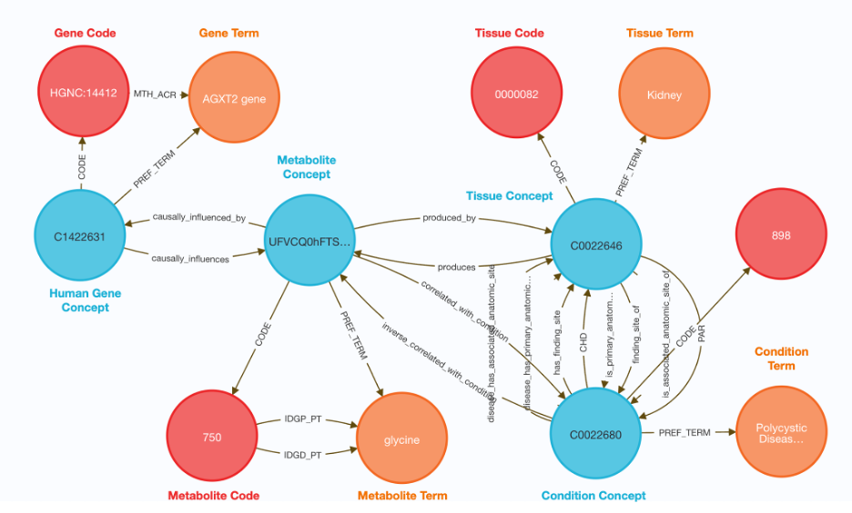

##### MW Node Counts

| **SAB** | **Count** |
|---------|-----------|
| UBERON  | 67        |
| CL      | 12        |
| CLO     | 3         |
| HGNC    | 1,061     |
| PUBCHEM | 8,543     |
| HMDB    | 18        |
| DOID    | 276       |
| HPO     | 32        |

##### MW Edge Counts

| **Subject SAB** | **Predicate**             | **Object SAB** | **Count** |
|-----------------|---------------------------|----------------|-----------|
| UBERON          | produces                  | PUBCHEM        | 34,471    |
| CL              | produces                  | PUBCHEM        | 6,777     |
| CLO             | produces                  | PUBCHEM        | 536       |
| HGNC            | causally influences       | PUBCHEM        | 5,527     |
| PUBCHEM         | correlated with condition | DOID           | 3,856     |
| HMDB            | correlated with condition | DOID           | 27        |
| PUBCHEM         | correlated with condition | HPO            | 77        |

### Stimulating Peripheral Activity to Relieve Conditions (SPARC) DCC

#### SPARC datasets

|                                                  |                                                                                                                                                                                                                                                                                                                                                                                                                                                                                                                                                                                                                                                                                                                                                                                                                                                                                                                                                                                                                                                                                                                                                                                                                                                                                                                                                                                                                                                                                                                                                                                                                                                                                          |
|--------------------------------------------------|------------------------------------------------------------------------------------------------------------------------------------------------------------------------------------------------------------------------------------------------------------------------------------------------------------------------------------------------------------------------------------------------------------------------------------------------------------------------------------------------------------------------------------------------------------------------------------------------------------------------------------------------------------------------------------------------------------------------------------------------------------------------------------------------------------------------------------------------------------------------------------------------------------------------------------------------------------------------------------------------------------------------------------------------------------------------------------------------------------------------------------------------------------------------------------------------------------------------------------------------------------------------------------------------------------------------------------------------------------------------------------------------------------------------------------------------------------------------------------------------------------------------------------------------------------------------------------------------------------------------------------------------------------------------------------------|
| Dataset SAB(s)                                   | SCKAN, NPO, UBERON, PATO, NIFSTD                                                                                                                                                                                                                                                                                                                                                                                                                                                                                                                                                                                                                                                                                                                                                                                                                                                                                                                                                                                                                                                                                                                                                                                                                                                                                                                                                                                                                                                                                                                                                                                                                                                         |
| DCC Website                                      | <https://sparc.science/>                                                                                                                                                                                                                                                                                                                                                                                                                                                                                                                                                                                                                                                                                                                                                                                                                                                                                                                                                                                                                                                                                                                                                                                                                                                                                                                                                                                                                                                                                                                                                                                                                                                                 |
| DCC                                              | SPARC Data and Resouce Center (DRC) - Knowledge Management and Curation Core                                                                                                                                                                                                                                                                                                                                                                                                                                                                                                                                                                                                                                                                                                                                                                                                                                                                                                                                                                                                                                                                                                                                                                                                                                                                                                                                                                                                                                                                                                                                                                                                             |
| Authority                                        | Tom Gillespie, Fahim Imam (SPARC K-Core, University of California San Diego) Jyl Boline (PM - SPARC K-Core)                                                                                                                                                                                                                                                                                                                                                                                                                                                                                                                                                                                                                                                                                                                                                                                                                                                                                                                                                                                                                                                                                                                                                                                                                                                                                                                                                                                                                                                                                                                                                                                                                                                           |
| Source Information                               | A key component of the SPARC Program is the SPARC Connectivity Knowledge Base of the Autonomic Nervous system, referred to as SCKAN. SCKAN is a semantic store housing a comprehensive knowledge base of autonomic nervous system (ANS) nerve to end organ connectivity. Connectivity information is derived from SPARC experts, SPARC data, and the literature and textbooks using a Natural Language Processing (NLP) pipeline.                                                                                                                                                                                                                                                                                                                                                                                                                                                                                                                                                                                                                                                                                                                                                                                                                                                                                                                                                                                                                                                                                                                                                                                                                                                        |
| Purpose                                          | Facilitate enhanced understanding of the peripheral nervous system to support the development of effective bioelectronic therapies by driving collaborative neurosciences and providing online resources for accessing and submitting curated data and models, as well as dynamic knowledge-management and visualization tools.                                                                                                                                                                                                                                                                                                                                                                                                                                                                                                                                                                                                                                                                                                                                                                                                                                                                                                                                                                                                                                                                                                                                                                                                                                                                                                                                                          |
| Description                                      | The SPARC Knowledge base of the Automatic Nervous System (SCKAN) is an integrated graph database composed of three parts: the SPARC dataset metadata graph, [ApiNATOMY](http://open-physiology-viewer-docs.surge.sh/) and Neuron Phenotype Ontology ([NPO](https://www.biorxiv.org/content/10.1101/2020.09.01.278879v1.full)) models of connectivity, and the larger ontology used by SPARC which is a combination of the NIF-Ontology and community ontologies.                                                                                                                                                                                                                                                                                                                                                                                                                                                                                                                                                                                                                                                                                                                                                                                                                                                                                                                                                                                                                                                                                                                                                                                                                         |
| Summarization of Methodology                     | SCKAN provides a central location to populate, discover, and query ANS connectivity knowledge over multiple scales. It allows issuing queries such as, "what are the locations of neuron somas with processes that pass through spinal cord level C4?" and create a searchable visual atlas of ANS circuitry. Users of the [SPARC maps](https://sparc.science/maps) can query SCKAN to find more information about routes, targets and evidence. SCKAN contains statements about neuronal connectivity at the neuron population level, largely in the form of: "Neurons with somas in structure A project to structure B via nerve C." SCKAN models connections at two levels of granularity: circuits and individual connections. A circuit represents a detailed model of connectivity that is associated with a particular organ like bladder or functional circuits like defensive breathing. Circuits contain detailed representations of neuron populations giving rise to ANS connections. They include mappings of the locations of cell bodies, dendrites, axon segments as well as synaptic endings involved in a particular circuit. Circuits in SCKAN are modelled using ApiNATOMY, a knowledge model and a tool specifically created to represent multiscale connectivity. To provide a comprehensive knowledge about ANS connectivity, the circuit-based approach is supplemented with well-known connections of ANS derived from the literature and textbooks using a Natural Language Processing (NLP) pipeline.These types of individual connectivity statements do not have detailed topological information associated with them and are represented using NPO. |
| Summarization of Methodology Code Repository URL | <https://zenodo.org/record/7476115>                                                                                                                                                                                                                                                                                                                                                                                                                                                                                                                                                                                                                                                                                                                                                                                                                                                                                                                                                                                                                                                                                                                                                                                                                                                                                                                                                                                                                                                                                                                                                                                                                                                      |
| Total Nodes                                      | 484,768                                                                                                                                                                                                                                                                                                                                                                                                                                                                                                                                                                                                                                                                                                                                                                                                                                                                                                                                                                                                                                                                                                                                                                                                                                                                                                                                                                                                                                                                                                                                                                                                                                                                                  |
| Total Edges                                      | 1,337,124                                                                                                                                                                                                                                                                                                                                                                                                                                                                                                                                                                                                                                                                                                                                                                                                                                                                                                                                                                                                                                                                                                                                                                                                                                                                                                                                                                                                                                                                                                                                                                                                                                                                                |
| Source Data DOI(s)                               | 10.5281/zenodo.7476115                                                                                                                                                                                                                                                                                                                                                                                                                                                                                                                                                                                                                                                                                                                                                                                                                                                                                                                                                                                                                                                                                                                                                                                                                                                                                                                                                                                                                                                                                                                                                                                                                                                                   |
| Source Data URL(s)                               | \- <https://doi.org/10.5281/zenodo.7476115> - <https://github.com/open-physiology/apinatomy-models> - <https://github.com/SciCrunch/NIF-Ontology/> - <https://bioportal.bioontology.org/ontologies/NPOKB>                                                                                                                                                                                                                                                                                                                                                                                                                                                                                                                                                                                                                                                                                                                                                                                                                                                                                                                                                                                                                                                                                                                                                                                                                                                                                                                                                                                                                                                                       |

##### SPARC Schema Diagram

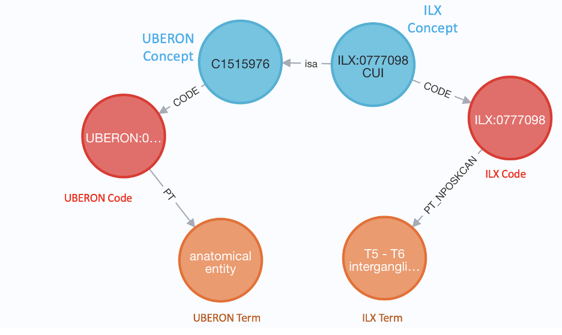

##### SPARC Node and Edge Counts

| **SAB**              | **Count** |
|----------------------|-----------|
| UBERON               | 1,552     |
| api.brain-map.org    | 1,329     |
| uri.interlex.org     | 893       |
| ILX                  | 174       |
| www.ncbi.nlm.nih.gov | 122       |
| CHEBI                | 122       |
| NIFEXT               | 70        |
| NLX                  | 56        |
| NCBITAXON            | 54        |
| PR                   | 39        |
| uri.neuinfo.org      | 38        |
| jaxmice.jax.org      | 31        |

## Additional Datasets

### CLINVAR

The ClinVar dataset (v2023-01-05) was utilized to define assertions between human genes and phenotypes. Only genes with pathogenic, likely pathogenic and pathogenic/likely pathogenic variants were considered, and we excluded associations with no assertion criteria met. To retrieve the target phenotype/disease we used MedGen IDs listed in the ClinVar dataset (also already present in the KG). Processed ClinVar dataset contains 214,040 relationships (including reverse relationships) with the following characteristics [Type: "gene_associated_with_disease_or_phenotype", SAB: "CLINVAR"] and [type: inverse_gene_associated_with_disease_or_phenotype, SAB: "CLINVAR"] connecting HGNC to MONDO, HPO, EFO and MESH Concept nodes.

### CMAP

The edge lists of the CMAP Signatures of Differentially Expressed Genes for Small Molecules dataset were obtained from the Harmonizome database <https://maayanlab.cloud>. The dataset added 2,625,336 relationships (including reverse relationships) connecting the CHEBI and HGNC nodes with predicates "negatively_correlated_with_gene", "inverse_negatively_correlated_with_gene", "positively_correlated_with_gene", "inverse_positively_correlated_with_gene" (SAB: "CMAP").

### HPOMP

This set of assertions maps human phenotype ontology (HPO) nodes to mammalian phenotype ontology (MP) nodes through the 'is_approximately_equivalent_to'. It is essentially a set of assertions mapping human phenotype codes to mouse phenotype codes. The mappings were produced by using a software tool called [PheKnowLator](https://github.com/callahantiff/PheKnowLator). There are 1,785 HPOMP mappings. These assertions can be queried by specifying the SAB property as HPOMP on the 'is_approximately_equivalent_to' relationship.

### HGNCHPO

This set of assertions maps HGNC gene nodes to human phenotype ontology (HPO) nodes through the 'associated_with' relationship. There are 671,046 HGNCHPO mappings. These assertions can be queried by specifying the SAB property as HGNCHPO on the 'associated_with' relationship.

### HCOPHGNC

This set of assertions maps mouse gene nodes (HCOP) to human gene nodes (HGNC). Mouse gene nodes are referred to as 'HCOP' in the Data Distillery Knowledge Graph because the HGNC Comparison of Orthology Predictions ([HCOP](https://www.genenames.org/tools/hcop/)) tool was used to generate these mappings. The 'in_1_to_1_orthology_relationship_with' is used to connect the HGNC and HCOP nodes. There are 67,027 HCOPHGNC mappings. These assertions can be queried by specifying the SAB property as HCOPHGNC on the 'in_1_to_1_orthology_relationship_with' relationship.

### HCOPMP

This set of assertions maps mouse gene nodes (HCOP) to the mammalian phenotype ontology (MP) nodes through the 'involved_in' relationship. These mappings are the mouse version of the HGNCHPO mappings. Files from the International Mouse Phenotyping Consortium ([IMPC](https://www.mousephenotype.org/)) and Mouse Genome Informatics ([MGI](https://www.informatics.jax.org/)) were used to create this dataset. There are 234,043 HCOPMP mappings. These assertions can be queried by specifying the SAB property as HCOPMP on the 'involved_in' relationship.

### Homo Sapiens Chromosomal Location Ontology (HSCLO)

Homo Sapiens Chromosomal Location Ontology (HSCLO) was primarily created to connect 4DN loop coordinates to the rest of the graph through the mapping between HSCLO and GENCODE. HSCLO was later utilized to connect GTEXEQTL locations in the graph as searchable nodes at 1 kbp resolution (same as 4DN). The dataset relationships as well as nodes use HSCLO as their SAB. HSCLO nodes are defined at 5 resolution levels; chromosomes, 1 Mbp, 100 kbp, 10 kbp and 1kbp with each level connects to lower level with above\_(resolution level)\_band (e.g. "above_1Mbp_band", "above 1_kbp_band") and nodes at the same resolution level are connected through prcedes\_(resolution level)\_band (e.g. "precedes_10kbp_band"). The dataset contains 3,431,155 nodes and 6,862,195 relationships (13,724,390 bidirectional).

### MSIGDB

Five subsets of MSigDB v7.4 datasets were introduced as entity-gene relationships to the knowledge graph: C1 (positional gene sets), C2 (curated gene sets), C3 (regulatory target gene sets), C8 (cell type signature gene sets) and H (hallmark gene sets ). With this subset, MSIGDB Concept nodes were created for MSigDB systematic names (used as Codes excluding KEGG data). The relationships between these Concept nodes and HGNC nodes were defined using the mentioned 5 subsets where the subset information was included in the relationship SABs as "MSIGDB".

### RATHCOP

This set of assertions maps human ENSEMBL gene nodes to rat ENSEMBL gene nodes. These mappings were generated from the [HCOP](https://www.genenames.org/tools/hcop/) tool just like for the mouse to human assertions, except we used the ENSEMBL codes here instead of the HGNC codes. The 'has_human_ortholog' relationship is used to connect ENSEMBL Rat nodes to ENSEMBL Human nodes. There are 42,371 RATHCOP mappings and they can be queried by specifying the SAB property as RATHCOP on the 'has_human_ortholog' relationship.
